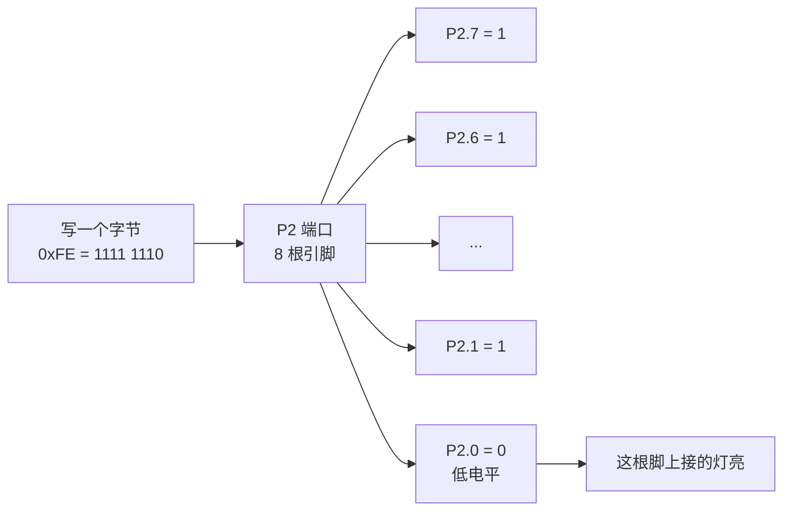

---
title:
aliases:
tags:
  - 51单片机
description: 从引脚电平讲到端口、位和低电平点亮，把「一个字节 = 八颗灯」这件事从电路层面讲透，换任何一块板都能自己对上号。
---

# 为什么一行 `P2 = 0xFE` 能点亮一颗灯

## 一句话

板子上每颗 LED 都用一根电线接到单片机的一根**引脚**；8 根引脚编成一组，叫一个**端口**；一个端口正好用一个字节的 8 个**位**来控制——所以**一位管一颗灯**，一行代码就能同时决定 8 颗灯的亮灭。

## 从一根线说起

单片机芯片四周伸出一排金属脚，这些脚就是**引脚**。每根引脚都能被程序控制成一个开关：

- 输出**低电平**（约 0V）≈ 这根脚接到电源负极
- 输出**高电平**（约 5V）≈ 这根脚接到电源正极

开发板上每颗 LED，都是用一根电线（电路板上的铜箔）焊到某一根引脚上的。所以**程序控制引脚电平 = 控制那颗灯**。

## 什么是端口：8 根脚编成一组

51 单片机有 32 根输入输出引脚，分成 **4 组、每组 8 根**，分别叫 **P0、P1、P2、P3**（P 是 Port，端口）。

这么分组是为了方便：一组 8 根正好对应一个**字节**，程序里可以一次性给 8 根脚下命令。



> [!tip] 灯接在哪个口，是板厂定的，不是 C 语言定的
> 常见的 51 学习板把 LED 接在 P2，板上会印一行丝印说明（例如 `P20—P27 ← LED模块`）。
>
> 看丝印（或原理图）→ 知道零件接在哪个口 → 代码就操作那个口。以后学按键、数码管、蜂鸣器都是这一套，**不用背，看一眼就行**。

## 为什么写 0 反而亮

这是最容易卡住的地方。学习板上 LED 的接法通常是：

```
5V ── 限流电阻 ── LED正极 ▸|── LED负极 ── 单片机引脚
```

电流要流动，需要一头电压高、一头电压低：

- 引脚输出 **0V（低电平）**：5V 和 0V 之间有压差 → 电流从 5V 出发，穿过 LED，**灌进引脚** → **灯亮**
- 引脚输出 **5V（高电平）**：LED 两头都是 5V，没有压差 → 没有电流 → **灯灭**

这种"电流灌进芯片"的接法叫**灌电流**，对应的规律是**低电平点亮**。于是在这种板上：

> **字节里有几个 0，就有几颗灯亮。**

`0xFE` 写成二进制是 `1111 1110`，8 位里只有 **1 个 0** → 只亮 1 颗。（二进制和十六进制怎么互相翻译，见 [[二进制、十进制、十六进制到底在数什么]]。）

反过来，`0x80` 是 `1000 0000`，里面有 **7 个 0** → 会亮 7 颗、灭 1 颗，正好和"只亮一颗"的意图相反。这就是必须用 `0xFE` 而不是 `0x80` 的原因。

> [!warning] 这条规律不是普适的
> 低电平点亮只是**这种接法**的结果。换成高电平点亮的板或模块，规律整个反过来（`0xFF` 全亮、`0x00` 全灭）。
>
> 拿到任何一块新板或新模块，先烧一次 `P2 = 0xFF` 试试：**全灭说明是低电平点亮，全亮说明是高电平点亮。** 五秒钟就能定下来，比翻原理图快。

## 位的顺序为什么看起来是"反"的

这是两套互不相干的约定叠加的结果：

1. **数学书写约定**：写数字时低位在右边——十进制 254 的个位也在最右。所以 `1111 1110` 里那个唯一的 0 是**最低位 bit0**，也就是 **P2.0**，写在**最右边**。
2. **板厂布线约定**：灯的编号 D1~D8 按从左到右标；D1 接到哪根引脚，是画电路板时走线决定的。

一个把最低位写在**右端**，一个把 P2.0 放在**最左端**——叠在一起就显得"反"了。换一块板，D1 完全可能接到 P2.7，那时同样的代码就亮在另一端。

**所以别心算位置。** 三种可靠做法，任选其一：

1. **烧一次**：写 `P2 = 0xFE` 下载进去，哪颗亮那颗就是 P2.0，五秒确定
2. **看丝印**：板上印的 `P20—P27` 和 `D1—D8` 就是答案
3. **按名字操作某一位**（见下），彻底绕开位序问题

## 常用取值对照

前提：低电平点亮、D1 接 P2.0、D8 接 P2.7。换一块板，"结果"这一列可能整列反过来。

| 代码 | 二进制 | 结果 |
| --- | --- | --- |
| `P2 = 0xFE;` | 1111 1110 | 只亮 D1（最左） |
| `P2 = 0xFD;` | 1111 1101 | 只亮 D2 |
| `P2 = 0xFB;` | 1111 1011 | 只亮 D3 |
| `P2 = 0xF7;` | 1111 0111 | 只亮 D4 |
| `P2 = 0xEF;` | 1110 1111 | 只亮 D5 |
| `P2 = 0xDF;` | 1101 1111 | 只亮 D6 |
| `P2 = 0xBF;` | 1011 1111 | 只亮 D7 |
| `P2 = 0x7F;` | 0111 1111 | 只亮 D8（最右） |
| `P2 = 0x00;` | 0000 0000 | 8 颗全亮 |
| `P2 = 0xFF;` | 1111 1111 | 全灭 |

## 直接操作某一位（推荐写法）

头文件 `REGX52.H` 里已经把每一位单独起了名字（`sbit` 是 C51 的扩展关键字，用来给某一"位"起名字）：

```c
sbit P2_0 = 0xA0;   // P2.0 这一位
sbit P2_1 = 0xA1;
...
sbit P2_7 = 0xA7;
```

于是可以完全不碰二进制：

```c
P2_0 = 0;   // 点亮接在 P2.0 的那颗灯
P2_7 = 0;   // 点亮接在 P2.7 的那颗灯
```

意图一目了然，也不受位序和板子方向影响。

## 一个必须养成的习惯：main 里加 `while(1)`

```c
#include <REGX52.H>

void main()
{
    while(1)      // 让程序永远停在这里
    {
        P2 = 0xFE;
    }
}
```

单片机的 `main` 不像电脑程序那样"跑完就退出"——它没有地方可退。

如果没写 `while(1)`，`P2 = 0xFE;` 执行完程序计数器会继续往下走，一路跑进空白的程序区（那里全是 `FF`），这就是俗称的**跑飞**。当前看起来正常，只是因为没人再去改 P2、引脚保持了原状而已；一旦后面加了别的逻辑，就会出现莫名其妙的复位或乱动作。
