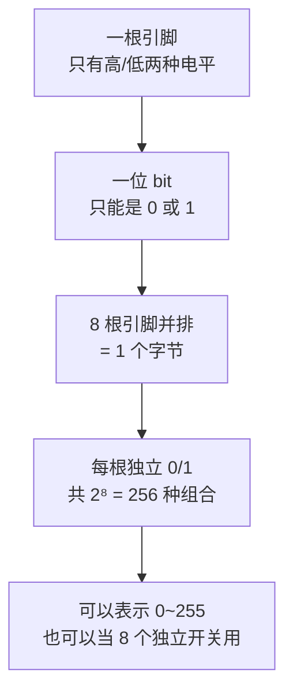

---
title:
aliases:
tags:
  - 51单片机
description: 从"为什么人有十进制、机器有二进制"讲到位权与十六进制缩写，把三种进制统一成同一件事，看完能自己口算 0xFE 是多少、也能看懂为什么要这么写。
---
# 二进制、十进制、十六进制到底在数什么

## 一句话

它们数的**是同一个东西**，只是写法不同。十进制是因为人有十根手指，二进制是因为一根电线只有"通"和"断"两种状态，十六进制只是二进制的缩写。**进制是写法，不是数学。**

## 先破一个错觉

`254` 不是一个叫"二五四"的符号，它是：

$$254 = 2 \times 100 + 5 \times 10 + 4 \times 1$$

而 `0xFE` 和 `1111 1110`，**跟它完全是同一个数量**，只是换了两种写法：

```
十进制     254
十六进制   0xFE
二进制     1111 1110
        ↑ 三个是同一个数
```

所以初学时最容易犯的错，就是把它们当成三件不同的事分别去背。记住：**它们是一件事的三种写法**，剩下就只是"怎么互相翻译"的问题。

## 什么是进制：逢几进一

数数的时候，数到头了怎么办？**多写一位，从 0 重新开始。**

| 进制 | 有几个符号 | 数到几就进位 |
| --- | --- | --- |
| 十进制 | 0 1 2 3 4 5 6 7 8 9（10 个） | 数到 9 再来一个 → 写成 `10` |
| 二进制 | 0 1（2 个） | 数到 1 再来一个 → 写成 `10`（这个 10 等于十进制的 2） |
| 十六进制 | 0-9 再加 A B C D E F（16 个） | 数到 F 再来一个 → 写成 `10`（等于十进制的 16） |

看出来了吗：**所有进制里的 `10`，含义都是"这个进制的一个整轮"**。二进制的 `10` 是 2，十六进制的 `10` 是 16。

## 位权：同一个数字在不同位置值多少

这是整个进制问题的核心。

十进制 `254` 里，两个 `2` 和 `5` 之所以代表不同的量，是因为**位置决定权重**：

| 位置 | 百位 | 十位 | 个位 |
| --- | --- | --- | --- |
| 数字 | 2 | 5 | 4 |
| 权重 | $10^2 = 100$ | $10^1 = 10$ | $10^0 = 1$ |
| 贡献 | 200 | 50 | 4 |

二进制完全一样，只是权重从"10 的幂"换成"2 的幂"。8 位二进制的权重表，建议直接记住：

| 位号 | bit7 | bit6 | bit5 | bit4 | bit3 | bit2 | bit1 | bit0 |
| --- | --- | --- | --- | --- | --- | --- | --- | --- |
| 权重 | 128 | 64 | 32 | 16 | 8 | 4 | 2 | 1 |

于是 `1111 1110` 就是：

```
1×128 + 1×64 + 1×32 + 1×16 + 1×8 + 1×4 + 1×2 + 0×1
= 128+64+32+16+8+4+2+0
= 254
```

**做法就一句话：哪一位是 1，就把那一位的权重加起来。**

## 为什么机器用二进制：不是因为它高级，是因为物理只给两种状态

单片机的一根引脚，本质上就是一根电线。程序能控制它的只有两种可靠状态：

- **低电平**（约 0V）→ 记作 `0`
- **高电平**（约 5V）→ 记作 `1`

为什么不做成"0V / 1.7V / 3.3V / 5V"四档、一位表示 0~3？因为电压会漂移、会被干扰、会随温度和线长变化。要可靠区分四档需要精密的模数转换电路，成本高、速度慢、还容易出错。**只区分"高"和"低"两档，两者离得最远，最抗干扰，电路也最简单。**

所以二进制不是数学上的选择，是**电路物理上的妥协**。



最后那一行很重要：一个字节既可以当**一个数**（0~255）用，也可以当**8 个独立开关**用。这一点在 [[为什么一行 P2 = 0xFE 能点亮一颗灯]] 里就是"一位管一颗灯"的来源。

> [!tip] 顺带记住这几个数
> 8 位 = 1 字节 = 0~255（256 种）
> 4 位 = 半字节 = 0~15（16 种）→ 正好对应十六进制的一位
> 16 位 = 2 字节 = 0~65535

## 十六进制：二进制的缩写

二进制写起来太长——`1111 1110` 八个字符，而且一眼数不清有几个 1。

注意到 **4 位二进制正好有 16 种组合**（$2^4 = 16$），跟十六进制的 16 个符号一一对应。所以干脆**每 4 位压缩成 1 个字符**：

```
1111 1110
├──┤ ├──┤
 │    └─ 1110 = 14 = E
 └────── 1111 = 15 = F
→ 0xFE
```

对照表（只要记住 10~15 是 A~F，其余和十进制一样）：

| 二进制 | 十进制 | 十六进制 |
| --- | --- | --- |
| 0000 | 0 | 0 |
| 0001 | 1 | 1 |
| 0010 | 2 | 2 |
| 0011 | 3 | 3 |
| 0100 | 4 | 4 |
| 0101 | 5 | 5 |
| 0110 | 6 | 6 |
| 0111 | 7 | 7 |
| 1000 | 8 | 8 |
| 1001 | 9 | 9 |
| 1010 | 10 | A |
| 1011 | 11 | B |
| 1100 | 12 | C |
| 1101 | 13 | D |
| 1110 | 14 | E |
| 1111 | 15 | F |

反着拆也一样：`0xFE` → F 是 1111、E 是 1110 → `1111 1110`。

**为什么 C 语言要写 `0x` 前缀？** 为了和十进制区分。不写前缀的话 `10` 到底是十还是十六？写上就明确了：

```c
P2 = 10;     // 十进制的十   → 0000 1010
P2 = 0x10;   // 十六进制的十 → 0001 0000（等于十进制 16）
```

## 四个最容易踩的坑

**1. `0x10` 不是 10，是 16**

十六进制的 `10` 表示"满满一轮"，等于十进制 16。同理 `0x100` 是 256。

**2. 位数必须补齐，前导 0 有意义**

`0x0F` 是 `0000 1111`（只有低 4 位是 1），`0xF0` 是 `1111 0000`（高 4 位是 1）。两个数看起来都是 F 和 0，但含义完全相反。写十六进制时**按两位一组写**（8 位就写满两位），不要省掉前面的 0。

**3. 字母大小写无所谓**

`0xFE`、`0xfe`、`0xFe` 都是同一个数。习惯上大写。

**4. 十进制看不出"位"**

这是十六进制真正好用的地方。给你 `254`，你能一眼看出哪一位是 0 吗？很难。但写 `0xFE`，熟悉之后立刻能想到"F 是全 1、E 是 1110，所以只有最低位是 0"。

**凡是跟"位"打交道的地方（端口、寄存器、掩码、标志位），一律用十六进制或二进制，别用十进制。**

## 在代码里的三种常见操作

**按位取反 `~`** —— 每一位 0↔1 翻转：

```c
P2_0 = ~P2_0;     // 原来是 0 变 1，原来是 1 变 0 → 灯的亮灭切换
```

**掩码 `&` 和 `|`** —— 只改动某几位，其余保持不变：

```c
P2 = P2 & 0xFE;   // 把最低位强制清成 0（点亮 D1），其他 7 位原样保留
P2 = P2 | 0x01;   // 把最低位强制置成 1（熄灭 D1），其他 7 位原样保留
```

为什么这样能"只动一位"？因为 `&` 的规则是"两边都是 1 才得 1"——和 `0xFE`（`1111 1110`）相与，最低位无论是什么都会变 0，其余位遇到 1 则保持原值。

**移位 `<<` `>>`** —— 把位整体左移或右移：

```c
1 << 3            // 1 左移 3 位 → 0b0000 1000 = 8
```

`1 << n` 就等于 $2^n$，写位号的时候比手算方便得多。

## 怎么验算

- **Windows 计算器**切到"程序员"模式，顶部有 HEX / DEC / OCT / BIN 四个按钮，输入一个数点另一个就自动换算了。学习阶段用它核对，比心算靠谱。
- **心算技巧**：二进制转十进制就背那串权重 `128 64 32 16 8 4 2 1`，把 1 的位置加起来；十六进制转二进制就逐个字母拆成 4 位。

真正熟练之后，常用的那几个数会形成肌肉记忆：`0xFF` 全 1、`0x00` 全 0、`0xFE` 只有最低位是 0、`0x0F` 低四位是 1、`0xF0` 高四位是 1。
