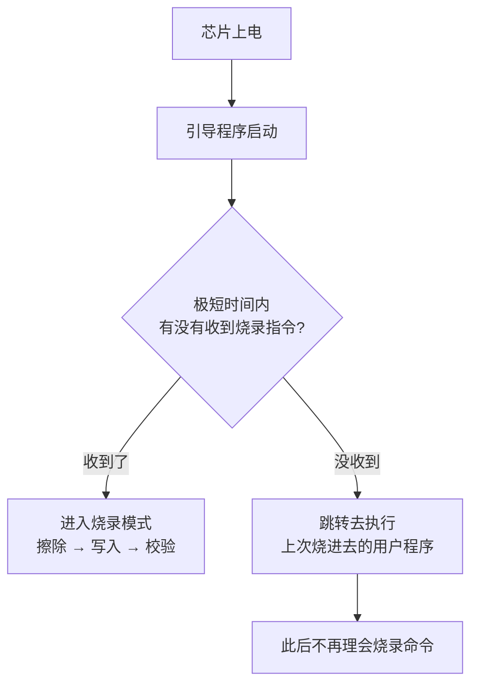

---
title:
aliases:
tags:
  - 51单片机
description: 点下载之后必须给单片机断电再上电，因为它只在上电后极短的一瞬间接受烧录指令——这是卡在「检测目标单片机」不动的根本原因。
---

# 怎么把程序烧进 51 单片机

## 为什么必须重新上电

STC 单片机不是点下载就立刻烧录，而是「点下载 → 给芯片重新上电」。

单片机内部除了我们写的程序，还固化着一小段厂家写好的**引导程序**（bootloader）。每次上电，芯片先跑它，它做一件事：

错过窗口就再也不响应，界面一直停在「正在检测目标单片机」。

> [!warning] 按复位键没用
> 必须是**断电再上电**（这叫冷启动）。按复位键只是热复位，芯片不会重新打开那个等待窗口——因为等待窗口是上电复位电路触发的，不是复位键触发的。

## 正确的操作顺序

1. 烧录软件里选好芯片型号、串口号，打开编译生成的 hex 文件
2. 点**下载/编程**，等界面出现「正在检测目标单片机」
3. **这时候**给开发板断电 → 停 1 秒 → 再通电
4. 接着就会看到握手 → 擦除 → 编程 → 完成

顺序不能反——先通电再点下载，那时芯片已经在跑用户程序了，永远握不上手。

## 断电要用板载开关，不要拔 USB 线

| 做法 | 结果 |
| --- | --- |
| 按板载**电源开关**（自锁开关：按下去卡住、再按弹起） | 推荐 |
| 拔插 USB 线 | 几乎必然失败 |

原因是两个时间差得太远：

- 芯片等待烧录指令的窗口：**几十到几百毫秒**
- 拔掉 USB 后，操作系统重新识别串口芯片、把 COM 口交出来：**好几秒**

也就是说，拔插 USB 的瞬间芯片确实上电了、窗口也确实打开了，但电脑这边的串口要好几秒后才能用——**等串口能发数据时，窗口已经关了好几倍的时间**。

板载电源开关为什么就行？因为这类开发板上，开关通常**只切断单片机，不动 USB 转串口芯片**（常见的是 CH340，一颗把 USB 转成串口信号的小芯片）。串口全程在线，上电那一瞬间指令立刻就发出去了。

> [!tip] 怎么判断你的板属于哪种
> 按开关的时候，如果电脑上那个 COM 口没有消失（设备管理器里还在），说明开关只切了单片机——这是最理想的情况，用开关下载就行得通。

## 还是不行，按顺序查这几项

- **芯片型号选对**：芯片表面印着 `STC89C52RC`，烧录软件里就要选 `STC89C52RC/LE52RC` 这一条，不要选没有 RC 后缀的老条目。型号选错，握手时芯片 ID 对不上就会失败（详见 [[STC 芯片型号怎么看]]）
- **串口号选对**：设备管理器里看 USB-SERIAL CH340 占的是哪个 COM
- **跳线帽**：USB 转串口芯片和单片机之间通常靠跳线帽连接，掉了就永远握不上手
- **数据线**：换一根，直接插机箱后面的 USB 口，不要经过集线器或前面板延长线
- **hex 文件是不是最新的**：改过代码要重新编译，并且烧录软件要重新打开一次 hex 文件

> [!note] 停在「正在检测目标单片机」超过十秒，就是还没进烧录模式，按上面的清单查。
