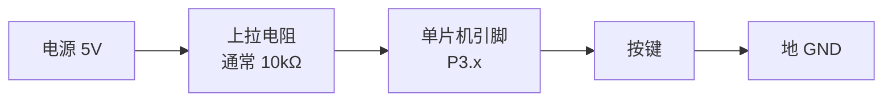

---
title:
aliases:
tags:
description: 按下按键 LED 却没反应，多半不是代码写错，而是查的那根引脚上根本没接这颗键——从按键电路讲到「镜子程序」实测法，一次确定每颗键接在哪根脚，顺带讲清消抖为什么要三步。
---

# 按下按键灯没反应，怎么查出它接在哪根引脚

## 一句话

按下按键 LED 却没反应，**多半不是代码写错，而是你查的那根引脚上根本没接这颗键**。丝印上写的 `P30-P33` 是范围说明（这几颗键占用 P3.0 到 P3.3），**不等于**"第一颗键接 P3.0"。哪颗键接哪根脚，要实测一次才确定。

## 问题：按下按键，灯没反应

写个"按一下按键、翻转一颗 LED"的程序烧进去，按下去却纹丝不动。或者更怪的现象：

- 按下去完全没反应
- 按住不放时灯**急促闪烁**，松手后停在一个随机状态
- 按一次，灯却翻了两下

代码看着没问题，编译也是 0 错误 0 警告。这时候别急着改代码，先按这个顺序排查——**越靠前的原因越常见**：

| 顺序 | 怀疑对象 | 怎么确认 |
| --- | --- | --- |
| 1 | LED 那一侧根本没通 | 先烧 `P2 = 0x00;`，8 颗灯全亮说明灯没问题 |
| 2 | **查错了引脚** | 这颗键压根不在你写的那根脚上 ← 本文重点 |
| 3 | 按键模块没接到引脚 | 有些板靠跳线帽连接，掉了就完全没反应 |
| 4 | 消抖逻辑写错 | `while` 写成 `if` 会导致按住一直闪（见后文） |

第 2 条是最容易想当然的一环：**大家都默认"第一颗键 = P3.0"，但没人保证过这件事。**

## 按键按下时，引脚上发生了什么

要排查，先得知道程序里那个 `if(P3_1==0)` 到底在判断什么。

学习板上的独立按键，接法基本都是这样的：



- **没按下**：引脚通过上拉电阻接到 5V → 读到 **1**
- **按下了**：按键把引脚直接短接到地 → 电流绕过电阻走按键这条路 → 引脚被拉到 0V → 读到 **0**

所以代码判断的是 **"这根脚有没有被拉到低电平"**，`==0` 就是"按下"。

这也是为什么**按键必须配一个上拉电阻**：没有它，按键不按时引脚是悬空的，电平飘忽不定，读出来的值毫无意义。51 单片机 P1/P2/P3 口内部自带上拉电阻，所以可以直接接按键；**P0 口内部没有上拉，用 P0 做按键输入必须外接上拉电阻**，否则永远读不准。

## 为什么丝印不能直接照抄

板上按键区通常印着一行字，比如 `独立按键 →P30-P33`，下面标着 `K1 K2 K3 K4`。

它给的是**范围**（这几颗键占用 P3.0 到 P3.3），**不是分配表**（哪颗键接哪根脚）。每颗键具体焊到哪根脚，是画电路板时走线决定的；走线为了不打交叉，经常会在某几根上绕一下——于是"按键编号顺序"和"引脚号顺序"就可能对不上。

这不是故障，只是两套编号没对齐。**以实测为准。**

## 镜子程序：一次测出全部对应关系

思路很直白：**把每根引脚的状态，原样复制到一颗 LED 上。**

之所以能这么干，是因为两边刚好都是"低电平 = 有事发生"——按键按下时引脚变低电平，LED 也是低电平点亮。所以直接赋值，按下哪个键，对应的灯就亮。

```c
#include <REGX52.H>

void main()
{
    while(1)
    {
        P2_0 = P3_0;   // D1 照 P3.0
        P2_1 = P3_1;   // D2 照 P3.1
        P2_2 = P3_2;   // D3 照 P3.2
        P2_3 = P3_3;   // D4 照 P3.3
    }
}
```

烧进去后**逐个按住按键，看哪颗灯亮**。

下面是一块常见 51 学习板（普中 PRECHIN 实验板）上的实测结果，用来说明读法：

| 现象              | 结论                  |
| --------------- | ------------------- |
| 按 K1 → **D2** 亮 | K1 接的是 **P3.1**     |
| 按 K2 → **D1** 亮 | K2 接的是 **P3.0**     |
| 按 K3 → D3 亮     | K3 接 P3.2，编号和引脚号对得上 |
| 按 K4 → D4 亮     | K4 接 P3.3           |
|                 |                     |

画出来是这样——左边是你按下的键，中间是它真正接的引脚，右边是镜子程序里亮起的那颗灯：

<svg viewBox="0 0 680 300" xmlns="http://www.w3.org/2000/svg" style="max-width:100%;height:auto">
  <defs>
    <marker id="arw" markerWidth="8" markerHeight="8" refX="7" refY="3" orient="auto">
      <path d="M0,0 L7,3 L0,6 Z" fill="var(--gray)" />
    </marker>
    <marker id="arw-x" markerWidth="8" markerHeight="8" refX="7" refY="3" orient="auto">
      <path d="M0,0 L7,3 L0,6 Z" fill="var(--tertiary)" />
    </marker>
  </defs>

  <text x="80" y="22" font-size="13" text-anchor="middle" font-weight="600">按下的键</text>
  <text x="325" y="22" font-size="13" text-anchor="middle" font-weight="600">实际接的引脚</text>
  <text x="570" y="22" font-size="13" text-anchor="middle" font-weight="600">亮起的灯</text>

  <rect x="30" y="40" width="100" height="44" rx="8" fill="var(--lightgray)" stroke="var(--gray)" />
  <text x="80" y="67" font-size="15" text-anchor="middle">K1</text>
  <rect x="30" y="100" width="100" height="44" rx="8" fill="var(--lightgray)" stroke="var(--gray)" />
  <text x="80" y="127" font-size="15" text-anchor="middle">K2</text>
  <rect x="30" y="160" width="100" height="44" rx="8" fill="var(--lightgray)" stroke="var(--gray)" />
  <text x="80" y="187" font-size="15" text-anchor="middle">K3</text>
  <rect x="30" y="220" width="100" height="44" rx="8" fill="var(--lightgray)" stroke="var(--gray)" />
  <text x="80" y="247" font-size="15" text-anchor="middle">K4</text>

  <rect x="275" y="40" width="100" height="44" rx="8" fill="var(--lightgray)" stroke="var(--gray)" />
  <text x="325" y="67" font-size="15" text-anchor="middle">P3.0</text>
  <rect x="275" y="100" width="100" height="44" rx="8" fill="var(--lightgray)" stroke="var(--gray)" />
  <text x="325" y="127" font-size="15" text-anchor="middle">P3.1</text>
  <rect x="275" y="160" width="100" height="44" rx="8" fill="var(--lightgray)" stroke="var(--gray)" />
  <text x="325" y="187" font-size="15" text-anchor="middle">P3.2</text>
  <rect x="275" y="220" width="100" height="44" rx="8" fill="var(--lightgray)" stroke="var(--gray)" />
  <text x="325" y="247" font-size="15" text-anchor="middle">P3.3</text>

  <rect x="520" y="40" width="100" height="44" rx="8" fill="var(--lightgray)" stroke="var(--gray)" />
  <text x="570" y="67" font-size="15" text-anchor="middle">D1</text>
  <rect x="520" y="100" width="100" height="44" rx="8" fill="var(--lightgray)" stroke="var(--gray)" />
  <text x="570" y="127" font-size="15" text-anchor="middle">D2</text>
  <rect x="520" y="160" width="100" height="44" rx="8" fill="var(--lightgray)" stroke="var(--gray)" />
  <text x="570" y="187" font-size="15" text-anchor="middle">D3</text>
  <rect x="520" y="220" width="100" height="44" rx="8" fill="var(--lightgray)" stroke="var(--gray)" />
  <text x="570" y="247" font-size="15" text-anchor="middle">D4</text>

  <path d="M130,62 C 195,62 210,122 275,122" fill="none" stroke="var(--tertiary)" stroke-width="2.5" marker-end="url(#arw-x)" />
  <path d="M130,122 C 195,122 210,62 275,62" fill="none" stroke="var(--tertiary)" stroke-width="2.5" marker-end="url(#arw-x)" />
  <line x1="130" y1="182" x2="275" y2="182" stroke="var(--gray)" stroke-width="2" marker-end="url(#arw)" />
  <line x1="130" y1="242" x2="275" y2="242" stroke="var(--gray)" stroke-width="2" marker-end="url(#arw)" />

  <line x1="375" y1="62" x2="520" y2="62" stroke="var(--gray)" stroke-width="2" marker-end="url(#arw)" />
  <line x1="375" y1="122" x2="520" y2="122" stroke="var(--gray)" stroke-width="2" marker-end="url(#arw)" />
  <line x1="375" y1="182" x2="520" y2="182" stroke="var(--gray)" stroke-width="2" marker-end="url(#arw)" />
  <line x1="375" y1="242" x2="520" y2="242" stroke="var(--gray)" stroke-width="2" marker-end="url(#arw)" />

  <text x="340" y="288" font-size="12" text-anchor="middle">青绿色的两条是交叉的（K1、K2），灰色的两条编号对得上（K3、K4）</text>
</svg>

**读法**：哪颗灯亮，那颗键就接在"这颗灯所照的那根引脚"上。灯和键的编号对不上没关系，看的是**灯照的是哪根脚**。

上面这块板上 K1 和 K2 是交叉的。换一块板结果可能完全不同——所以这张表只能当例子，你自己的板要自己测一次。

> [!tip] 这招不只用于按键
> 任何"不知道某个零件接在哪根脚"的场合，都可以写一段镜子程序把引脚状态映射到 LED 上，比翻原理图快得多。

## 完整的按键翻转程序

确定好引脚之后，一个"按一下切换一次亮灭"的程序长这样（这里假设测出来 K1 接在 P3.1）：

```c
#include <REGX52.H>

void Delay(unsigned int xms)
{
    unsigned char i, j;
    while(xms)
    {
        i = 2; j = 239;
        do { while (--j); } while (--i);
        xms--;
    }
}

void main()
{
    while(1)
    {
        if(P3_1==0)                    // 按下
        {
            Delay(20);                 // ① 按下消抖
            while(P3_1==0) Delay(20);  // ② 等松手
            Delay(20);                 // ③ 松手消抖
            P2_0=~P2_0;                // 翻转一颗灯
        }
    }
}
```

> [!warning] 等松手那句必须是 `while`，不能是 `if`
> `if` 只是"看一眼"，`while` 才是"一直盯到条件不成立"。写成 `if` 的话，按住不放时外层 `while(1)` 每转一圈就翻转一次，灯会**急促闪烁**而不是按一次翻一次。
>
> 另外注意翻转那句要在循环体**外面**——和 `while` 的行首对齐，说明它在循环之后才执行。

## 为什么要消抖三次

机械按键内部是金属弹片，闭合和断开的瞬间会**来回弹跳几毫秒**，电平跟着抖好几个来回。单片机跑得极快（每秒上百万条指令），会把这些抖动当成好几次按下。

| 步骤 | 作用 |
| --- | --- |
| ① 延时 20ms 再判断 | 跳过按下瞬间的抖动，确认是真的按下了 |
| ② 等松手 | 按住不放时只算一次 |
| ③ 松手后再延时 20ms | 跳过松手瞬间的抖动 |

少了第 ③ 步也能跑，但松手瞬间有几率被当成第二次按下，表现是"按一次却翻了两下"。

> [!note] 20 毫秒这个数字怎么来的
> 机械按键的抖动一般持续 5~10 毫秒，取 20 毫秒是留足余量的经验值。时间短了挡不住抖动，太长了会觉得按键迟钝。

## 三种"按键按下去却读不到低电平"的情况

镜子程序测出来某颗键完全没反应时，通常是下面三种之一：

**1. 按键模块没接到引脚上**

有些板的按键区靠**跳线帽**（或拨码开关）连到单片机引脚，掉了或者没拨对，按键就悬空着，怎么按都没反应。检查按键区附近有没有空着的排针。

**2. 这根脚被别的芯片顶住了**

这是个很隐蔽的坑：很多 51 学习板的 **P3.0 / P3.1 同时是串口下载脚**（RXD / TXD），板上通过跳线帽接到 USB 转串口芯片（常见的是 CH340，一颗把 USB 转成串口信号的小芯片）。

烧程序必须靠它，所以跳线帽得插着；但那颗芯片的输出脚在不发数据时是**主动驱动**的（把电平硬顶在高位），按键只通过一个电阻拉低，拉不过它——结果就是这根脚**永远读不到 0**。

判断方法：镜子程序里如果 K1、K2 毫无反应而 K3、K4 正常，八成是这个原因。**换用 P3.2 或 P3.3 做按键实验最省心**（编号和引脚号对得上，也不在串口那两根上）。

> [!warning] 这条不是绝对的
> 有的板在串口芯片和单片机之间串了隔离电阻，按键照样能拉低。所以不要凭猜测下结论——**用镜子程序实测一次**，能拉低就是能用。

**3. 测的引脚范围不对**

不是所有板都把按键接在 P3。把镜子程序改成测 P0~P3 各一根（或者干脆先测 P3 全部 8 根），一次就能覆盖。

## 排查清单

- [ ] 先烧 `P2 = 0x00;` 确认 8 颗灯本身都能亮
- [ ] 烧镜子程序，逐个按键，记录"哪颗键 → 哪颗灯亮"
- [ ] 对照读出每颗键实际接的引脚号，别照抄丝印
- [ ] 主程序里 `while(P3_x==0)` 等待松手，翻转语句放在循环外面
- [ ] 按下、松手各消抖一次
- [ ] 某颗键完全没反应时：查跳线帽 → 换 P3.2/P3.3 → 扩大测量范围
