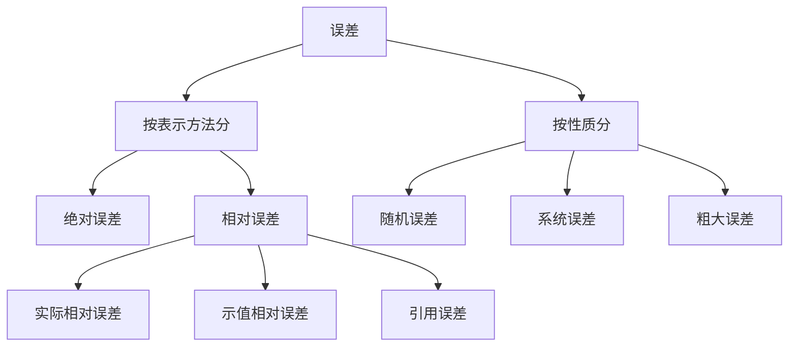
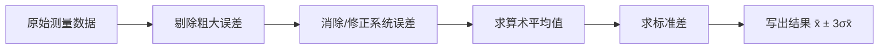

> [!tip] 这一章在讲什么
> 一句话：**测出来的数都不是真值，这章教你估算"差了多少"以及怎么补救。**
> 后面所有传感器章节都要用这里的误差分析，是地基。

## 1. 测量是什么

**定义**：拿待测量跟一个标准量比，看它是标准量的几倍。

$$ x = nu $$

$x$ 被测量、$u$ 标准量（单位）、$n$ 比值。

> 人话：用尺子量桌子，尺子的 1 cm 就是标准量 $u$，量出来"3.5 个那么多"，3.5 就是 $n$。

**测量结果 = 测量数据 + 测量单位 + 测量误差**

三件套缺一不可。只说"10.2 cm"是不完整的，得说"10.2 cm，误差 ±0.1 cm"，别人才能判断这个数能不能用。

## 2. 测量方法的四种分法

| 分类角度 | 两种 | 人话 |
| --- | --- | --- |
| 怎么得到结果 | 直接测量 / 间接测量 | 直接 = 仪表读出来就是；间接 = 先测别的再算（测 $U$、$I$ 算 $P=UI$） |
| 精度是否一致 | 等精度 / 不等精度 | 等精度 = 同人同仪器同环境多次测；不等精度 = 换了仪器/人/方法 |
| 被测量变不变 | 静态 / 动态 | 静态 = 测一个不动的量；动态 = 测变化中的量 |
| 接触与否 | 接触 / 非接触 | 温度计插进去 vs 红外测温枪 |

## 3. 误差的两种分类法

### 3.1 按"怎么表示"分

**绝对误差**：测出来的值减去真值

$$ \Delta = x - L $$

**相对误差** 三种，区别只在分母：

| 名字 | 公式 | 分母是谁 |
| --- | --- | --- |
| 实际相对误差 | $\delta = \dfrac{\Delta}{L} \times 100\%$ | 真值 $L$ |
| 示值相对误差 | $\delta' = \dfrac{\Delta}{x} \times 100\%$ | 测量值 $x$ |
| **引用误差** | $\gamma = \dfrac{\Delta}{x_m} \times 100\%$ | 满量程 $x_m$ |

> [!important] 为什么要有相对误差
> 同样是差 1 ℃：测 100 ℃ 的水，误差 1%，可以接受；测 20 ℃ 的室温，误差 5%，这表就废了。
> **绝对误差相同，不代表测量质量相同** —— 这就是相对误差存在的理由。

**引用误差决定仪表的精度等级**：0.5 级表 = 引用误差 ≤ ±0.5%，1.0 级 = ≤ ±1.0%。于是：

$$ \text{最大绝对误差} \Delta_m = \pm (\text{精度等级}) \% \times \text{量程} $$

> [!example] 例：选表（很实用，爱考）
> 要测 100 ℃，手上两块表：
>
> **A：0.5 级，量程 0~300 ℃** → $\Delta_m = \pm0.5\% \times 300 = \pm1.5$ ℃，示值相对误差 = ±1.5/100 = **±1.5%**
> **B：1.0 级，量程 0~100 ℃** → $\Delta_m = \pm1.0\% \times 100 = \pm1.0$ ℃，示值相对误差 = ±1.0/100 = **±1.0%**
>
> **结论：选 B。**等级更低的反而更准，因为它量程合适。
> 所以选表原则：**示值尽量接近满度值，一般不小于量程的 2/3。**

### 3.2 按"性质"分（最重要）

| 类型 | 表现 | 能修吗 |
| --- | --- | --- |
| **随机误差** | 忽大忽小、正负不定，但大量数据时服从统计规律 | 不能修，只能多测取平均 |
| **系统误差** | 固定不变，或按某规律变化（比如永远偏大 0.1） | 能修：加修正值、做补偿 |
| **粗大误差** | 明显离谱的错值（读错、记错、环境突变） | 直接删掉 |

> 打靶类比：
> **随机误差** = 手抖，弹孔散开一片 → 多打几枪取中心
> **系统误差** = 准星歪了，弹孔整体偏一边 → 校准准星
> **粗大误差** = 有一枪飞到别人靶上 → 这一枪不算

## 4. 数据处理的标准流程

**顺序不能乱**：先删粗大 → 再修系统 → 最后处理随机。

### 4.1 三个核心量

**① 算术平均值** —— 真值的最佳估计

$$ \bar{x} = \frac{1}{n}\sum_{i=1}^{n} x_i $$

**② 残差** —— 每个值跟平均值的差（注意：残差 ≠ 误差，真值不可知所以只能用残差）

$$ \nu_i = x_i - \bar{x} $$

**③ 标准差的估计值** —— 描述数据有多散

$$ \sigma_s = \sqrt{\frac{\sum_{i=1}^{n} \nu_i^2}{n-1}} $$

> [!danger] 分母是 n-1，不是 n
> 因为用 $\bar{x}$ 代替了真值，自由度少了一个。考试必考这个细节。

**算术平均值本身的标准差**：

$$ \sigma_{\bar{x}} = \frac{\sigma_s}{\sqrt{n}} $$

> [!warning] 别靠狂加测量次数来提高精度
> $\sigma_{\bar{x}}$ 按 $1/\sqrt{n}$ 缩小：**测 4 次才让误差减半，测 100 次才减到 1/10**。
> 而且 $n > 10$ 之后收益明显变缓，次数多了环境反而更难保持稳定。一般取 10 次左右就够。

### 4.2 置信概率（结果怎么写）

| 置信系数 $k$ | 1 | 2 | 3 |
| --- | --- | --- | --- |
| 落在 $\pm k\sigma$ 内的概率 | 68.27% | 95.45% | 99.73% |

$k=3$ 时几乎不可能超出，称**极限误差** $\sigma_{lim} = \pm 3\sigma$。

结果的标准写法：

$$ x = \bar{x} \pm 3\sigma_{\bar{x}} \quad (P_a = 99.73\%) $$

### 4.3 粗大误差怎么剔

| 准则 | 判据 | 特点 |
| --- | --- | --- |
| $3\sigma$（莱以达） | $\lvert \nu_i \rvert > 3\sigma$ 就删 | 最简单，但测量次数少时不好使 |
| 肖维勒 | $\lvert \nu_i \rvert > Z_c \sigma$ | $Z_c$ 查表，比 3σ 灵敏 |
| **格拉布斯** | $\lvert \nu_i \rvert > G \sigma$ | $G$ 按测量次数 $n$ 和置信概率查表，**最常用** |

步骤是：**删一个 → 重算平均值和标准差 → 再判一次 → 直到没有可疑值为止**。

### 4.4 系统误差怎么找

1. **理论分析法**：分析测量方法本身带来的误差（比如电压表内阻不够大，测高内阻电源会分流）
2. **实验对比法**：换更高精度的仪表再测一次，对比就露馅
3. **残差观察法**：看残差画出来的曲线

| 残差曲线的样子 | 说明 |
| --- | --- |
| 正负随机、无规律 | 没有系统误差 |
| 线性递增/递减 | 累进性系统误差 |
| 周期性起伏 | 周期性系统误差 |

## 5. 不等精度测量：权

不同组数据可靠程度不同，给每组一个**权 $p$**（无量纲，只看相对大小）：

$$ p_1 : p_2 : \cdots : p_m = \frac{1}{\sigma_1^2} : \frac{1}{\sigma_2^2} : \cdots : \frac{1}{\sigma_m^2} $$

标准差越小 → 权越大 → 越可信。

**加权算术平均值**：

$$ \bar{x}_p = \frac{\sum \bar{x}_i p_i}{\sum p_i} $$

> 人话：可信的数据说话分量重，不可信的少说话。

## 6. 误差合成

已知各环节误差，求总误差。

**系统误差合成** —— 代数相加，带正负号，**能互相抵消**：

$$ \Delta y = \sum_{i=1}^{n} \frac{\partial f}{\partial x_i} \Delta x_i $$

**随机误差合成** —— 方和根，**只会变大不会抵消**：

$$ \sigma_y = \sqrt{\sum_{i=1}^{n} \left(\frac{\partial f}{\partial x_i}\right)^2 \sigma_{x_i}^2} $$

> 人话：系统误差像账本上的借贷，能相抵；随机误差像两个醉汉各走各的，越走越散。

## 7. 最小二乘法与线性回归

**核心思想**：让所有测量点到拟合曲线的**残差平方和最小**。

$$ \sum_{i=1}^{n} \nu_i^2 \to \min $$

矩阵解（通式）：

$$ \mathbf{X} = (\mathbf{A}'\mathbf{A})^{-1}\mathbf{A}'\mathbf{Y} $$

**一元线性回归** $y = kx + b$，两个系数直接套公式：

$$ k = \frac{n\sum x_i y_i - \sum x_i \sum y_i}{n\sum x_i^2 - (\sum x_i)^2} $$

$$ b = \frac{\sum x_i^2 \sum y_i - \sum x_i \sum x_i y_i}{n\sum x_i^2 - (\sum x_i)^2} $$

> 人话：一堆散点，画一条直线，让所有点到这条线的"竖直距离平方之和"最小 —— 这条线就是 $y=kx+b$。
> 传感器标定就是干这个事：测一堆（温度, 电阻）数据点，拟出 $R = R_0(1+\alpha t)$ 里的 $R_0$ 和 $\alpha$。

## 速记表

| 要什么 | 用什么 |
| --- | --- |
| 真值的最佳估计 | 算术平均值 $\bar{x}$ |
| 数据有多散 | 标准差估计值 $\sigma_s$（分母 $n-1$） |
| 平均值有多可信 | $\sigma_{\bar{x}} = \sigma_s/\sqrt{n}$ |
| 仪表准不准 | 看引用误差 = 精度等级 |
| 结果怎么写 | $x = \bar{x} \pm 3\sigma_{\bar{x}}$ |
| 删坏值 | 格拉布斯准则 |
| 多组数据合并 | 加权平均，权 ∝ $1/\sigma^2$ |

## 章后习题

1. 测量结果由哪几部分组成？可信度用什么表示？
2. 什么是相对误差？实际相对误差、示值相对误差、引用误差的异同？
3. 随机误差有什么特征？怎么减小它对结果的影响？
4. 系统误差和随机误差有什么区别？各怎么处理？
5. 为什么标准差估计值的分母是 $n-1$？
