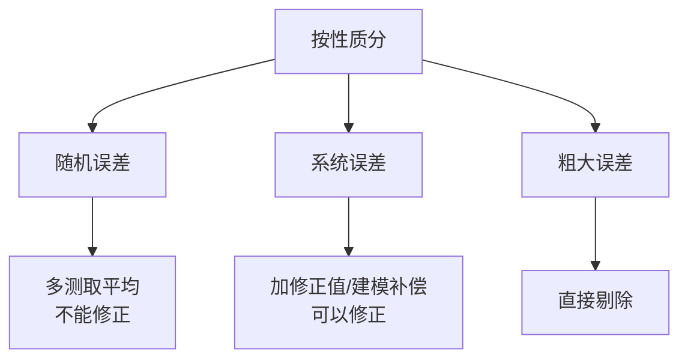

> [!abstract] 这一章的地图
> 整章就回答一个问题：**测出来的数到底有多可信？**
>
> 拆成 9 个小概念，一层层往里走：
> 1. 什么是测量 → 2. 误差怎么表示 → 3. 误差分哪几类
> 4. 随机误差怎么算 → 5. 系统误差怎么找 → 6. 粗大误差怎么删
> 7. 多组数据怎么合并（权）→ 8. 多个环节的误差怎么合成 → 9. 怎么从一堆数据里拟合出公式（最小二乘）
>
> **这 9 块是后面所有章节的地基。** 第 2 章讲传感器特性（[[第2章 传感器理论基础]]），用的就是这里的线性度和最小二乘法；第 3~9 章每种传感器都要算误差；第 10 章的数据融合就是"权"的升级版。

---

## 概念 1：什么是测量

### 定义

**以确定量值为目的而进行的实验过程**，叫测量。

最基本的动作是：把待测量和**同种性质的标准量**作比较，看它是标准量的几倍。

$$ x = nu $$

> [!note] 三个符号
> $x$ = 被测量值 | $u$ = 标准量（即测量单位）| $n$ = 比值（纯数，**含有测量误差**）

> 人话：用尺子量桌子。尺子的"1 cm"是标准量 $u$，量出来"3.5 个那么多"，3.5 就是 $n$，桌子长 3.5 cm 就是 $x$。

### 测量结果的三个组成部分

$$ \text{测量结果} = \text{测量数据} + \text{测量单位} + \text{测量误差} $$

| 部分 | 说明 | 缺了会怎样 |
| --- | --- | --- |
| 测量数据 | 比值 $n$，是被测量的**最佳估计值**，不是真值 | 没有数就不叫测量 |
| 测量单位 | 标准量 $u$ | 3.5 什么？3.5 米还是 3.5 厘米？ |
| 测量误差 | 可信程度（不确定度） | **无法判断这个数能不能用** |

> [!important] 为什么要带误差（工程视角）
> 工厂里说"这个零件 10.02 mm"，没给误差范围，这句话没有意义：
>
> | 说法 | 公差 ±0.1 时能否判定 |
> | --- | --- |
> | 10.02 mm | 不能判断 |
> | 10.02 mm ± 0.05 mm | 合格 |
> | 10.02 mm ± 0.2 mm | 不敢用 |
>
> **不带误差的测量值不是测量结果，只是个数字。**

### 测量方法的四种分法

| 分类角度 | 分出哪两种 | 各自是什么 | 例子 |
| --- | --- | --- | --- |
| **怎么得到结果** | 直接 / 间接 | 直接：仪表读数就是结果；间接：先测别的再算 | 直接：卡尺量外径。间接：测 $U$、$I$ 算 $P = UI$ |
| **精度是否一致** | 等精度 / 不等精度 | 等精度：同人同仪器同环境重复测；不等精度：换了仪器/人/方法 | 三坐标和卡尺各测一遍同一尺寸 |
| **被测量变不变** | 静态 / 动态 | 静态：量不动的；动态：量变化中的 | 动态：切削中实时测振动 |
| **接触与否** | 接触 / 非接触 | 测头碰不碰得到工件 | 接触：三坐标测头。非接触：激光位移、机器视觉 |

**直接测量**还能再分两种：

- **直接比较**：被测物和标准量是**同一种物理量**，直接比。例：用米尺量长度。
- **间接比较**：通过仪表把被测量**变换成另一种**能感知的量。例：水银温度计（温度 → 水银柱长度）、弹簧秤（力 → 弹簧伸长）。

> [!tip] 记住这条
> 判断"直接比较"还是"间接比较"，就看**被测物和被比较的量是不是同一种物理量**。

> [!note]- 智能制造里的实际区别
> 现代产线的**在线检测**（in-process）基本是动态 + 非接触：零件在加工的同时被测，不停机。
> **离线检测**（三坐标测量机）是静态 + 接触：精度高但慢。两者互补，不是替代关系。

---

## 概念 2：误差怎么表示

### 绝对误差

$$ \Delta = x - L \quad (1\text{-}6) $$

$\Delta$ 绝对误差，$x$ 测量值，$L$ 真值。

> [!warning] 绝对误差不能反映测量质量
> 差 1℃，测 100℃ 的水是 1% 的误差（可接受）；测 20℃ 的室温是 5%（这表废了）。
> **同样的绝对误差，质量天差地别** —— 这就是要有相对误差的原因。

### 相对误差的三种（区别只在分母）

| 名称 | 公式 | 分母 | 什么时候用 |
| --- | --- | --- | --- |
| **实际相对误差** | $\delta = \dfrac{\Delta}{L} \times 100\%$ | 真值 $L$ | 理论分析（真值通常不可知，用得少） |
| **示值相对误差** | $\delta' = \dfrac{\Delta}{x} \times 100\%$ | 测量值 $x$ | **工程实际**（用测量值代替真值） |
| **引用误差** | $\gamma = \dfrac{\Delta}{x_m} \times 100\%$ | 满量程 $x_m$ | **仪表精度等级** |

### 精度等级

引用误差决定仪表的**精度等级**：0.5 级表 = 引用误差 ≤ ±0.5%，1.0 级 = ≤ ±1.0%。

于是最大绝对误差：

$$ \Delta_m = \pm(\text{精度等级})\% \times \text{量程} $$

> [!example]- 例 1-1：1.0 级电流表，满度 100 μA，求测 100 / 80 / 20 μA 时的误差
> 精度等级 1.0 → 引用误差 ±1.0%
> 最大绝对误差：$\Delta_m = 100\,\mu\text{A} \times (\pm1.0\%) = \pm 1.0\,\mu\text{A}$
>
> 按**误差整量化原则**，同一量程内各示值处的绝对误差都按 $\Delta_m$ 算：
> $$\Delta x_1 = \Delta x_2 = \Delta x_3 = \pm 1.0\,\mu\text{A}$$
>
> 示值相对误差：
> - $x_1 = 100\,\mu\text{A}$：$\gamma_{x_1} = \pm 1/100 = \pm 1\%$
> - $x_2 = 80\,\mu\text{A}$：$\gamma_{x_2} = \pm 1/80 = \pm 1.25\%$
> - $x_3 = 20\,\mu\text{A}$：$\gamma_{x_3} = \pm 1/20 = \pm 5\%$
>
> **同一个表，测小值时相对误差暴涨。**

> [!important] 误差整量化原则 & 选表原则
> 仪器在同一量程各示值处的绝对误差其实不一定相等，但使用者拿不到修正值，只能**按最坏情况处理** —— 这就是整量化。
>
> 由此得出**选表原则**：**示值尽量接近满度值，一般不小于量程的 2/3。**

> [!example]- 例 1-2：测 100℃，选哪块温度计？（经典题）
> **A：0.5 级，量程 0~300℃**
> $\Delta x_{m1} = \pm0.5\% \times 300 = \pm 1.5℃$ → 示值相对误差 $= 1.5/100 = \pm1.5\%$
>
> **B：1.0 级，量程 0~100℃**
> $\Delta x_{m2} = \pm1.0\% \times 100 = \pm 1.0℃$ → 示值相对误差 $= 1.0/100 = \pm1.0\%$
>
> **结论：选 B。** 精度等级更低（1.0 < 0.5 级差），但量程合适，反而更准。

---

## 概念 3：误差分哪几类（按性质）

| 类型 | 定义 | 特点 | 处理 |
| --- | --- | --- | --- |
| **随机误差** | 多次重复测量时，绝对值和符号**不可预知**地随机变化，但总体服从统计规律 | 有统计规律 | 不能修正，多测取平均 |
| **系统误差** | 同一条件下多次测量，按**一定规律**出现的误差 | 条件不变则误差为确定值 | **可修正**（修正值/补偿） |
| **粗大误差** | 明显偏离测量结果的误差（疏忽误差） | 明显不合常理 | **先剔除**再做分析 |

三个定义式：

$$ \text{随机误差} = x_i - \bar{x}_\infty \qquad (1\text{-}10) $$

$$ \text{系统误差} = \bar{x}_\infty - L \qquad (1\text{-}11) $$

其中 $\bar{x}_\infty$ 是**无限次测量的均值**（实际中拿不到，用有限次的 $\bar{x}$ 近似）。

> [!tip] 打靶类比（一定要记住）
> **随机误差** = 手抖，弹孔散开一片 → 多打几枪取中心
> **系统误差** = 准星歪了，弹孔整体偏一边 → 校准准星
> **粗大误差** = 一枪飞到别人靶上 → 这枪不算

**误差来源**：
- 随机：温度、湿度、气压、电磁场的微小波动等**难以控制的因素**
- 系统：标准量不准、刻度不准、方法不当、零点未调、近似公式
- 粗大：测量者疏忽、环境条件突变

> [!example]- 工程实例：数控机床热误差（系统误差的典型）
> **现象**：冷机时加工精度是微米级，连续开机几小时后，同一程序加工出的零件**系统性偏移几十微米**。
> **原因**：主轴轴承、丝杠、电机发热 → 结构热膨胀 → 刀具与工件相对位置变了。
>
> 有多严重：**热变形占机床总制造误差的 70% 以上**；某立式加工中心实测温升 10℃，定位误差波动超 80 μm。
>
> | 补偿层级 | 做法 | 效果 | 适用公差 |
> | --- | --- | --- | --- |
> | L1 手动 | 操作工测完手动改刀补 | 消除 30~50% | > 25 μm |
> | L2 查表 | 预存温度—误差对应表 | 消除 50~70% | 10~25 μm |
> | L3 实时自适应 | 传感器 + 模型 + 实时补偿 | 消除 70~90% | < 10 μm |
>
> 研究成果（Sensors 2025，高雄科技大学）：布 **33 个 PT100** → **K-means** 挑出 8 个关键测点 → **BP 神经网络**预测 → 6 小时实切验证，**三轴平均热误差 50 μm → 14 μm**（PCA+K-means 方案 11 μm）。
>
> 这正是"系统误差可修正"的落地：有规律 → 能建模 → 能补偿。

---

## 概念 4：随机误差怎么算

### 正态分布

单次测量的随机误差无规律，但**测量次数足够多时服从正态分布**：

$$ f(\delta) = \frac{1}{\sigma\sqrt{2\pi}} e^{-\frac{\delta^2}{2\sigma^2}} \quad (1\text{-}14) $$

随机误差的**四个特征**：

| 特征 | 含义 |
| --- | --- |
| **单峰性** | 绝对值小的误差出现概率大 |
| **有界性** | 绝对值不会超出一定界限 |
| **对称性** | 绝对值相等、符号相反的概率相等 |
| **抵偿性** | $n \to \infty$ 时，正负误差相互抵消，代数和趋于 0 |

> [!note] 抵偿性是最关键的一条
> 正因为有抵偿性，**多次测量取平均**才能逼近真值。如果误差不抵消，测一万次也没用。

### 四个数字特征

**① 算术平均值** —— 真值的最佳估计

$$ \bar{x} = \frac{1}{n}\sum_{i=1}^{n} x_i \quad (1\text{-}15) $$

**② 残差** —— 用平均值代替真值后的偏差

$$ \nu_i = x_i - \bar{x} \quad (1\text{-}16) $$

> [!warning] 残差 ≠ 误差
> 误差 = 测量值 − 真值（真值不可知，算不出来）
> 残差 = 测量值 − 平均值（**能算**）
> 我们实际能用的只有残差。

**③ 标准差估计值** —— 数据的分散程度

$$ \sigma_s = \sqrt{\frac{\sum_{i=1}^{n} \nu_i^2}{n-1}} \quad (1\text{-}18) $$

> [!danger] 分母是 n−1，不是 n（必考）
> 因为用 $\bar{x}$ 代替了真值，自由度少了一个。
> 直觉检验：n=1 时分母为 0 → 只测一次算不出分散性，符合常识。

**④ 算术平均值的标准差** —— 平均值本身有多可信

$$ \sigma_{\bar{x}} = \frac{\sigma_s}{\sqrt{n}} \quad (1\text{-}19) $$

> [!tip] 测几次才够？
> $\sigma_{\bar{x}}$ 按 $1/\sqrt{n}$ 缩小：n=4 → 1/2；n=10 → 1/3.16；n=100 → 1/10。
> **但 n>10 后收益明显变缓**，而且测太久环境会变，反而引入新的系统误差。**工程惯例取 5~10 次。**

### 置信概率

| 置信系数 $k$ | 0.6745 | 1 | 1.96 | 2 | 2.58 | 3 | 4 |
| --- | --- | --- | --- | --- | --- | --- | --- |
| 概率 $P_a$ | 0.5 | **0.6827** | 0.95 | 0.9545 | 0.99 | **0.9973** | 0.99994 |

$k=3$ 时几乎不可能超出，称**极限误差** $\sigma_{lim} = \pm 3\sigma$。

**测量结果的标准写法**：

$$ x = \bar{x} \pm \sigma_{\bar{x}} \quad (P_a = 0.6827) $$

$$ x = \bar{x} \pm 3\sigma_{\bar{x}} \quad (P_a = 0.9973) $$

> [!example]- 例 1-3：10 次测量求结果
> 数据：237.4、237.2、237.9、237.1、237.1、237.5、237.4、237.6、237.6、237.4（已消除系统和粗大误差）
>
> | 序号 | 1 | 2 | 3 | 4 | 5 | 6 | 7 | 8 | 9 | 10 |
> | --- | --- | --- | --- | --- | --- | --- | --- | --- | --- | --- |
> | $x_i$ | 237.4 | 237.2 | 237.9 | 237.1 | 237.1 | 237.5 | 237.4 | 237.6 | 237.6 | 237.4 |
> | $\nu_i$ | −0.12 | −0.32 | 0.38 | −0.42 | 0.58 | −0.02 | −0.12 | 0.08 | 0.08 | −0.12 |
>
> $\bar{x} = 237.52$，$\sum \nu_i^2 = 0.816$
>
> $$\sigma_s = \sqrt{\frac{0.816}{10-1}} \approx 0.30, \quad \sigma_{\bar{x}} = \frac{0.30}{\sqrt{10}} \approx 0.09$$
>
> 结果：
> $$x = 237.52 \pm 0.09 \quad (P_a = 0.6827)$$
> $$x = 237.52 \pm 0.27 \quad (P_a = 0.9973)$$

---

## 概念 5：系统误差怎么找、怎么消

### 三种判断方法

| 方法 | 思路 | 例子 |
| --- | --- | --- |
| **理论分析法** | 分析测量方法本身引入的误差 | 用内阻不高的电压表测高内阻电源电压 → 分流造成误差 |
| **实验对比法** | 换更高精度仪表/人员/环境再测一次对比 | 发现**固定**的系统误差特别有效 |
| **残差观察法** | 看残差的变化规律 | 下面详解 |

### 残差观察法：看残差曲线的形状

| 残差曲线的样子 | 结论 |
| --- | --- |
| 正负随机、无明显规律 | **无系统误差** |
| 线性递增 / 递减 | **累进性系统误差** |
| 大小、符号周期性变化 | **周期性系统误差** |
| 周期性递增 | 累进性 + 周期性**同时存在** |

> [!tip] 工程师的习惯
> **先画图，再算数。** 判断有没有系统误差，画一张残差图比套公式快得多。

### 三种消除方法

1. **消除产生的根源** —— 检查安装是否合理（水平、偏心）、方法是否完善、仪表是否可靠、环境是否符合要求、操作是否正确（视差、视觉疲劳）
2. **在结果中加修正值** —— 恒值系统误差直接加修正值；变化的找规律用修正公式；未知规律的按随机误差处理
3. **在系统中加补偿措施** —— 测量过程中自动消除。例：热电偶的**冷端补偿**、热电阻的**环境温度实时反馈修正**

---

## 概念 6：粗大误差怎么删

> [!important] 顺序不能乱
> 数据处理顺序：**先剔除粗大 → 再修正系统 → 最后处理随机**。顺序反了白算。

### 三个准则

| 准则 | 判据 | 特点 |
| --- | --- | --- |
| **$3\sigma$（莱以达）** | $\lvert\nu_i\rvert > 3\sigma$ 则删 | 最简单；测量次数少时不好使 |
| **肖维勒** | $\lvert\nu_i\rvert > Z_c\sigma$（$Z_c$ 查表，<3） | 比 3σ 灵敏 |
| **格拉布斯** | $\lvert\nu_i\rvert > G\sigma$（按 $n$ 和 $P_a$ 查表） | **最常用、最可靠** |

**肖维勒 $Z_c$ 值**（部分）：n=3→1.38｜5→1.65｜10→1.96｜20→2.24｜50→2.58

**格拉布斯 $G$ 值**（部分，$P_a=0.95$）：n=5→1.67｜8→2.03｜10→2.18｜12→2.28｜15→2.41｜20→2.56

> [!warning] 前提
> 这些准则都以**数据呈正态分布**为前提。偏离正态分布或测量次数很少时，判断可靠性下降。

**操作步骤**：删一个 → 重算 $\bar{x}$ 和 $\sigma_s$ → 再判一次 → 直到没有可疑值。

> [!example]- 例 1-4：12 次电压测量，判断并剔除粗大误差
> 数据（mV）：20.42、20.43、20.40、20.39、20.41、**20.31**、20.42、20.39、20.41、20.40、20.40、20.43
>
> **Step 1** 求平均值和标准差：
> $$\bar{U}_1 = 20.401, \quad \sigma_s = \sqrt{\frac{0.011372}{12-1}} = 0.032 \text{ mV}$$
>
> **Step 2** 判断：次数不多 → 用格拉布斯。$n=12$、$P_a=0.95$ → 查表 $G=2.28$
> $$G \cdot \sigma_s = 2.28 \times 0.032 = 0.073 < |\nu_6| = 0.091$$
> → **剔除 $U_6$（20.31）**
>
> **Step 3** 剔除后重算：
> $$\bar{U}_2 = 20.409, \quad \sigma_{s2} = \sqrt{\frac{0.002091}{11-1}} = 0.0145 \text{ mV}$$
> 再判：$n=11$ → $G=2.23$，$G\sigma_s = 0.032$ > 所有 $|\nu_{i2}|$ → **已无粗大误差**
>
> **Step 4** 求平均值的标准差：
> $$\sigma_{\bar{x}} = \frac{0.0145}{\sqrt{11}} \approx 0.004 \text{ mV}$$
>
> **Step 5** 结果：
> $$x = 20.41 \pm 0.012 \text{ mV} \quad (P_a = 99.73\%)$$

---

## 概念 7：多组数据怎么合并（权）

### 权是什么

不同组数据可靠程度不同，这个"可信赖程度"叫**权 $p$**（无量纲，只看相对大小）。

**测量次数多、方法完善、仪表精度高、环境好、人员水平高 → 权大。**

### 权怎么定

1. 凭经验直接赋
2. 按测量次数比：$p_1:p_2:\cdots = n_1:n_2:\cdots$
3. **按标准差平方的倒数比**（最常用）：

$$ p_1 : p_2 : \cdots : p_m = \frac{1}{\sigma_1^2} : \frac{1}{\sigma_2^2} : \cdots : \frac{1}{\sigma_m^2} \quad (1\text{-}26) $$

> 计算技巧：实际算时令**最小的权为 1**，化简数字。

### 加权算术平均值

$$ \bar{x}_p = \frac{\sum_{i=1}^{m} \bar{x}_i p_i}{\sum_{i=1}^{m} p_i} \quad (1\text{-}27) $$

**加权平均值的标准差**：

$$ \sigma_{\bar{x}_p} = \sqrt{\frac{\sum p_i \nu_i^2}{(m-1)\sum p_i}} \quad (1\text{-}28) $$

其中 $\nu_i = \bar{x}_i - \bar{x}_p$。

> [!example]- 例 1-5：三种方法测同一电感
> $\bar{L}_1 = 1.25$ mH，$\sigma_{\bar{L}_1} = 0.040$｜$\bar{L}_2 = 1.24$ mH，$\sigma_{\bar{L}_2} = 0.030$｜$\bar{L}_3 = 1.22$ mH，$\sigma_{\bar{L}_3} = 0.050$
>
> 令 $p_3 = 1$：
> $$p_1:p_2:p_3 = \left(\frac{0.050}{0.040}\right)^2 : \left(\frac{0.050}{0.030}\right)^2 : 1 = 1.563 : 2.778 : 1$$
>
> $$\bar{L}_p = \frac{1.25 \times 1.563 + 1.24 \times 2.778 + 1.22 \times 1}{1.563 + 2.778 + 1} = 1.239 \text{ mH}$$
>
> $$\sigma_{\bar{L}_p} = \sqrt{\frac{1.563(0.011)^2 + 2.778(0.001)^2 + 1(0.019)^2}{2 \times 5.341}} = 0.007 \text{ mH}$$

> [!tip] 这就是多传感器融合的雏形
> 三坐标测 10.021 mm（σ=0.002）和卡尺测 10.03 mm（σ=0.02），权差 100 倍 → 结果几乎完全采信三坐标。
> 第 10 章的**多传感器信息融合**，本质就是这套加权思想的升级：从静态加权变成动态自适应权重。

---

## 概念 8：多个环节的误差怎么合成

已知各环节的误差，求总误差。

### 系统误差合成（代数相加，能抵消）

$$ \Delta y = \sum_{i=1}^{n} \frac{\partial f}{\partial x_i} \Delta x_i \quad (1\text{-}30) $$

### 随机误差合成（方和根，只会变大）

$$ \sigma_y = \sqrt{\sum_{i=1}^{n} \left(\frac{\partial f}{\partial x_i}\right)^2 \sigma_{x_i}^2} \quad (1\text{-}31) $$

### 总合成误差

$$ \epsilon = \Delta y + \sigma_y \quad (1\text{-}32) $$

> [!tip] 为什么一个相加一个方和根？
> **系统误差**像账本上的借贷，**有正负能相抵**。
> **随机误差**像两个醉汉各走各的，**只会越走越散**，不可能抵消。

> [!example]- 例 1-6：电桥测电阻的误差合成
> 已知 $R_1 = 100\,\Omega$、$R_2 = 1000\,\Omega$、$R_N = 100\,\Omega$，系统误差 $\Delta R_1 = 0.1$、$\Delta R_2 = 0.5$、$\Delta R_N = 0.1\,\Omega$
>
> 平衡时：$R_1 R_N = R_2 R_x$ → $R_x = R_1 \cdot \dfrac{R_N}{R_2}$
>
> 不计误差：$R_x = 100 \times \dfrac{100}{1000} = 10\,\Omega$
>
> 按误差合成（对三个变量求偏导）：
> $$\Delta R_x = \frac{R_N}{R_2}\Delta R_1 + \frac{R_1}{R_2}\Delta R_N - \frac{R_1 R_N}{R_2^2}\Delta R_2$$
> $$= \frac{100}{1000}(0.1) + \frac{100}{1000}(0.1) - \frac{100 \times 100}{1000^2}(0.5) = 0.015\,\Omega$$
>
> 修正后：$R_x = 10 - 0.015 = 9.985\,\Omega$
>
> **注意第三项是负号** —— $R_2$ 在分母上，它的正误差会让 $R_x$ 变小。这就是"系统误差能相抵"的直观例子。

---

## 概念 9：最小二乘法与回归（最重要）

### 原理

**使各测量值的残余误差平方和最小**：

$$ \sum_{i=1}^{n} \nu_i^2 \to \min $$

### 线性函数通式

设待求参数 $x_1 \dots x_m$，测了 $n$ 次（$n \ge m$），实测值 $y_1 \dots y_n$：

$$ \nu_i = y_i - (a_{i1}x_1 + a_{i2}x_2 + \dots + a_{im}x_m) $$

令各偏导为 0，整理得**正规方程**：

$$ \begin{cases} [a_1a_1]x_1 + [a_1a_2]x_2 + \dots = [a_1y] \\ [a_2a_1]x_1 + [a_2a_2]x_2 + \dots = [a_2y] \\ \vdots \end{cases} \quad (1\text{-}47)$$

矩阵形式：

$$ \mathbf{A}'(\mathbf{Y} - \mathbf{A}\mathbf{X}) = 0 \quad \Rightarrow \quad \mathbf{X} = (\mathbf{A}'\mathbf{A})^{-1}\mathbf{A}'\mathbf{Y} \quad (1\text{-}50) $$

### 一元线性回归

$y = kx + b$，两个系数：

$$ k = \frac{n\sum x_i y_i - \sum x_i \sum y_i}{n\sum x_i^2 - (\sum x_i)^2} \quad (1\text{-}56) $$

$$ b = \frac{\sum x_i^2 \sum y_i - \sum x_i \sum x_i y_i}{n\sum x_i^2 - (\sum x_i)^2} $$

> [!example]- 例 1-7 / 1-8：铜电阻标定（两种解法，结果一致）
> 关系 $R_t = R_0(1 + \alpha t)$，实测 7 组：
>
> | $t_i$ (℃) | 19.1 | 25.0 | 30.1 | 36.0 | 40.0 | 45.1 | 50.0 |
> | --- | --- | --- | --- | --- | --- | --- | --- |
> | $R_{t_i}$ (Ω) | 76.3 | 77.8 | 79.75 | 80.80 | 82.35 | 83.9 | 85.10 |
>
> **解法一（正规方程）**：令 $x_1 = R_0$、$x_2 = \alpha R_0$，则 $a_{i1}=1$、$a_{i2}=t_i$
> $$\begin{cases} 7x_1 + 245.3x_2 = 566 \\ 245.3x_1 + 9325.38x_2 = 20044.5 \end{cases} \Rightarrow \begin{cases} x_1 = 70.8 \\ x_2 = 0.288 \end{cases}$$
>
> **解法二（矩阵）**：$\mathbf{X} = (\mathbf{A}'\mathbf{A})^{-1}\mathbf{A}'\mathbf{Y} = \begin{bmatrix} 70.8 \\ 0.288 \end{bmatrix}$
>
> 结果：$R_0 = 70.8\,\Omega$，$\alpha = \dfrac{0.288}{70.8} = 4.07 \times 10^{-3}\,(1/℃)$
> 回归方程：$R = 0.288t + 70.8$

### 【实践】标定就是干这个

> [!example]- 压力传感器标定（完整可复现）
> 量程 0~10 MPa，输出 0~5 V：
>
> | X (MPa) | 0 | 2 | 4 | 6 | 8 | 10 |
> | --- | --- | --- | --- | --- | --- | --- |
> | Y (V) | 0.05 | 1.02 | 2.01 | 3.04 | 4.02 | 5.03 |
>
> 拟合得 $k = 0.498$ V/MPa，$b = 0.048$ V
> **反算公式**（标定的目的）：$\text{MPa} = \dfrac{V - 0.048}{0.498}$
> 验证：代入各 Y 算 X，最大绝对误差 ≤ 0.1% 为合格。
>
> > [!warning] 拟合完必须看残差分布
> > 残差**随机散布** → 线性模型 OK
> > 残差呈 **U 型** → 有二次项，改多项式拟合
> > 残差呈 **S 型** → 需分段线性补偿
> > **不看残差的标定等于没做。**

> [!example]- 三个真实研究成果
> **① AD590 温度传感器标定**（郑州轻工业大学，《大学物理实验》2019）
> 用最小二乘法拟合处理系统误差后精确标定，**系统测量精度达 ±0.02℃**。
> → 证明课本公式不是纸面功夫：0.1℃ 级的传感器能做到 0.02℃。
>
> **② 无人机 IMU 自标定**（南京理工大学，《空间电子技术》2025）
> 微加速度计/陀螺仪受温度漂移影响，传统静态标定无法标定全部参数。用**最小二乘拟合**确定补偿系数，标定后**残差稳定在 ±2×10⁻³ 以内**。
>
> **③ 最小二乘法也有短板**（TDLAS 气体检测研究）
> 普通最小二乘最小化的是**绝对误差**平方和。低浓度段同样的绝对误差 → **相对误差很大**。
> 改用**相对误差最小二乘**（高斯-牛顿迭代），全量程相对误差平稳，最大相对误差 0.0494，远优于普通方法。
> → **教训：你优化的是绝对误差，得到的就不是相对误差最优。先想清楚要优化什么。**

---

## 动手做一遍（强烈推荐）

**用万用表测一个电阻，重复 10 次**：

1. 记录 10 个读数
2. 算 $\bar{x}$
3. 算每个残差 $\nu_i$，**画出来看形状**
4. 算 $\sigma_s$（分母 n−1！）和 $\sigma_{\bar{x}} = \sigma_s/\sqrt{n}$
5. 写出结果 $\bar{x} \pm 3\sigma_{\bar{x}}$

**然后做对比实验**：用手捏住电阻 30 秒再测。

> 你会发现读数跟之前差了一截，而且是**朝一个方向偏** —— 这就是**系统误差**（温度漂移），前面的随机误差分析完全抓不到它。
> 这一个对比能让你一次性理解三种误差的区别，比看十页书管用。

---

## 速记表

| 要什么 | 用什么 |
| --- | --- |
| 真值的最佳估计 | 算术平均值 $\bar{x}$ |
| 单个值的偏差 | 残差 $\nu_i = x_i - \bar{x}$ |
| 数据有多散 | $\sigma_s$（分母 **n−1**） |
| 平均值多可信 | $\sigma_{\bar{x}} = \sigma_s/\sqrt{n}$ |
| 结果怎么写 | $x = \bar{x} \pm 3\sigma_{\bar{x}}$（$P=99.73\%$） |
| 仪表准不准 | 看引用误差 = 精度等级 |
| 删坏值 | 格拉布斯（n 少时）／3σ（n 多时） |
| 判断系统误差 | **看残差图**（比算数快） |
| 多组合并 | 加权平均，权 ∝ $1/\sigma^2$ |
| 合成系统误差 | 代数相加（能抵消） |
| 合成随机误差 | 方和根（只变大） |
| 拟合标定曲线 | 最小二乘，**必看残差** |

## 参考资料

- 工业级传感器标定实操：<https://tsight.io/articles/19584776>
- AD590 温度标定，《大学物理实验》2019 年第 2 期，郑州轻工业大学
- 无人机微惯性传感器自标定，《空间电子技术》2025：<https://kjdzjs.spacejournal.cn/article/doi/10.3969/j.issn.1674-7135.2025.06.007>
- CNC 热误差预测与实时补偿，Sensors 2025：<https://sensors.myu-group.co.jp/sm_pdf/SM4241.pdf>

## 章后习题

1. 测量结果由哪几部分组成？可信度用什么表示？
2. 实际相对误差、示值相对误差、引用误差的异同？
3. 随机误差有什么特征？怎么减小它对结果的影响？
4. 系统误差和随机误差的区别？各怎么处理？各举一个工程例子。
5. 为什么标准差估计值的分母是 n−1？
6. 某 1.0 级电流表满度 100 μA，测 100 / 50 μA 时的示值相对误差各是多少？说明什么道理。
7. **（实践题）** 压力传感器标定数据如上表，求拟合直线、反算公式，并说明拟合完还要检查什么。
8. **（思考题）** 普通最小二乘法在低浓度段相对误差偏大，原因是什么？怎么改进？
