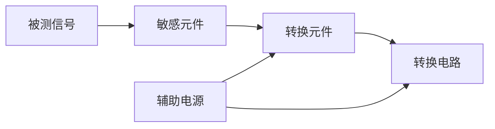

> [!tip] 这一章在讲什么
> 两件事：**传感器是什么**（定义、组成、分类）+ **怎么评价一个传感器好不好**（静态 5 指标 + 动态响应）。
> 后面第 3~9 章每一种传感器，都是套这一章的框架去分析。

## 1. 传感器是什么

**定义**：能感受规定的被测量，并按一定规律转换成可用输出信号的器件或装置。

三层含义拆开看：

1. 对被测量有"反应"
2. 输出与被测量之间**有规律的一一对应**（不是乱来）
3. 它是个器件或装置

**组成**（四部分）：

| 部件 | 干嘛的 | 例子（应变式加速度传感器） |
| --- | --- | --- |
| **敏感元件** | 直接感受被测量 | 质量块（感受惯性力） |
| **转换元件** | 把敏感元件的输出变成电量 | 应变片（形变 → 电阻变化） |
| **转换电路** | 放大、运算、调制 | 电桥 |
| **辅助电源** | 供电 | — |

> [!note] 敏感元件和转换元件经常合二为一
> 热电偶就是典型：两种金属焊在一起，**既是敏感元件（感受温度）又是转换元件（产生电动势）**。
> 所以有时说"传感器 = 敏感元件"，这种说法窄了点，但工程上常见。

## 2. 传感器的三种分类法

| 分类依据 | 分出什么 | 侧重点 |
| --- | --- | --- |
| **按工作原理** | 电参量式（电阻/电容/电感）、磁电式、压电式、光电式、热电式、半导体式 | 物理原理（**第 3~9 章就是这样分章的**） |
| **按被测量** | 位移、速度、加速度、温度、力/力矩、流量…… | 用途 |
| **按能源** | 有源（能量转换型）/ 无源（能量控制型） | 要不要外接电源 |

> [!important] 有源 vs 无源
> **有源**：自己能发电 —— 压电式、热电偶。被测量一作用就产生电信号。
> **无源**：只是参数变了 —— 电阻式、电容式。必须外接电源 + 测量电路才能输出信号。
>
> 人话：有源像"发电机"，无源像"可变电阻"。

## 3. 静态特性（输入不变或变化很慢时）

五个指标，**公式长得都一样：某个最大偏差 ÷ 满量程 × 100%**。

$$ \gamma = \pm \frac{\Delta_{\max}}{Y_{FS}} \times 100\% $$

| 指标 | 符号 | 人话 | 类比 |
| --- | --- | --- | --- |
| **线性度** | $\gamma_L = \pm\dfrac{\Delta L_{\max}}{Y_{FS}}\times100\%$ | 刻度均匀不均匀 | 尺子的刻度是不是等距 |
| **灵敏度** | $S = \dfrac{dy}{dx}$ | 输入变 1 个单位，输出变多少 | 加 1 kg，秤的读数跳几格 |
| **迟滞** | $\gamma_H = \pm\dfrac{\Delta H_{\max}}{Y_{FS}}\times100\%$ | 正着走和反着走读数不一样 | 弹簧秤加上去和减下来读数对不上 |
| **重复性** | $\gamma_R = \pm\dfrac{\Delta R_{\max}}{Y_{FS}}\times100\%$ | 同样操作几次，结果一不一致 | 连称三次，读数抖不抖 |
| **温漂/零漂** | $\xi = \dfrac{y_t - y_{20}}{\Delta t \cdot h}$ | 没输入时读数自己慢慢跑 | 电子秤空着，数字还在变 |

> [!warning] 三个易混点
> 1. **灵敏度不是误差**，越大越好（越灵敏）；其余四个都是误差，越小越好
> 2. **迟滞 vs 重复性**：迟滞 = 正反行程差多少；重复性 = 同一方向多次差多少
> 3. 分母永远是**满量程 $Y_{FS}$**，不是当前测量值

**线性度怎么来的**：实际输入输出是曲线 $y = a_0 + a_1x + a_2x^2 + \dots$，我们希望它是直线，就用拟合直线近似，两者最大偏差就是 $\Delta L_{\max}$。拟合方法有 5 种（理论拟合、过零旋转、端点连线、端点连线平移、**最小二乘法**），最小二乘法最常用（第 1 章学过）。

> [!example] 例：位移传感器（0~5 mm，输出 0~25 mV）
> 端点连线拟合 → $y = 5x$，灵敏度 $S = 25/5 = 5$ mV/mm
> 最大偏差 1 mV → 线性度 $\gamma_L = 1/25 = \pm4\%$
> 正反行程最大差 2 mV → 迟滞 $\gamma_H = 2/25 = \pm8\%$
> 同方向多次最大差 1 mV → 重复性 $\gamma_R = 1/25 = \pm4\%$

## 4. 动态特性（输入变化快时）

**核心问题：输出能不能跟得上输入的变化。**

通式是一个微分方程，$n$ 是阶数：

$$ a_n \frac{d^n y}{dt^n} + \dots + a_1\frac{dy}{dt} + a_0 y = b_m \frac{d^m x}{dt^m} + \dots + b_0 x $$

### 4.1 零阶、一阶、二阶

| 阶数 | 方程 | 传递函数 | 响应特点 |
| --- | --- | --- | --- |
| **零阶** | $y = kx + b$ | $k$ | 完全跟随，**无滞后** |
| **一阶** | $\tau\dfrac{dy}{dt} + y = x$ | $H(s) = \dfrac{1}{\tau s + 1}$ | 指数上升，慢慢逼近 |
| **二阶** | $\dfrac{d^2y}{dt^2} + 2\xi\omega_n\dfrac{dy}{dt} + \omega_n^2 y = \omega_n^2 x$ | $H(s) = \dfrac{\omega_n^2}{s^2 + 2\xi\omega_n s + \omega_n^2}$ | 可能振荡 |

**一阶的阶跃响应**：

$$ y(t) = 1 - e^{-t/\tau} $$

> 人话：把室温温度计插进热水里 —— 读数不是瞬间跳到 100℃，而是一点点爬上去。
> **时间常数 $\tau$** 就是"爬的快慢"：
> $t = \tau$ → 到 63%；$t = 3\tau$ → 到 95%；$t = 5\tau$ → 到 99%。
> 所以工程上说"等 3~5 倍时间常数就认为稳定了"。

**二阶的阶跃响应**取决于**阻尼比 $\xi$**：

| $\xi$ | 状态 | 表现 |
| --- | --- | --- |
| $\xi = 0$ | 无阻尼 | 等幅振荡，永远晃 |
| $0 < \xi < 1$ | 欠阻尼 | 衰减振荡（**最典型**） |
| $\xi = 1$ | 临界阻尼 | 不振荡，最快回稳 |
| $\xi > 1$ | 过阻尼 | 不振荡，慢慢爬 |

> 人话：汽车悬挂。$\xi$ 太小 → 过个坎晃半天；$\xi$ 太大 → 硬邦邦回位慢；$\xi \approx 0.7$ 最舒服（超调量只有 5%）。

### 4.2 时域指标（看阶跃响应曲线）

| 指标 | 含义 |
| --- | --- |
| 时间常数 $\tau$ | 越小响应越快 |
| 延时时间 $t_d$ | 到稳态值 50% 的时间 |
| 上升时间 $t_r$ | 到稳态值 90% 的时间 |
| 超调量 $\sigma$ | 冲过稳态值多少 |
| 超调时间 $t_p$ | 冲到最高点的时间 |

### 4.3 频域分析（输入是正弦信号时）

把传递函数里的 $s$ 换成 $j\omega$ 即可。

**一阶**：

$$ A(\omega) = \frac{1}{\sqrt{1 + (\omega\tau)^2}} \qquad \Phi(\omega) = -\arctan(\omega\tau) $$

**二阶**：

$$ A(\omega) = \frac{1}{\sqrt{\left[1-\left(\frac{\omega}{\omega_n}\right)^2\right]^2 + \left(2\xi\frac{\omega}{\omega_n}\right)^2}} $$

> [!important] 频域在说什么
> 输入变化太快（频率高）时，传感器跟不上 → **幅值缩水** + **相位滞后**。
> 一阶的经验值：$\omega\tau = 1$ 时幅值只剩 0.707（−3 dB）。
>
> 两个常用频带：
> **通频带 $\omega_{0.707}$** = 幅值降到 0.707 的频率范围
> **工作频带 $\omega_{0.95}$** = 幅值误差 ±5% 以内的频率范围

> [!example] 例：温度传感器（一阶，$\tau_0 = 120$ s）
> 介质温度从 25℃ 突升到 300℃，350 s 后示值？
> $$ T_2 = T_1 + k(1 - e^{-t/\tau_0}) = 25 + 275 \times (1 - e^{-350/120}) = 285.2 \, ^\circ\text{C} $$
> （真值 300℃，350 秒后还差 15℃ —— 这就是动态滞后）

## 5. 标定

**标定** = 用更高等级的标准器具，给传感器定出"输入→输出"的刻度，同时确定误差。

> [!danger] 硬性要求
> 标准器具的精度等级必须**比被标定传感器至少高一级**。
> 用同级别的去标定是没意义的。

**静态标定步骤**（五步）：

1. 全量程分成若干个点
2. **由小到大**逐点输入，记录输出
3. **由大到小**逐点输入，记录输出
4. 正反行程**反复循环多次**
5. 数据处理，算出线性度、灵敏度、迟滞、重复性

（正因为要做正反行程，才能算出迟滞；正因为要循环多次，才能算出重复性 —— 这几个指标是这么来的。）

**动态标定**：输入标准**阶跃**信号 → 测时间常数、上升时间；输入标准**正弦**信号 → 测工作频带、通频带。

## 速记表

| 想表达什么 | 用什么指标 |
| --- | --- |
| 输出对输入敏感不敏感 | 灵敏度 $S$（越大越好） |
| 刻度匀不匀 | 线性度 $\gamma_L$ |
| 正反行程一致吗 | 迟滞 $\gamma_H$ |
| 多次测量稳不稳 | 重复性 $\gamma_R$ |
| 会不会自己跑 | 零漂 / 温漂 |
| 反应快不快 | 时间常数 $\tau$、上升时间 $t_r$ |
| 会不会冲过头 | 超调量 $\sigma$、阻尼比 $\xi$ |
| 能测多快的信号 | 通频带 $\omega_{0.707}$、工作频带 $\omega_{0.95}$ |

## 章后习题

1. 传感器通常由哪几部分组成？为什么说传感器组成的概念还在不断拓展？
2. 静态特性指标主要有哪些？写出表达式。
3. 时间常数 0.355 s 的一阶传感器，测周期 1 s / 2 s / 3 s 的正弦信号，幅值误差各是多少？
4. 某传感器微分方程 $30\dfrac{dy}{dt} + 3y = 0.15x$（$y$ 为 mV，$x$ 为 ℃），求时间常数 $\tau$ 和静态灵敏度 $k$，并写出阶跃响应。
5. 一阶传感器受阶跃作用：$t=0$ 时输出 10 mV，$t \to \infty$ 时 100 mV，$t=5$ s 时 50 mV。求时间常数。
6. 用一阶传感器测 100 Hz 正弦信号，要求幅值误差 ≤ ±5%，时间常数应取多少？改用 50 Hz 时误差多少？
7. 二阶传感器 $f_0 = 20$ kHz，$\xi = 0.1$，要求幅值误差 < 3%，求工作频率范围。
