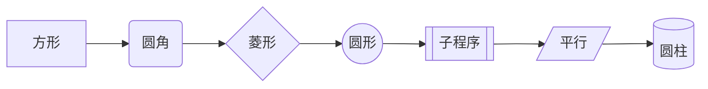
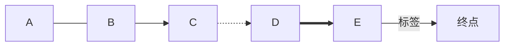
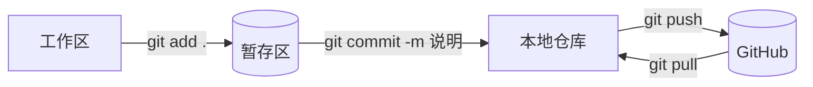

打开就看到效果，源码折在下面，点箭头展开。

## 提示框 Callout

> [!note] 这是 note
> 最常用的基础款。

> [!tip] 这是 tip
> 放技巧、建议。

> [!warning] 这是 warning
> 提醒注意，标黄。

> [!danger] 这是 danger
> 最严重，标红。

> [!quote] 这是 quote
> 用来放引用别人的话。

> [!example]- 源码在这里（点左边的箭头）
> ```markdown
> > [!note] 标题可以省略
> > 内容，多行就每行都加 >
>
> > [!warning]- 结尾加减号：默认折叠
> > 藏在里面的内容
>
> > [!tip]+ 结尾加加号：默认展开
> ```

全部类型：`note` `abstract` `summary` `info` `todo` `tip` `success` `question` `warning` `failure` `danger` `bug` `example` `quote`

## 公式

行内写法：质能方程 $E = mc^2$，混在句子里没问题。

独占一行：

$$
S = \sum_{i=1}^{n} \frac{(x_i - \bar{x})^2}{n}
$$

| 源码 | 效果 |
| --- | --- |
| `$x^2$` `$x_i$` | $x^2$ $x_i$ |
| `$\frac{a}{b}$` | $\frac{a}{b}$ |
| `$\sqrt{x}$` | $\sqrt{x}$ |
| `$\sum_{i=1}^{n}$` `$\int_0^1$` | $\sum_{i=1}^{n}$ $\int_0^1$ |
| `$\alpha \beta \pi \Delta$` | $\alpha \beta \pi \Delta$ |
| `$\pm \times \div \neq \leq \geq \approx$` | $\pm \times \div \neq \leq \geq \approx$ |
| `$\vec{a}$` `$\hat{y}$` | $\vec{a}$ $\hat{y}$ |
| `$\begin{matrix} a & b \\ c & d \end{matrix}$` | $\begin{matrix} a & b \\ c & d \end{matrix}$ |

> [!example]- 源码在这里
> ```markdown
> 行内：$E = mc^2$
>
> $$
> S = \sum_{i=1}^{n} \frac{(x_i - \bar{x})^2}{n}
> $$
> ```

## Mermaid 图

**所有节点形状**：方形 → 圆角 → 菱形 → 圆形 → 子程序 → 平行四边形 → 圆柱



**所有连线样式**：



**Git 三步**：



> [!example]- 源码在这里
> ```mermaid
> graph LR
>   A[工作区] -->|git add .| B[(暂存区)]
>   B -->|git commit -m 说明| C[本地仓库]
>   C -->|git push| D[(GitHub)]
>   D -.->|git pull| C
> ```

第一行换成 `TD` 就是从上往下排。其他图型：`sequenceDiagram` 时序、`mindmap` 思维导图、`pie` 饼图、`gantt` 甘特图、`classDiagram` 类图、`erDiagram` 实体关系图、`timeline` 时间线。

> [!danger] Mermaid 最容易报错的地方
> `-->` 两边必须是**节点 ID**，ID 只能是字母数字，**不能有空格、句点、横线**。
>
> ❌ `git add . --> git push`（报错 `Expecting 'LINK', got 'NODE_STRING'`）
> ✅ `A[git add .] --> B[git push]`
>
> 要显示带空格或符号的文字，一律套一层 `ID[文字]`。文字里的双引号写成 `#quot;`。

## 行内强调

这里**加粗**，这里==高亮==，这里~~删除线~~，这里 `行内代码`。

任务清单：

- [x] 已完成的任务
- [ ] 待办的任务

> [!example]- 源码在这里
> ```markdown
> 这里**加粗**，这里==高亮==，这里~~删除线~~，这里 `行内代码`。
>
> - [x] 已完成的任务
> - [ ] 待办的任务
> ```

| 语法 | 作用 |
| --- | --- |
| `[[笔记\|显示成别的字]]` | 带别名的双链 |
| `[[笔记#某个标题]]` | 链到段落 |
| `![[笔记]]` | 整篇嵌入进来 |
| `![[图片.png\|300]]` | 嵌入并指定宽度 |
| `%%这段不显示%%` | 注释 |
| `#父/子` | 嵌套标签 |
| 段尾加 `^块id` | 之后用 `[[#^块id]]` 链到这一段 |
| `正文[^1]` + 文末 `[^1]: 注释` | 脚注 |

## 三条硬规则

> [!danger] 记住就不会翻车
> 1. **Mermaid 的 ID 不能有空格和句点** —— 一律 `A[文字]` 套起来
> 2. **正文写价格要转义** —— `$5` 会被当公式吃掉，写成 `\$5`
> 3. **本地能看 ≠ 网站能看** —— Obsidian 用 MathJax、网站用 KaTeX，复杂公式发布前跑一次 `npx quartz build --serve` 预览确认

## 参考

- 公式能写哪些符号：[KaTeX 支持的函数](https://katex.org/docs/supported.html)
- Mermaid 在线编辑器（边写边看）：<https://mermaid.live>
