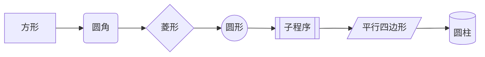
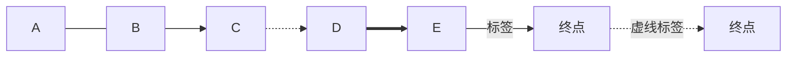
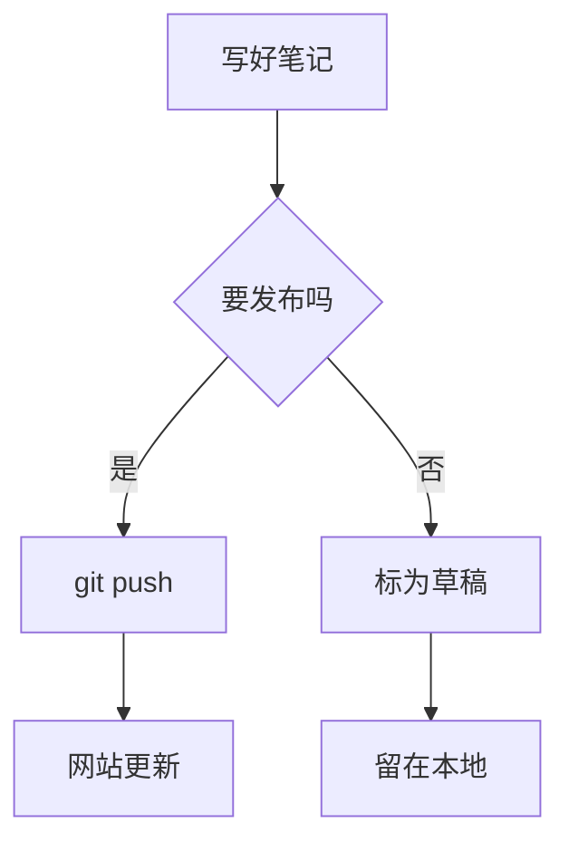
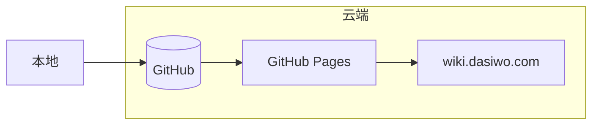
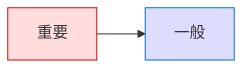
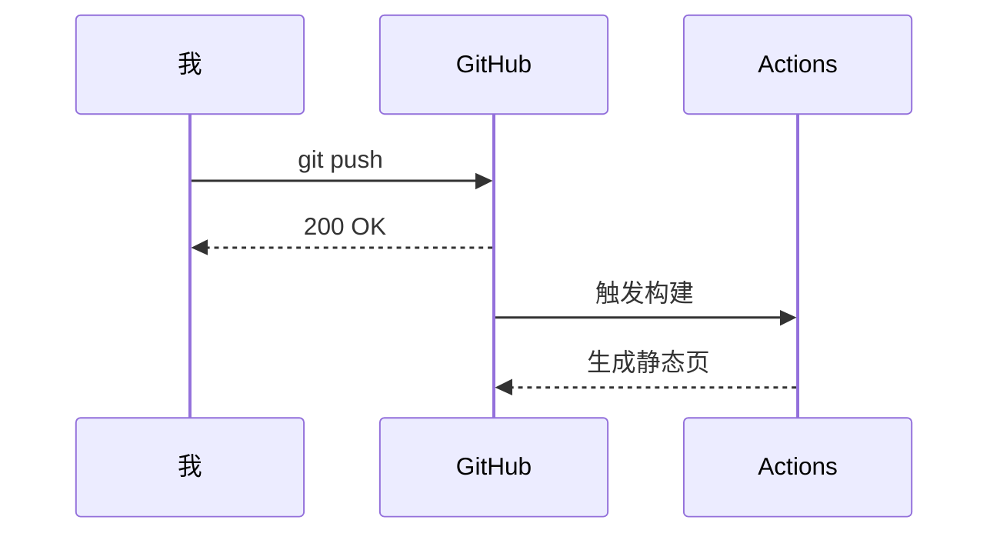
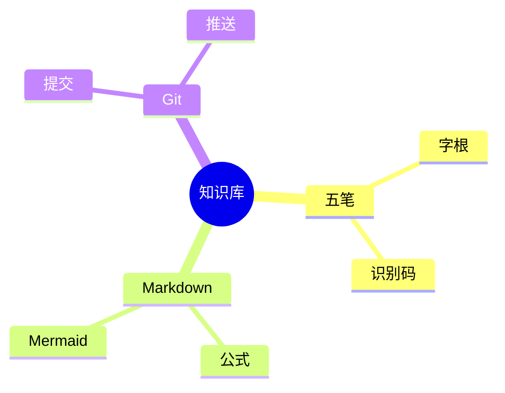
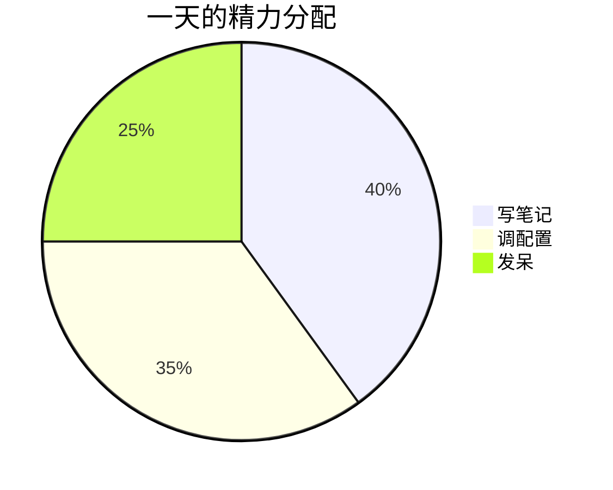
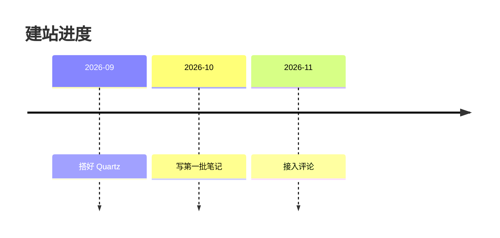
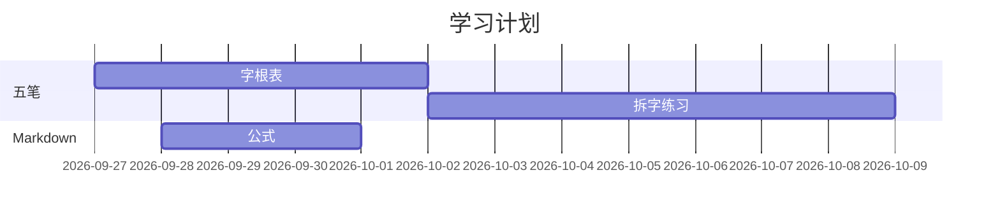

代码块的语言写 `mermaid`，Obsidian 和网站都能直接渲染成图。

> [!tip] 这篇笔记怎么看
> 每节都是**先出图，下面紧跟源码块**。源码块用的是 `text` 语言标记，这样 Obsidian 不会把它渲染成图，你才看得到原始代码。自己写的时候记得把 `text` 换回 `mermaid`。

## 方向

第一行 `graph <方向>`：

| 写法 | 排布 |
| --- | --- |
| `LR` | 从左到右 |
| `TD` / `TB` | 从上到下 |
| `RL` | 从右到左 |
| `BT` | 从下到上 |

## 节点形状



```text
graph LR
  A[方形] --> B(圆角) --> C{菱形}
  C --> D((圆形)) --> E[[子程序]]
  E --> F[/平行/] --> G[(圆柱)]
```

| 写法 | 形状 | 一般用来 |
| --- | --- | --- |
| `A[文字]` | 方形 | 普通步骤（默认） |
| `A(文字)` | 圆角 | 开始、结束 |
| `A{文字}` | 菱形 | 判断、分支 |
| `A((文字))` | 圆形 | 连接点 |
| `A[[文字]]` | 子程序 | 可展开的流程 |
| `A[/文字/]` | 平行四边形 | 输入、输出 |
| `A[(文字)]` | 圆柱 | 数据库、存储 |

## 连线样式



```text
graph LR
  A --- B
  B --> C
  C -.-> D
  D ==> E
  E --标签--> F[终点]
  F -. 虚线标签 .-> G[终点]
```

| 写法 | 效果 |
| --- | --- |
| `---` | 无箭头直线 |
| `-->` | 实线箭头 |
| `-.->` | 虚线箭头 |
| `==>` | 粗线箭头 |
| `-->\|标签\|` | 实线带文字 |
| `-- 标签 -->` | 同上，另一种写法 |
| `-. 标签 .->` | 虚线带文字 |

## 判断分支



```text
graph TD
  A[写好笔记] --> B{要发布吗}
  B -->|是| C[git push]
  B -->|否| D[标为草稿]
  C --> E[网站更新]
  D --> F[留在本地]
```

## 分组（subgraph）



```text
graph LR
  A[本地] --> B[(GitHub)]
  subgraph 云端
    B --> C[GitHub Pages]
    C --> D[wiki.dasiwo.com]
  end
```

## 给节点上色



```text
graph LR
  A[重要] --> B[一般]
  style A fill:#fdd,stroke:#c00
  style B fill:#ddf,stroke:#06c
```

## 时序图 sequenceDiagram



```text
sequenceDiagram
  我->>GitHub: git push
  GitHub-->>我: 200 OK
  GitHub->>Actions: 触发构建
  Actions-->>GitHub: 生成静态页
```

`->>` 实线箭头，`-->>` 虚线（返回），`Note over A: 说明` 加注释。

## 思维导图 mindmap



```text
mindmap
  root((知识库))
    五笔
      字根
      识别码
    Markdown
      公式
      Mermaid
    Git
      提交
      推送
```

## 饼图 pie



```text
pie title 一天的精力分配
  "写笔记" : 40
  "调配置" : 35
  "发呆" : 25
```

## 时间线 timeline



```text
timeline
  title 建站进度
  2026-09 : 搭好 Quartz
  2026-10 : 写第一批笔记
  2026-11 : 接入评论
```

## 甘特图 gantt



```text
gantt
  title 学习计划
  dateFormat YYYY-MM-DD
  section 五笔
  字根表 :a1, 2026-09-27, 5d
  拆字练习 :after a1, 7d
  section Markdown
  公式 :2026-09-28, 3d
```

## 其他图型

`classDiagram` 类图、`erDiagram` 实体关系图、`quadrantChart` 四象限、`gitGraph` 分支图、`flowchart` 是 `graph` 的新写法（功能更多）。

## 必踩的坑

> [!danger] ID 里不能有空格和符号
> `-->` 两边必须是**节点 ID**，只能是字母数字。想显示带空格、句点、横线的文字，一律套 `ID[文字]`。
>
> ❌ `git add . --> git push` → 报错 `Expecting 'LINK', got 'NODE_STRING'`
> ✅ `A[git add .] --> B[git push]`
>
> 文字里的双引号要写成 `#quot;`，或者换成中文引号、单引号。

> [!warning] 两个小问题
> 1. 节点文字里出现 `()` 时用引号包起来：`A["函数 (简写)"]`
> 2. `end` 是 subgraph 的结束关键字，不能当普通节点 ID

## 参考

- 官方文档：<https://mermaid.js.org/intro/>
- 在线编辑器（边写边看）：<https://mermaid.live>
