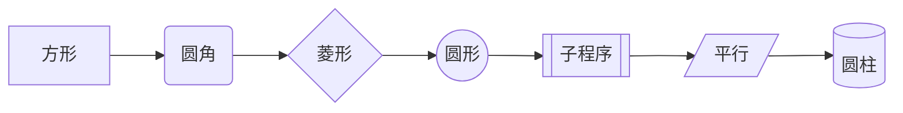
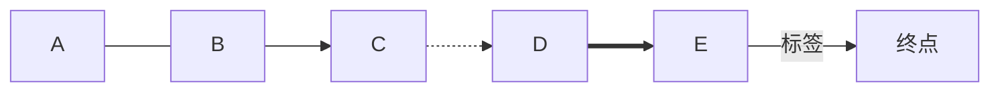
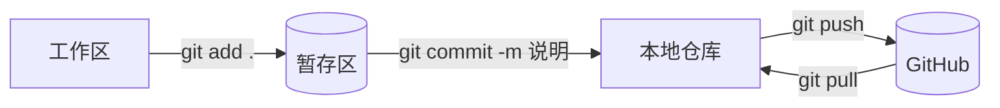

## Mermaid 图

**所有节点形状**：方形 → 圆角 → 菱形 → 圆形 → 子程序 → 平行四边形 → 圆柱



**所有连线样式**：



**Git 三步**：



> [!example]- 源码在这里
> ```mermaid
> graph LR
>   A[工作区] -->|git add .| B[(暂存区)]
>   B -->|git commit -m 说明| C[本地仓库]
>   C -->|git push| D[(GitHub)]
>   D -.->|git pull| C
> ```

第一行换成 `TD` 就是从上往下排。其他图型：`sequenceDiagram` 时序、`mindmap` 思维导图、`pie` 饼图、`gantt` 甘特图、`classDiagram` 类图、`erDiagram` 实体关系图、`timeline` 时间线。

> [!danger] Mermaid 最容易报错的地方
> `-->` 两边必须是**节点 ID**，ID 只能是字母数字，**不能有空格、句点、横线**。
>
> ❌ `git add . --> git push`（报错 `Expecting 'LINK', got 'NODE_STRING'`）
> ✅ `A[git add .] --> B[git push]`
>
> 要显示带空格或符号的文字，一律套一层 `ID[文字]`。文字里的双引号写成 `#quot;`。
