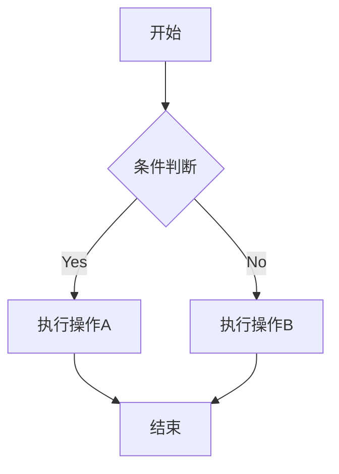
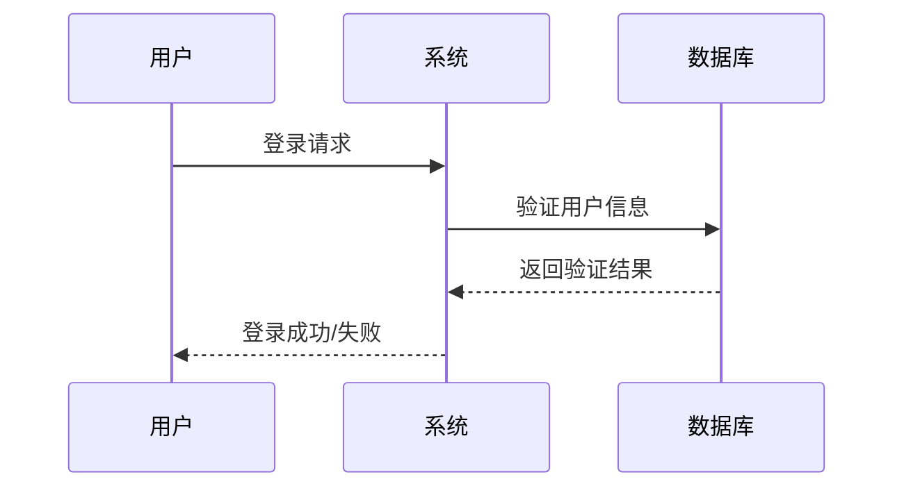
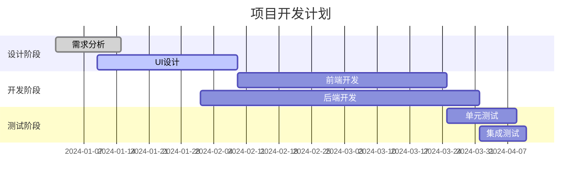
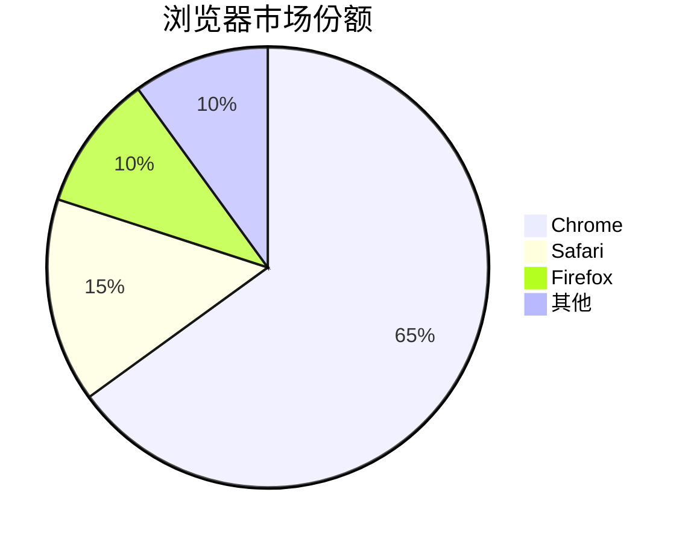
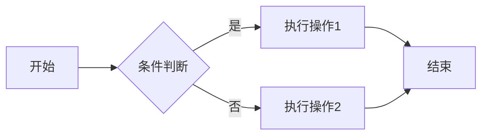
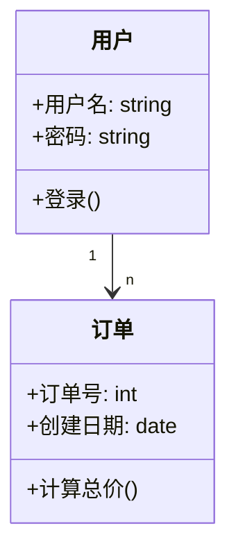
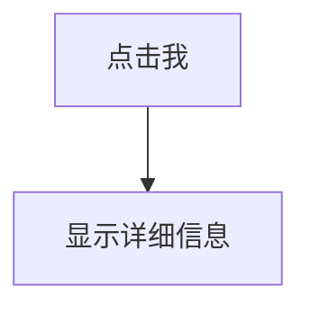

### Mermaid

Mermaid 是最流行的 Markdown 图表工具之一，它允许你使用简单的文本语法生成各种图表。

#### 支持图表类型：

- 流程图 (Flowchart)
- 序列图 (Sequence Diagram)
- 类图 (Class Diagram)
- 状态图 (State Diagram)
- 甘特图 (Gantt Chart)
- 饼图 (Pie Chart)

### 流程图

````

````

预览：


### 时序图和甘特图

#### 时序图（Sequence Diagram）

````

````


#### 甘特图（Gantt Chart）

````

````

预览：


### 饼图

````

````


### 流程图 (Flowchart)

流程图是最常用的图表类型，用于展示过程或算法流程。

````

````


### 类图 (Class Diagram)

类图用于面向对象设计，展示类及其关系。

````

````


### 交互式图表

一些工具支持添加交互功能

````

````


