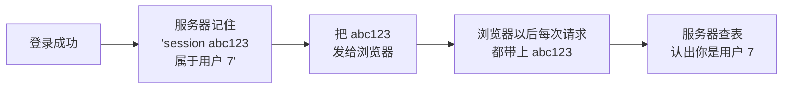

---
title:
aliases:
tags:
  - php
description: Cookie 和 Session 分别存在哪、各自适合放什么、怎么做登录状态和退出，以及为什么 Cookie 不能信。
---

# Cookie 和 Session，让服务器记住你

## 为什么需要这两样东西

HTTP 是"一次请求一次响应，然后大家互相不认识"的。你点一下导航去了下一页，服务器**完全不知道刚才是谁点了上一页**。

但登录状态必须跨页面保持。这套东西就是为了解决这个问题：



做法有两种：Cookie 直接把信息交给浏览器，Session 把信息留在服务器、只给浏览器一个编号号牌。

## Cookie：存在用户电脑上

```php
<?php
// 设置：名字，值，过期时间戳
setcookie("theme", "dark", time() + 3600);     // 一小时后过期

// 不写过期时间 = 关掉浏览器就没了（会话 Cookie）
setcookie("tmp", "abc");

// 读
echo $_COOKIE["theme"] ?? "未设置";
```

**设置 Cookie 必须在任何输出之前。** 和 `header()` 一样，前面有一个空格、一个换行都会失败。所以 `setcookie` 要写在所有 `echo` 和 HTML 之前。

删除就是把过期时间设到过去：

```php
<?php
setcookie("theme", "", time() - 3600);
```

几个要点：

- **能看到、能改。** 用户按 F12 就能修改 Cookie 的值，也能直接删掉。所以**Cookie 里的内容一律当成"用户说了算"，不能信**。
- **容量小**，一个站点通常最多几十个、总共几 KB。
- **会跟着请求一起发**，所以别往里放大的东西。

**因此 Cookie 只适合放这些**：主题偏好、语言选择、"记住我"的随机令牌、广告来源标记。**绝不能放**：用户 ID 决定的权限（改成 1 就是管理员了）、余额、密码。

## Session：数据留在服务器上

Session 的做法是：服务器把数据存在自己这边，只给浏览器发一个随机编号（session id），编号通常是通过 Cookie 传的。

```php
<?php
session_start();          // 必须在任何输出之前

$_SESSION["username"] = "小明";     // 存
echo $_SESSION["username"];        // 读
```

`session_start()` 要做两件事：看看浏览器有没有带 session id 过来，有就把对应的数据读进 `$_SESSION`；没有就新开一个，并安排一个 Set-Cookie 发回去。**所以它必须在任何输出之前调用**，一个页面里也只调一次。

一个完整的三页流程：

```php
<?php
// login.php —— 登录成功之后
session_start();

$_SESSION["uid"] = 7;
$_SESSION["username"] = "小明";

header("Location: /member.php");
exit;
```

```php
<?php
// member.php —— 需要登录才能看的页面
session_start();

if (!isset($_SESSION["uid"])) {
    header("Location: /login.php");
    exit;
}

echo "欢迎回来，" . htmlspecialchars($_SESSION["username"]);
```

这是**判断登录状态的标准写法**，每个需要登录的页面开头都抄这一段就行。真实项目里会把它放进一个 `auth.php`，用 `require_once` 引入（第 11 篇）。

```php
<?php
// logout.php —— 退出
session_start();

$_SESSION = [];              // 清空数据
session_destroy();           // 销毁服务器上的会话文件

header("Location: /login.php");
exit;
```

三步都要做。只 `session_destroy()` 的话，当前这次请求里 `$_SESSION` 还有值。

## 对照一下

| | Cookie | Session |
| --- | --- | --- |
| 数据存哪 | 用户的浏览器 | 服务器 |
| 用户能看到吗 | 能，F12 里就是明文 | 看不到，只有一个随机编号 |
| 能改吗 | 能随便改 | 改不了（改了也找不到对应的会话） |
| 能存多少 | 几 KB | 受服务器限制，能存不少 |
| 活多久 | 由你设的过期时间决定 | 默认到浏览器关闭为止，服务器也会清理长期不用的 |
| 能跨域名吗 | 不能 | 不能 |
| 适合放什么 | 偏好设置、来源标记 | 登录状态、购物车 |

**一句话：要安全就用 Session，要"关掉浏览器还记得"就用 Cookie。**

## 登录状态该用哪个

用 Session。如果一定要"记住我、下次打开还是登录状态"，做法是生成一个随机令牌存进数据库和 Cookie，下次凭令牌重新登录——**而不是把用户名密码或者 `is_login=1` 放进 Cookie**。

那个令牌也要够长够随机：

```php
<?php
$token = bin2hex(random_bytes(32));    // 64 位十六进制字符串
```

`rand()` 和 `uniqid()` **不能用来生成令牌**，它们猜得出来。用 `random_bytes()`。

## 两个安全细节

### ① 登录成功后换一个 session id

```php
<?php
session_start();

// 校验密码通过之后
session_regenerate_id(true);

$_SESSION["uid"] = $user["id"];
```

这一步防的是"会话固定攻击"：攻击者先把自己的 session id 想办法塞给你，等你登录之后那个 id 就成了你的登录凭证。

### ② Session 也要过期

```php
<?php
session_start();

$timeout = 1800;    // 半小时不动就退出

if (isset($_SESSION["last"]) && time() - $_SESSION["last"] > $timeout) {
    $_SESSION = [];
    session_destroy();
    header("Location: /login.php");
    exit;
}

$_SESSION["last"] = time();
```

银行、后台这类场合都会这么做。

## 一个最小的登录例子

```php
<?php
session_start();

// 演示用的假用户，真实项目里从数据库查（第 19 篇）
$USERS = [
    "admin" => password_hash("admin123", PASSWORD_DEFAULT),
];

$error = "";

if ($_SERVER["REQUEST_METHOD"] === "POST") {
    $name = trim($_POST["username"] ?? "");
    $pwd  = $_POST["password"] ?? "";

    if (!isset($USERS[$name]) || !password_verify($pwd, $USERS[$name])) {
        $error = "用户名或密码不正确";
    } else {
        session_regenerate_id(true);
        $_SESSION["uid"] = 1;
        $_SESSION["username"] = $name;
        header("Location: member2.php");
        exit;
    }
}
?>
<!DOCTYPE html>
<html lang="zh-CN">
<head><meta charset="UTF-8"><title>登录</title></head>
<body>
<h1>登录</h1>

<?php if ($error !== ""): ?>
  <p style="color:red"><?php echo htmlspecialchars($error); ?></p>
<?php endif; ?>

<form method="post">
  <p>用户名：<input type="text" name="username"></p>
  <p>密码：<input type="password" name="password"></p>
  <button type="submit">登录</button>
</form>
</body>
</html>
```

```php
<?php
// member2.php
session_start();

if (!isset($_SESSION["uid"])) {
    header("Location: login.php");
    exit;
}
echo "欢迎，" . htmlspecialchars($_SESSION["username"]);
echo '<p><a href="logout.php">退出</a></p>';
```

注意错误提示写的是"用户名或密码不正确"，**没有说清是哪一个错了**。这个模糊是有意的——说得太具体，等于告诉别人"这个用户名是存在的"。

`password_verify` 是第 5 篇讲的那个，存密码用 `password_hash`，校验用 `password_verify`，别用 `md5`。

延伸阅读：[PHP Cookie - 菜鸟教程](https://www.runoob.com/php/php-cookies.html)，[PHP Session](https://www.runoob.com/php/php-sessions.html)，[PHP 官方手册：会话](https://www.php.net/manual/zh/book.session.php)，[PHP 官方手册：setcookie](https://www.php.net/manual/zh/function.setcookie.php)。

---

> 系列第 14 / 19 篇 · ← 上一步：[[13-表单验证，在服务端拦住错误|表单验证]] · 下一步：[[15-日期和时间|日期和时间]] → · 路线图：[[00-PHP 总览]]
