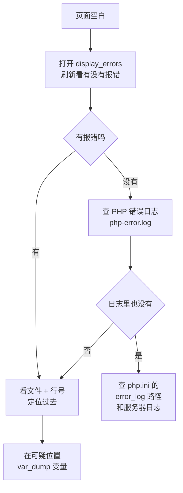

---
title:
aliases:
tags:
  - php
description: 怎么把报错打开、常见报错信息各是什么意思、用 try/catch 接住异常，以及页面一片空白时按什么顺序查。
---

# 错误处理和异常，报错怎么查

## 第一步：让报错显示出来

PHP 默认在生产环境下**不显示任何错误**。所以你最常见的现象不是看到报错，而是**页面一片空白**。

学习阶段先把报错打开，在入口文件最上面加两行：

```php
<?php
error_reporting(E_ALL);
ini_set("display_errors", "1");
```

再打开详细的警告：

```php
<?php
ini_set("display_startup_errors", "1");
```

改完之后刷新，报错会直接打在页面上，包括**文件、行号、原因**。有这条信息，一半的问题当场就解决了。

**上线前一定要关掉。** 报错里会暴露文件路径、数据库表名、甚至 SQL 语句，是给攻击者送情报。

```php
<?php
// 上线后的配置
error_reporting(E_ALL);
ini_set("display_errors", "0");
ini_set("log_errors", "1");
ini_set("error_log", __DIR__ . "/logs/php-error.log");
```

这样错误不显示给用户，但都记进日志文件，自己还能查。

## 页面一片空白时，按这个顺序查



**"一片空白"几乎都是"报了一个致命错误，但被设置关掉了"。** 打开显示，答案立刻就出来。

## 常见报错对照表

| 报错里出现 | 什么意思 | 怎么办 |
| --- | --- | --- |
| `Parse error: syntax error` | 语法错，多半是少括号、少分号 | 看它指的行，也往回看上一行 |
| `Undefined variable: $x` | 变量还没赋值就用了 | 用之前先赋值，或 `$x ?? 默认值` |
| `Undefined array key "id"` | 数组里没这个键 | 用 `isset()` 或 `??` 先判断 |
| `Trying to access array offset on value of type null` | 你以为有值，其实是 null | `var_dump` 看看上一句的结果为什么是 null |
| `Call to undefined function foo()` | 函数不存在 | 拼错了，或者扩展没开 |
| `Fatal error: Uncaught Error: Call to a member function on null` | 变量是 null，却去调它的方法 | 查上一步为什么返回 null |
| `Cannot modify header information - headers already sent` | `header()`/`setcookie()`/`session_start()` 之前已经有输出 | 把这些调用移到最前面；纯 PHP 文件去掉结尾的 `?>` |
| `Warning: include(...): Failed to open stream` | 引用的文件路径不对 | 用 `__DIR__` 拼路径 |
| `Fatal error: Allowed memory size ... exhausted` | 内存不够 | 别把大文件整个读进来；调大 `memory_limit` |
| `Maximum execution time exceeded` | 超时（默认 30 秒） | 查死循环；确实要跑很久就调 `max_execution_time` |
| `headers already sent by (output started at ...)` | 同上，括号里会告诉你哪里先输出了 | 通常是某个文件结尾多了一个空行 |
| 浏览器显示 **500 Internal Server Error** | 服务器直接崩了 | 页面看不到细节，去查服务器错误日志 |

**看不懂报错的时候，把整条信息连文件名行号一起复制去搜。** PHP 报错信息的措辞很固定，搜出来的结果一般都对得上。

## 用 `var_dump` 定位

报了错但不知道哪一步出问题，就在中间"打点"：

```php
<?php
$rows = getUsers();

var_dump($rows);        // 看看这里到底是数组还是 false
exit;                   // 停在这里，后面的不执行

foreach ($rows as $r) {
    // ...
}
```

**`exit;` 是关键。** 加它之后，页面只输出到这一行为止，不用在一堆 HTML 里找那句 `var_dump`。

更规范的做法是用 `error_log`，输出到日志而不是页面：

```php
<?php
error_log("rows = " . print_r($rows, true));
```

`print_r` 的第二个参数传 `true` 表示"返回字符串，不要直接输出"。

## `try` / `catch`：接住异常

有些错误没法用 `if` 判断，比如"数据库连不上"。这类情况 PHP 用**异常**来处理。

```php
<?php
try {
    $pdo = new PDO("mysql:host=localhost;dbname=test", "root", "");
    echo "连上了";
} catch (PDOException $e) {
    echo "连不上数据库：" . $e->getMessage();
}
```

抛异常和捕获异常是一对：

```php
<?php
function divide($a, $b) {
    if ($b == 0) {
        throw new Exception("除数不能为 0");
    }
    return $a / $b;
}

try {
    echo divide(10, 0);
} catch (Exception $e) {
    echo "出错了：" . $e->getMessage();
}
```

```text
出错了：除数不能为 0
```

`throw` 之后函数立刻结束，一层层往外找有没有 `catch`。都没接住就是致命错误。

### `finally`：不管成不成都执行

```php
<?php
try {
    $fp = fopen(__DIR__ . "/a.txt", "r");
    echo fgets($fp);
} catch (Exception $e) {
    echo "读文件失败";
} finally {
    if (isset($fp) && $fp) {
        fclose($fp);      // 不管成功失败都要关
    }
}
```

`finally` 里的代码**无论有没有抛异常都会执行**，适合放"收尾"的动作。

### 按类型分别处理

```php
<?php
try {
    // ...
} catch (InvalidArgumentException $e) {
    echo "参数不对：" . $e->getMessage();
} catch (PDOException $e) {
    echo "数据库错误";
} catch (Exception $e) {
    echo "其他错误：" . $e->getMessage();
}
```

**顺序很重要**：具体的异常类写在前面，宽泛的 `Exception` 写在最后。写反了，具体的那个永远轮不到。

### 抛出带信息的异常

```php
<?php
function checkAge(int $age): void {
    if ($age < 0 || $age > 120) {
        throw new InvalidArgumentException("年龄必须在 0 到 120 之间，收到 {$age}");
    }
}
```

**异常信息要写清"收到了什么值"**，出问题的时候不用猜。

## `@` 抑制符不要用

```php
<?php
$conn = @mysqli_connect("localhost", "root", "");
```

`@` 会把这条语句的所有报错吞掉。**看起来"干净"了，实际上是把线索一起丢了。** 真出了问题，你会花几个小时找不出原因。

正确做法是判断返回值：

```php
<?php
$data = file_get_contents($path);
if ($data === false) {
    // 处理失败
}
```

## 一个例子：把异常变成对用户友好的提示

```php
<?php
error_reporting(E_ALL);
ini_set("display_errors", "1");
date_default_timezone_set("Asia/Shanghai");

function readConfig(string $path): array {
    if (!file_exists($path)) {
        throw new RuntimeException("配置文件不存在：{$path}");
    }

    $json = file_get_contents($path);
    $data = json_decode($json, true);

    if (!is_array($data)) {
        throw new RuntimeException("配置文件格式不对：{$path}");
    }

    return $data;
}

try {
    $config = readConfig(__DIR__ . "/config.json");
    echo "站点名：" . htmlspecialchars($config["site_name"] ?? "未设置");
} catch (RuntimeException $e) {
    // 真实项目里这里一般写日志，页面上只说一句人话
    error_log($e->getMessage());
    echo "配置读取出错，请联系管理员";
}
```

```text
配置读取出错，请联系管理员
```

**`$e->getMessage()` 写进日志，页面上只说人话。** 技术细节给开发者看，用户只需要知道"出问题了、该找谁"。

延伸阅读：[PHP 错误处理 - 菜鸟教程](https://www.runoob.com/php/php-error.html)，[PHP 异常处理](https://www.runoob.com/php/php-exception.html)，[PHP 官方手册：错误与异常](https://www.php.net/manual/zh/language.errors.php)，[PHP 官方手册：预定义异常](https://www.php.net/manual/zh/spl.exceptions.php)。

---

> 系列第 17 / 19 篇 · ← 上一步：[[16-文件读写和上传|文件读写和上传]] · 下一步：[[18-JSON，和前端交换数据|JSON]] → · 路线图：[[00-PHP 总览]]
