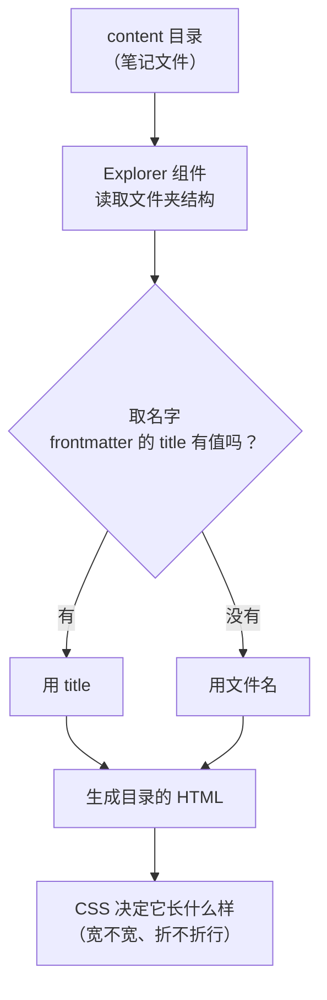

---
title:
aliases:
tags:
description: Quartz 站点的目录组件里长名字会折成两三行的原因，以及改显示名、改成单行省略号、把栏调宽三种处理办法。
---

# Quartz 目录里的长文件名折成好几行，怎么截断、缩短和加宽

用 Quartz 搭起来的知识库，左侧那一列目录会随着笔记越攒越多而变得层次很深。

层次一深、名字一长，目录就不再是整齐的一列：有的名字占一行，有的占两三行，高低错落，扫一眼很难定位到想找的那条。

这一篇专讲 **Quartz 的目录组件**（也就是 Explorer）为什么会把长名字折行，以及三条处理办法。

## 先搞清楚这个目录是怎么来的

目录不是手写的，是 Quartz 从你的笔记文件夹里**自动生成**的一棵树。整条链路是这样：



拆开看有三层，出问题的时候先判断是哪一层：

| 层 | 由什么控制 | 在哪儿改 |
| --- | --- | --- |
| **显示的名字** | frontmatter 的 `title`，没有就用文件名 | 笔记的 frontmatter / 文件名 |
| **目录的结构**（哪些文件、怎么折叠、怎么排序） | Explorer 组件本身 | `quartz.config.yaml` |
| **外观**（栏宽、文字折不折行） | CSS | `quartz/styles/custom.scss` |

下面这条要单独记一下：**目录上显示的名字，优先取 frontmatter 里的 `title`；只有 `title` 为空时才回退到文件名。** 这一点后面第一种办法要用。

顺带说一句，目录的**排序**也是这一层的事：它按显示名字做字典序比较（带数字的会当成数字排，所以 `10` 排在 `9` 后面而不是前面），跟文件在磁盘上的先后无关。

## 为什么会折成好几行

两个原因叠在一起：**组件没写截断规则**，加上**这一栏本身就窄**。

### 原因一：Explorer 组件自带的样式里，一条截断规则都没有

我把 Explorer 组件编译出来的 CSS 翻了一遍，`text-overflow` 和 `ellipsis` **出现 0 次**。

它自带的样式只管颜色、层级缩进、折叠动画这几类事，**没有任何跟文字截断相关的内容**。

所以条目文字走的是浏览器最默认的行为：一行装不下，就折到下一行接着排。

这点决定了排查方向——**这不是"少开了一个开关"**，而是这个组件压根没做这个功能。在 `quartz.config.yaml` 里翻遍配置也找不到相关选项，只能自己补样式。

### 原因二：目录这一栏本来就窄

栏宽写在 `quartz/styles/variables.scss` 里：

```scss
$sidePanelWidth: 320px; //380px;
```

目前是 320px。行尾那句 `//380px` 是 Quartz 官方的原生默认值，说明现在这个值是被人特意改窄过的。

320px 还要扣掉左右各 2rem 的内边距（一共 64px），真正留给文字的大约只有 **256px**。

而目录每往下一层，还会再吃掉一部分缩进：

| 缩进来源 | 大约宽度 |
| --- | --- |
| 每层的 `margin-left` | 6px |
| 每层的 `padding-left` | 约 13px |
| 左侧那条层级竖线 | 若干 |

| 在第几层 | 大约剩余可用宽度 |
| --- | --- |
| 第 1 层 | 256px |
| 第 2 层 | 237px |
| 第 3 层 | 218px |
| 第 4 层 | 199px |

到第三、四层只剩两百来像素，像「第9章 多元函数微分法及其应用」这种名字，两三个字就得换行。

所以长名字折行这件事，**层级越深越明显**，浅一点的目录往往看不出问题。

## 三条路，先挑一条

| 办法 | 做什么 | 适合什么情况 | 代价 |
| --- | --- | --- | --- |
| **一、改显示的名字** | 给笔记填一个更短的 frontmatter `title` | 只想让少数几条变短；或者目录层级太深，再怎么加宽也不够 | 要逐条改，文件多了麻烦 |
| **二、改成单行省略号** | 在 `custom.scss` 里加截断规则 | 想让整个目录整齐划一，一次生效 | 名字后半段依然看不见 |
| **三、把这一栏加宽** | 覆盖栏宽 | 想真的看到完整名字 | 正文区域会变窄 |

也可以两条一起上：先加宽一点，再让仍然超出的部分显示省略号。

## 办法一：把显示的名字改短（不用碰 CSS）

目录显示的是 frontmatter 的 `title`，所以只要给它填一个更短的值，目录上就短了，**文件名、网址、双链、搜索全都照旧**。

比如一个文件叫 `01-换行到底怎么回事，回车、两空格、空行有什么区别.md`，可以给它填：

```yaml
---
title: 01-换行怎么回事
---
```

目录上就只显示「01-换行怎么回事」，点进去还是原来那篇。

几个要注意的点：

- **序号别丢**。系列笔记靠文件名里的两位序号（`01-`、`02-`）排序，如果 `title` 里不带序号，目录上就看不出顺序了。所以 `title` 建议保留前缀，只砍掉后面那半句。
- **回退规则**：`title` 一旦有值就永远用它；想恢复用文件名，把 `title` 清空就行。
- 适合的是"少数几条特别长的"，如果整站几十条都长，还是用办法二更省事。

## 办法二：让超出的部分显示成省略号

改一个文件：`quartz/styles/custom.scss`。

<svg viewBox="0 0 680 300" style="max-width:100%;height:auto" xmlns="http://www.w3.org/2000/svg">
  <rect x="24" y="36" width="300" height="230" rx="8" fill="var(--light)" stroke="var(--lightgray)"/>
  <text x="40" y="24" font-size="12" font-weight="600" fill="var(--dark)">现在：装不下就折行</text>

  <text x="48" y="76" font-size="13" fill="var(--darkgray)">智能制造工程</text>
  <text x="66" y="106" font-size="13" fill="var(--darkgray)">高等数学下册</text>
  <text x="84" y="136" font-size="13" fill="var(--darkgray)">第9章 多元函数微分法</text>
  <text x="84" y="156" font-size="13" fill="var(--darkgray)">及其应用</text>
  <text x="102" y="186" font-size="13" fill="var(--darkgray)">9.10 最小二乘法</text>
  <rect x="78" y="120" width="228" height="46" rx="4" fill="none" stroke="var(--tertiary)" stroke-dasharray="4 3"/>
  <text x="78" y="212" font-size="11" fill="var(--tertiary)">一个名字占两行，目录被撑高</text>

  <rect x="356" y="36" width="300" height="230" rx="8" fill="var(--light)" stroke="var(--lightgray)"/>
  <text x="372" y="24" font-size="12" font-weight="600" fill="var(--dark)">改后：一行 + 省略号</text>

  <text x="380" y="76" font-size="13" fill="var(--darkgray)">智能制造工程</text>
  <text x="398" y="106" font-size="13" fill="var(--darkgray)">高等数学下册</text>
  <text x="416" y="136" font-size="13" fill="var(--darkgray)">第9章 多元函数微分法及<tspan fill="var(--tertiary)">…</tspan></text>
  <text x="434" y="166" font-size="13" fill="var(--darkgray)">9.10 最小二乘法</text>
  <rect x="410" y="120" width="228" height="26" rx="4" fill="none" stroke="var(--tertiary)" stroke-dasharray="4 3"/>
  <text x="410" y="212" font-size="11" fill="var(--tertiary)">每项都是一行，整齐、目录更短</text>
</svg>

### 为什么写在 custom.scss

`quartz/styles/custom.scss` 是官方文档明确指定的自定义样式入口。Quartz 官方 Layout 页的原话是：

> You can see the base style sheet in `quartz/styles/base.scss` and write your own in `quartz/styles/custom.scss`.

出处：[Quartz 官方文档 · Layout](https://quartz.jzhao.xyz/layout)

它比别的位置好在两点：

1. **优先级天然更高**。构建时它被拼在框架样式**之后**，而且不在 `@layer quartz-base` 这一层里，所以同优先级下它是后写的，直接压过组件自带样式，不用写一堆 `!important`。
2. **不会被升级覆盖**。`quartz/` 目录下那些文件是框架自带的（包括 `variables.scss`、`base.scss`），以后更新 Quartz 可能被覆盖或者产生冲突；`custom.scss` 是留给使用者的，改动是安全的。

### 要加的那段代码

```scss
.explorer-content {
  // 可收缩的层级，全部放开压缩限制
  li,
  .folder-container,
  .folder-container > div {
    min-width: 0;
  }

  // 文件夹名那一行：让文字块吃掉箭头之外的剩余宽度
  .folder-container > div {
    flex: 1 1 auto;
  }

  // 笔记文件名
  a.nav-file-title,
  .folder-container > div > a {
    display: block;
    min-width: 0;
    max-width: 100%;
    overflow: hidden;
    white-space: nowrap;
    text-overflow: ellipsis;
  }

  // 文件夹名（可折叠的那些）
  .folder-button,
  .folder-title {
    min-width: 0;
    max-width: 100%;
  }

  .folder-title {
    display: block;
    overflow: hidden;
    white-space: nowrap;
    text-overflow: ellipsis;
  }

  // 左边的小文件夹图标 / 展开箭头不要被挤掉
  .folder-icon {
    flex-shrink: 0;
  }
}
```

最后那条 `.folder-icon { flex-shrink: 0 }` 是配套的：文字块可以随便压，图标不行，否则窄的时候图标先被压扁。

> [!warning] 有一个坑，`min-width: 0` 千万别漏
> 目录里的每一项都是 flex 布局的子项，而 flex 子项默认 `min-width: auto`，意思是"我拒绝被压到比我的内容更窄"。
> 不显式写成 `0`，文字块就永远保持内容宽度、永不产生溢出，省略号**永远不会出现**——代码明明写着，页面上看起来却跟没改一样。

这段 CSS 每一行为什么这么写、原理是什么，展开下面的折叠块有完整说明。只想知道怎么改的话，跳过也不影响。

<details>
<summary>补充：CSS 单行省略号的通用原理（换个场景也用得上）</summary>

这套写法不只在 Quartz 里有意义，任何"一段文字要在一行内显示、超出部分用省略号"的场景都是同一套东西。

**三个属性缺一不可：**

| 属性 | 作用 | 少了它会怎样 |
| --- | --- | --- |
| `white-space: nowrap` | 禁止折行 | 文字照旧折成好几行 |
| `overflow: hidden` | 允许把装不下的部分裁掉 | 文字直接冲出容器边界，压到旁边内容上 |
| `text-overflow: ellipsis` | 在被裁掉的位置画省略号 | 文字被硬生生切断，看不出后面还有内容 |

这不是经验总结，是 CSS 规范本身的要求。MDN 上写得很直白：

> `text-overflow` 属性并不会强制"溢出"事件的发生，因此为了能让文本能够溢出容器，你需要在元素上添加几个额外的属性：`overflow` 和 `white-space`。

出处：[MDN · text-overflow](https://developer.mozilla.org/zh-CN/docs/Web/CSS/text-overflow)

**加上 `min-width: 0` 是第四个条件**，而且它最容易漏。

原因是 flex 子项有一条默认规则 `min-width: auto`：一个 flex 项不会自动被压缩到比它的内容更窄。于是容器只有 256px、文字有 300px 时，浏览器会认为"300px 就是我的最小宽度"，文字块保持原宽**不产生溢出**，省略号自然不触发。

所以必须显式写 `min-width: 0` 把这条默认规则关掉。

**通用结论**：给 flex 子项加省略号，`min-width: 0` 基本是必需品。

另外两个排查要点：

- 规则要加在**真正装着文字的那个元素**上。目录里文字通常套在 `<a>` 或 `<span>` 里，给外层 `li` 设 `overflow: hidden` 是没用的。
- 同一条链路上（父级、子级）都要放开压缩限制，只改最里层往往不够，所以上面的代码对 `li`、容器、文字块三层都写了 `min-width: 0`。

</details>

## 办法三：把目录这一栏加宽

截断只是让目录变整齐，**能看见的字数并没有变多**。想真的看全名字，得把栏加宽。

宽度有两种改法：

| 改哪里 | 怎么写 | 优点 | 代价 |
| --- | --- | --- | --- |
| `variables.scss` 里的 `$sidePanelWidth` | 改一个数 | 最直观，一处生效 | 框架自带的文件，升级可能被覆盖或产生冲突 |
| `custom.scss` 里覆盖栅格 | 加一段 CSS | 不会被覆盖 | 要自己写两个断点 |

推荐第二种。宽度最终由页面容器的栅格决定，直接覆盖就行：

```scss
// 桌面端（窗口 ≥1200px）：三栏，左右两栏同宽
@media all and (min-width: 1200px) {
  .page > #quartz-body {
    grid-template-columns: 380px auto 380px;
  }
}

// 平板端（800~1200px）：两栏，只有左栏
@media all and (min-width: 800px) and (max-width: 1200px) {
  .page > #quartz-body {
    grid-template-columns: 380px auto;
  }
}
```

两个断点的数值（800 / 1200）来自 `variables.scss` 里的 `$breakpoints`，写成同样的数字，行为才和框架一致。

380px 就是官方的原生默认值。想更宽就把两个 `380px` 一起改，**两处要同时改**，不然平板上还是窄的。

还有个不动栏宽的办法：**把侧边栏左右的内边距从 2rem 收到 1rem**，能白捡 32px 给文字，而且完全不挤压正文宽度。

## 改完怎么确认生效

1. **重新构建一次**（`npx quartz build`），刷新页面看目录。只改了 `custom.scss` 也要重新构建，样式是构建时打进去的。
2. **确认样式进了产物**：打开构建输出目录里任意一个 `.html`，搜 `text-overflow`，应该能搜到，并且位置在框架样式之后。
3. **省略号还是不出来，按这个顺序查**：
   - `min-width: 0` 写了吗？这是最常见的漏项。
   - `white-space: nowrap` 和 `overflow: hidden` 都写了吗？
   - 选择器选中的是不是真正装文字的那个元素？
   - 是不是被别的、优先级更高的规则盖掉了？（浏览器开发者工具里能直接看到哪条生效）

## 不想要了怎么还原

把 `custom.scss` 里对应那一段删掉、重新构建，就回到默认的折行行为。

因为改动全部集中在这一个文件里，组件、框架、配置都没碰，还原很干净，不留后遗症。
