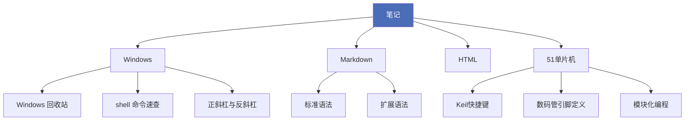

# 第二大脑

这里放我学过的东西。

写得比较随意——遇到什么记什么，搞懂了就展开写细，没搞懂就标着待查证。

## 区域

| 区域 | 内容 |
|---|---|
| 笔记 | Windows 技巧、Markdown、HTML、51 单片机 |
| 手册 | 这个库自己的规则、结构与维护方式 |
| 词库 | 英语单词与缩写 |
| 提示词 | 复用prompt |
| 日记 | 日常记录 |
| 项目 | 正在推进的事 |
| 领域 | 长期在管的事 |
| 资料 | 参考资料 |

## 笔记分布

## 从哪开始

- 想查 Windows 上的操作：[[Windows 回收站]] · [[shell 命令速查]]
- 想写 Markdown：[[Obsidian 语法速查]]
- 在折腾单片机：[[Keil快捷键]] · [[单片机引脚接错程序正确不亮灯]]
- 想系统学 HTML：[[相对路径和绝对路径]] · [[URL 与 URL编码]]
