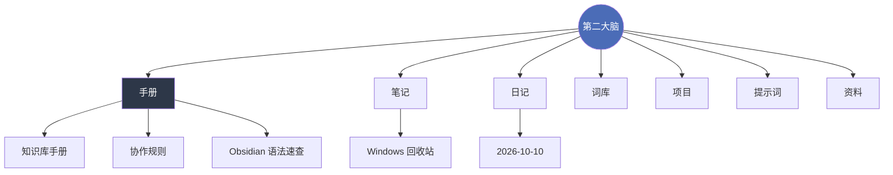

# 第二大脑

> [!tip] 这不是"知识点文件夹"
> 这里装的是一整个人的外部大脑：日记、单词、提示词、项目、个人资料、临时灵感、踩坑记录。
> 结构**随时可改**，改形是常态，不是事故。

> [!warning] 接管者先读
> 新来的 agent / 未来的自己：先读 [[知识库手册]] 和 [[协作规则]]，再动笔。

## 入口

| 区域 | 装什么 | 起点 |
|---|---|---|
| 手册 | 结构约定、命名方式、语法备忘 | [[知识库手册]] · [[协作规则]] · [[Obsidian 语法速查]] |
| 笔记 | 知识点、技巧、踩坑 | [[Windows 回收站]] |
| 日记 | 每日记录 | [[2026-10-10]] |
| 词库 | 英语单词 | 空 |
| 项目 | 正在进行的事 | 空 |
| 提示词 | 提示词库 | 空 |
| 资料 | 个人信息、参考、账号备忘 | 空 |

> [!note] 发布链路
> 本站由 Agents 协助维护，使用 **Quartz** 自动构建部署到 GitHub Pages。
> 写笔记时按 Quartz 兼容语法来（frontmatter、`[[双链]]`、callout、mermaid 均支持）。

## 结构图

## 时间线

- **2026-10-10** — 建库。改掉分类前缀式命名、定协作规则、写入第一条技巧笔记。详见 [[2026-10-10]]
