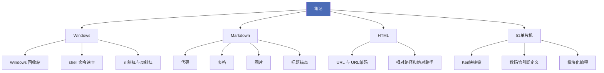

# 第二大脑

这里放我学过的东西。

写得比较随意——遇到什么记什么，搞懂了就展开写细，没搞懂就标着待查证。

## 区域

| 区域 | 内容 | 起点 |
|---|---|---|
| 笔记 | Windows 技巧、Markdown、HTML、51 单片机 | [[Windows 回收站]] · [[代码]] · [[表格]] |
| 项目 | 正在推进的事 | [[AutoCAD MCP]] · [[第二大脑站点]] |
| 手册 | 这个库自己的规则与维护方式 | [[知识库手册]] |
| 词库 | 英语单词与缩写 | [[单词]] |
| 提示词 | 复用 prompt | [[00-总纲|笔记规范]] |
| 日记 | 日常记录 | [[2026-10-10]] |
| 领域 | 长期在管的事 | [[个人数据]] |
| 资料 | 参考资料 | [[用户档案]] |

## 笔记分布

## 从哪开始

- 想查 Windows 上的操作：[[Windows 回收站]] · [[shell 命令速查]]
- 想写 Markdown：[[代码]] · [[表格]] · [[图片]]
- 在折腾单片机：[[Keil快捷键]] · [[单片机引脚接错程序正确不亮灯]]
- 想系统学 HTML：[[相对路径和绝对路径]] · [[URL 与 URL编码]]
- 想知道 AI 怎么操控 CAD：[[AutoCAD MCP]]
