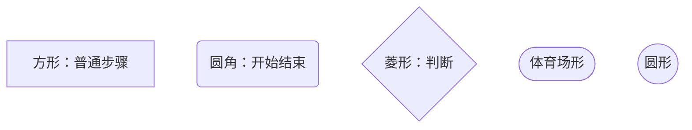
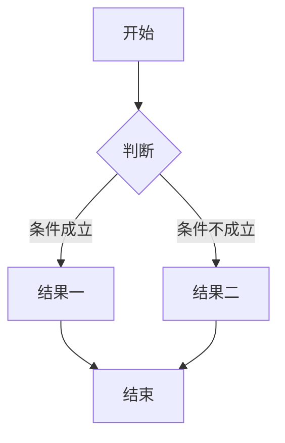
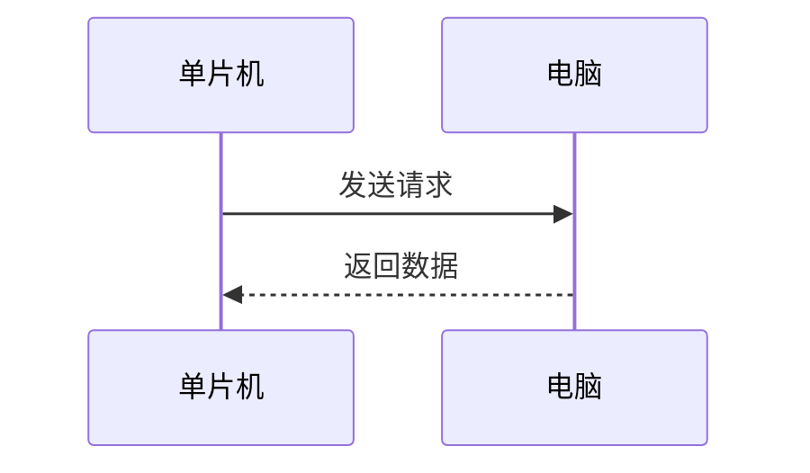
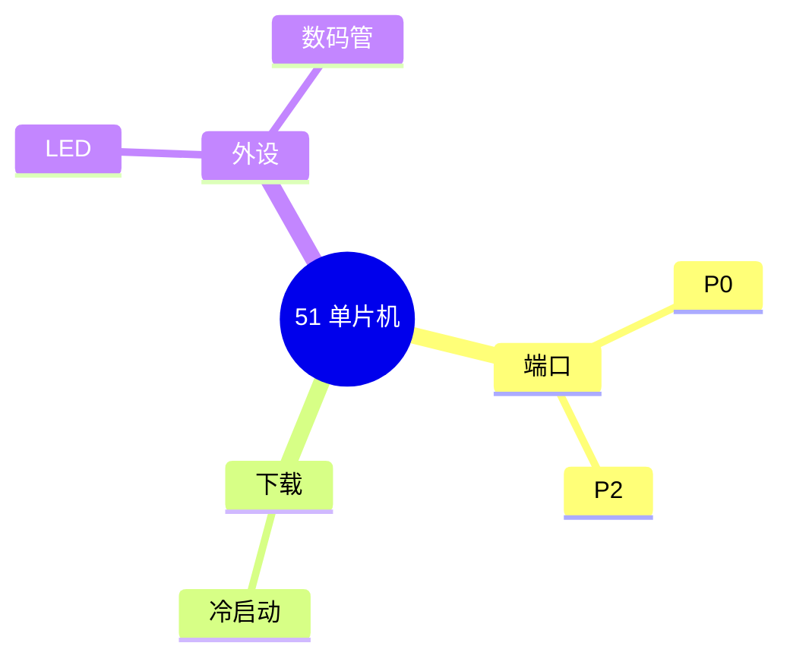

---
title:
aliases:
tags:
description: 在笔记里画图和写公式：Mermaid 图表的常用类型和节点写法，以及 KaTeX 数学公式的行内与独立两种写法。
---

# Mermaid 图表和数学公式

> 系列第 11 / 13 篇 · ← 上一步：[[10-Frontmatter 属性区和标签|Frontmatter 属性区]] · 下一步：[[12-Markdown 做不到的，直接写 HTML|直接写 HTML]] → · 路线图：[[Markdown 语法总览]]

Markdown 本身只能排版文字，画图和公式是后加的能力。这个站点两个都支持：**Mermaid 画图，KaTeX 写公式**。

## Mermaid：用文字画图

写一个语言标成 `mermaid` 的代码块，它就变成一张图：

````md

````

↓ 渲染出来是这样：


好处是：**图是"写"出来的，不是画出来的**。改一个字就改了图，不用打开画图工具、不用存图片文件、不用管版本。

## 常用的图表类型

| 类型 | 画什么 | 什么时候用 |
| --- | --- | --- |
| `flowchart` / `graph` | 流程图 | 最常用，步骤和分支 |
| `sequenceDiagram` | 时序图 | 谁先谁后、来回交互 |
| `mindmap` | 思维导图 | 一个主题的发散结构 |
| `pie` | 饼图 | 占比 |
| `gantt` | 甘特图 | 时间安排 |
| `stateDiagram-v2` | 状态图 | 状态怎么切换 |
| `classDiagram` | 类图 | 面向对象结构 |
| `erDiagram` | 实体关系图 | 数据结构 |
| `timeline` | 时间线 | 事件先后 |
| `quadrantChart` | 四象限图 | 二维分类 |
| `sankey-beta` | 桑基图 | 流量分配 |
| `gitGraph` | Git 分支图 | 分支合并历史 |
| `xychart-beta` | 柱状/折线图 | 数据趋势 |

前四个能覆盖 90% 的需求。

## 流程图怎么画

### 方向

`graph` 后面跟方向缩写：

| 写法 | 方向 |
| --- | --- |
| `TD` 或 `TB` | 从上到下 |
| `LR` | 从左到右 |
| `BT` | 从下到上 |
| `RL` | 从右到左 |

### 节点形状

方括号、圆括号、花括号决定节点长什么样：

````md

````

↓ 渲染出来是这样：



### 连线

````md

````

↓ 渲染出来是这样：


连线上的文字用 `|文字|` 夹在箭头中间。常用箭头：

| 写法 | 样子 |
| --- | --- |
| `-->` | 实线箭头 |
| `---` | 实线无箭头 |
| `-.->` | 虚线箭头 |
| `==>` | 粗箭头 |

## 时序图

画"谁在什么时候对谁做了什么"：

````md

````

↓ 渲染出来是这样：


## 思维导图

````md

````

↓ 渲染出来是这样：


## 几个实用技巧

**中文标签加引号更保险**

节点文字里有中文标点或特殊符号时，写成 `A["中文标签"]`，能避免被当成语法解析出错。

**让节点变成双链**

给节点加 `internal-link` 类，点节点就能跳到同名笔记：

````md

````

**图别太大**

节点超过十几个就会很挤，而且窄屏上会溢出。图太复杂说明该拆成两张。

## 数学公式

用 LaTeX 语法，这个站点用 KaTeX 渲染。

**行内公式**用一对 `$`：

```md
勾股定理是 $a^2 + b^2 = c^2$，很常用。
```

↓ 渲染出来是这样：

勾股定理是 $a^2 + b^2 = c^2$，很常用。

**独立成块**用上下各一行 `$$`：

```md
$$
x = \frac{-b \pm \sqrt{b^2 - 4ac}}{2a}
$$
```

↓ 渲染出来是这样：

$$
x = \frac{-b \pm \sqrt{b^2 - 4ac}}{2a}
$$

几个常用符号：

| 想写什么 | 写法 | 效果 |
| --- | --- | --- |
| 上标 | `x^2` | $x^2$ |
| 下标 | `x_1` | $x_1$ |
| 分数 | `\frac{a}{b}` | $\frac{a}{b}$ |
| 根号 | `\sqrt{x}` | $\sqrt{x}$ |
| 求和 | `\sum_{i=1}^{n}` | $\sum_{i=1}^{n}$ |
| 希腊字母 | `\alpha` `\beta` | $\alpha$ $\beta$ |
| 乘号 | `\times` | $\times$ |

> [!warning] 正文里的美元符号要转义
> 如果正文里真要写 `$100`，会被当成公式开头，后面整段可能变得很奇怪。写成 `\$100` 就没事了。

## 两个都要注意的限制

**它们是在浏览器里现场渲染的。**

这意味着通过 RSS 阅读器、或者别人转发链接时的预览卡片里，**图和公式都显示不出来**，只能看到一堆源码。

所以：**重要的结论别只写在图里**，文字里也要提一句。图是辅助，不是正文的替代品。

**Obsidian 里也要预览才能看到。**

在编辑视图里，mermaid 代码块显示的是源码（一堆文字），切到阅读视图才是图。
