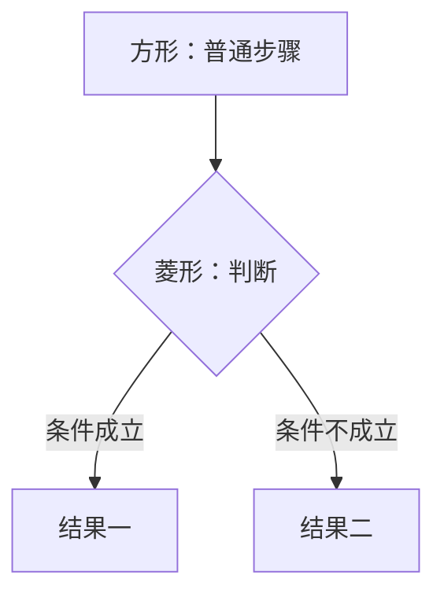

---
title:
aliases:
tags:
description: 一份从零开始的 Markdown 完整语法教程，覆盖标准语法、Obsidian 专有语法和本站实测支持情况，每种都给写法示例和真实渲染效果。
---

# Markdown 完整语法教程

Markdown 是一套**用普通符号表示排版**的约定。你在纯文本里写一个 `#`，它就变成大标题；写两个 `*`，中间的字就变粗。

它的好处是：写的时候不用点工具栏、不用调字号，改格式只需要加几个字符。坏处是——**这些符号你得记住**。这篇就是给你记的。

## 这篇怎么用

每个语法基本按这个顺序讲：**一句话说明 → 源码长什么样 → 渲染出来是什么效果**。

看到代码块里的内容，就是你要敲进笔记里的东西：

```md
**这是粗体**
```

↓ 渲染出来是这样：

**这是粗体**

（后面不再每次解释，看到代码块 + 箭头就是"源码 → 效果"。）

### 先说清楚"本站"是什么

Markdown 没有一个强制标准，各家实现都有出入。这篇笔记写在 **Obsidian** 里，通过 **Quartz** 发布成你现在看到的网页，所以会出现三个环境：

| 环境 | 是什么 | 影响 |
| --- | --- | --- |
| **Obsidian** | 你本机装的编辑器 | 编辑时看到的即时效果 |
| **Quartz（本站）** | 把笔记变成网站的生成器 | 发布后网页上的最终效果 |
| **标准 Markdown** | 最通用的那套规则 | 换到 GitHub、知乎等地方也通用的部分 |

绝大多数语法三边一致。凡是**有出入的地方，这篇都会单独标出来**，而且都是实测过的结论（构建时逐个检查过生成的 HTML）。

## 一、段落、换行、空格

这是新手栽得最多的地方，先讲。

**空一行 = 新的一段。** Markdown 靠空行来分段，不是靠回车。

```md
这是第一段。

这是第二段。
```

↓ 渲染出来是这样：

这是第一段。

这是第二段。

**只按一次回车 ≠ 换行。** 这是标准 Markdown 的规则，Obsidian 和本站都遵守：

```md
第一行
第二行
```

↓ 渲染出来是这样（两段被拼成了一行）：

第一行
第二行

想在同一段里强制换行，有两条路：

1. **行尾敲两个空格再回车**（最通用，Obsidian 和本站都认）
2. 直接写 `<br>` 标签

```md
第一行  
第二行
```

↓ 渲染出来是这样：

第一行  
第二行

> [!warning] 两个空格是看不见的
> 这就是它难用的地方：你敲了，但在编辑器里看不出来。所以很多人以为是 Markdown 坏了。Obsidian 里也可以按 `Shift+Enter` 换行，效果等同于行尾两个空格。

顺便说一句：**正文里连打多个空格是没用的**，渲染时会被合并成一个。想真的空出位置，要么用表格，要么写 `&nbsp;`（HTML 的不换行空格）。

### 为什么在 Obsidian 里看着换行了，发布出去却合并了

这件事困扰过很多人，原因是**两边的默认设置不一样**：

| 环境 | 只按一次回车会怎样 | 由什么决定 |
| --- | --- | --- |
| Obsidian（默认） | **换行** | 设置里的 Strict line breaks，默认关闭，也就是默认硬换行 |
| 标准 Markdown / GitHub | **合并** | 规范本身就是这么定的 |
| 本站（当前配置） | **合并** | `quartz.config.yaml` 里的 `hard-line-breaks` 插件，现在是 `enabled: false` |

"硬换行"这个词听着玄，意思就是一句话：**源码里按一次回车，页面上就真的换一行**。它的反面是"软换行"——回车只是为了让源码看着整齐，渲染时不算数。

想让本站也变成"一个回车就换行"，把那个插件的 `enabled` 改成 `true` 就行。它内部用的是通用的 `remark-breaks`，作用就是把源码里每一个换行符都变成一个 `<br>`。

代价只有一个：如果你习惯把一整句话**折成两行**写（为了让源码每行短一点），网页上也会跟着断成两行。所以习惯"一行一句话"的人适合开，习惯"整段写成一行、让它自动折"的人适合关。

## 二、标题

在行首写 1~6 个 `#`，就是一到六级标题。`#` 后面**必须有空格**。

```md
# 一级标题
## 二级标题
### 三级标题
#### 四级标题
##### 五级标题
###### 六级标题
```

↓ 渲染出来是这样（六级字号依次变小，页面上能看到层级）：

# 一级标题

## 二级标题

### 三级标题

#### 四级标题

##### 五级标题

###### 六级标题

几个经验：

- 一篇笔记**只用一次一级标题**，就是笔记名字本身。正文从 `##` 开始。
- 别跳级（二级下面直接四级），目录会很难看。
- 标题别写太长——它会变成网址的一部分。

**标题会自动生成锚点**，可以链过去。比如想跳到这一节，写 `[跳到列表那一节](#四、列表)`，本站实测可用。

> [!tip] 目录不用手写
> 本站每页右侧（窄屏时在顶部）的目录是**自动生成**的，你只管写好标题。Obsidian 里对应的是"大纲"面板。

## 三、强调文字

把字包起来就变样，这是最常用的一组：

| 想要什么 | 写法 | 效果 |
| --- | --- | --- |
| **粗体** | `**粗体**` 或 `__粗体__` | **粗体** |
| **斜体** | `*斜体*` 或 `_斜体_` | *斜体* |
| **粗斜体** | `***粗斜体***` | ***粗斜体*** |
| **删除线** | `~~删除线~~` | ~~删除线~~ |
| **高亮** | `==高亮==` | ==高亮== |

其中**高亮 `==` 是 Obsidian 专有的**（标准 Markdown 没有），但本站实测支持，可以放心用。

嵌套也行，比如粗体里面套斜体：

```md
**这段话是粗的，_这几个字是斜的_**
```

↓ 渲染出来是这样：

**这段话是粗的，_这几个字是斜的_**

### Markdown 没有、但 HTML 能补的

下划线、上下标、键盘按键这些，标准 Markdown 不管，直接写 HTML 标签就行，本站实测都支持：

| 想要什么 | 写法 | 效果 |
| --- | --- | --- |
| 下划线 | `<u>下划线</u>` | <u>下划线</u> |
| 上标 | `X<sup>2</sup>` | X<sup>2</sup> |
| 下标 | `H<sub>2</sub>O` | H<sub>2</sub>O |
| 按键 | `<kbd>Ctrl</kbd> + <kbd>C</kbd>` | <kbd>Ctrl</kbd> + <kbd>C</kbd> |
| 标记 | `<mark>标记</mark>` | <mark>标记</mark> |

注意：**`^2^` 和 `~2~` 这种写法本站不支持**（那是别的地方的方言），老老实实用 `<sup>` / `<sub>`。

### 想让符号原样显示

在符号前面加反斜杠 `\` 转义：

```md
\*这两个星号不会变成斜体\*
```

↓ 渲染出来是这样：

\*这两个星号不会变成斜体\*

## 四、列表

### 无序列表

`-`、`*`、`+` 三个符号都行，挑一个用到底就好（推荐 `-`）。符号后面要有空格。

```md
- 苹果
- 香蕉
- 橘子
```

↓ 渲染出来是这样：

- 苹果
- 香蕉
- 橘子

### 有序列表

数字加点，或者数字加右括号：

```md
1. 第一步
2. 第二步
3. 第三步
```

↓ 渲染出来是这样：

1. 第一步
2. 第二步
3. 第三步

**数字可以全写 1**，它会自动数成 1、2、3。这样中间插入一条时不用改后面所有数字：

```md
1. 第一步
1. 第二步
1. 第三步
```

↓ 渲染出来是这样（照样是 1、2、3）：

1. 第一步
1. 第二步
1. 第三步

### 嵌套

在子项前面**缩进两个或四个空格**（同一个列表里保持一致就行）：

```md
- 水果
  - 苹果
  - 香蕉
    - 红香蕉
- 蔬菜
```

↓ 渲染出来是这样：

- 水果
  - 苹果
  - 香蕉
    - 红香蕉
- 蔬菜

### 任务列表

在 `-` 后面加 `[ ]`（未完成）或 `[x]`（已完成），注意方括号里的空格：

```md
- [x] 已经做完的事
- [ ] 还没做的事
```

↓ 渲染出来是这样：

- [x] 已经做完的事
- [ ] 还没做的事

### 列表项里放别的内容

想在一个列表项里塞好几段、或者塞代码块，就把内容**缩进到和列表文字对齐**：

```md
- 这是第一项

  这是第一项的第二段，前面空一格缩进对齐。

- 这是第二项
```

↓ 渲染出来是这样：

- 这是第一项

  这是第一项的第二段，前面空一格缩进对齐。

- 这是第二项

## 五、引用

行首写一个 `>`，就是引用块，通常用来放别人的话或者补充说明。

```md
> 这是一句被引用的话。
```

↓ 渲染出来是这样：

> 这是一句被引用的话。

多行引用，可以在每行都写 `>`，也可以只在第一行写（推荐每行都写，在 Obsidian 里更好编辑）：

```md
> 第一段引用。
>
> 第二段引用。
```

↓ 渲染出来是这样：

> 第一段引用。
>
> 第二段引用。

引用可以套娃（`> >`），也可以里面放标题、列表、代码块：

```md
> ### 引用里的标题
> - 引用里的列表项
> - 另一项
```

↓ 渲染出来是这样：

> ### 引用里的标题
> - 引用里的列表项
> - 另一项

## 六、代码

### 行内代码

用反引号（键盘左上角那个 `` ` ``）包起来，用来写命令、文件名、变量名：

```md
用 `npx quartz build` 就能重新构建网站。
```

↓ 渲染出来是这样：

用 `npx quartz build` 就能重新构建网站。

### 代码块

用**上下各三个反引号**包起来。开场那三个反引号后面写上语言名，就会有语法高亮：

````md
```c
#include <REGX52.H>
void main()
{
    P2 = 0xFE;
}
```
````

↓ 渲染出来是这样：

```c
#include <REGX52.H>
void main()
{
    P2 = 0xFE;
}
```

本站用的是双主题高亮，亮色和暗色下都能看清。常见的语言标识：`c`、`python`、`bash`、`yaml`、`json`、`html`、`css`、`js`、`markdown`。

**不写语言**也行，就是纯色块没有高亮。

还有一种是**每行缩进四个空格**的老写法，能生效但不推荐——容易和列表缩进搞混，而且一不小心就失效。

### 代码里要写反引号怎么办

外面的围栏比里面多一层就行：里面最多用三个反引号，外面就用四个：

`````md
````
```md
这里面的三个反引号会被当成普通文字
```
````
`````

## 七、分隔线

单独一行写三个以上的 `-`、`*` 或 `_`，就是一条分隔线：

```md
上面一段

---

下面一段
```

↓ 渲染出来是这样：

上面一段

---

下面一段

> [!warning] 别和属性区搞混
> 笔记最开头那三行 `---` 是 **frontmatter（属性区）**，不是分隔线。区别是：属性区必须在文件**第一行**，而且上下成对出现。

## 八、链接

### 外链

`[显示文字](网址)`：

```md
[菜鸟教程](https://www.runoob.com)
```

↓ 渲染出来是这样：

[菜鸟教程](https://www.runoob.com)

### 自动链接

网址直接写在正文里，本站会**自动变成可点的链接**：

```md
https://www.runoob.com
```

↓ 渲染出来是这样：

https://www.runoob.com

也可以用尖括号包起来，效果一样但更明确：`<https://www.runoob.com>`

### 网址里有空格

空格会把链接截断。两种办法：把空格换成 `%20`，或者用尖括号把整个网址包起来：

```md
[带空格的链接](<https://example.com/my file.pdf>)
```

### 页内跳转

用 `#` 加标题文字，可以跳到同一篇的某一节：

```md
[跳回列表那一节](#四、列表)
```

↓ 渲染出来是这样（点一下试试）：

[跳回列表那一节](#四、列表)

## 九、图片

### 外链图片

语法就是链接前面加一个 `!`：

```md

```

方括号里的文字是**替代文字**：图挂了的时候会显示它，屏幕阅读器也会读它，别空着。

### Obsidian 里的本地图片

这是 Obsidian 的写法，用两个方括号：

```md
![[照片.png]]
```

前提是这张图已经在你的笔记库里（通常是拖进来，或者粘贴时自动保存）。

**改尺寸**用竖线加宽度：

```md
![[照片.png|200]]
```

外链图片则是 ``，只写宽度的话高度会按比例自动算。

> [!tip] 图片放哪
> 本站实测：被引用的图片会被复制到输出目录并正常显示，你不用手动管路径。Obsidian 里则取决于你的"附件存放位置"设置。

## 十、表格

用竖线 `|` 分列，第二行用 `-` 分隔表头和内容：

```md
| 元件 | 数量 | 单价 |
| --- | --- | --- |
| 电阻 | 10 | 0.05 |
| LED | 5 | 0.2 |
```

↓ 渲染出来是这样：

| 元件 | 数量 | 单价 |
| --- | --- | --- |
| 电阻 | 10 | 0.05 |
| LED | 5 | 0.2 |

几个要点：

- 第二行**至少要有两个 `-`**，多写几个没关系，只是为了对齐好看。
- 左右两侧的竖线可以省略，但写上更清楚。
- 单元格内容不用对齐，源码乱一点不影响显示。

### 对齐

在第二行用冒号控制：

```md
| 左对齐 | 居中 | 右对齐 |
| :-- | :-: | --: |
| a | b | c |
```

↓ 渲染出来是这样：

| 左对齐 | 居中 | 右对齐 |
| :-- | :-: | --: |
| a | b | c |

### 表格里放别的东西

单元格里可以用粗体、代码、链接、图片。但要注意两件事：

1. **竖线**在表格里有特殊含义，想在单元格里显示 `|`，要写成 `\|`
2. **表格里没法换行**，硬回车没用，要换行只能写 `<br>`

```md
| 语法 | 用途 |
| --- | --- |
| `\|` | 在单元格里显示竖线 |
| `<br>` | 在单元格里换行 |
```

## 十一、转义：让符号原样显示

Markdown 里有一批符号是"有任务"的，想让它们当普通字符显示，就在前面加 `\`：

| 符号 | 名字 | 转义写法 |
| --- | --- | --- |
| `#` | 井号 | `\#` |
| `*` | 星号 | `\*` |
| `_` | 下划线 | `\_` |
| `` ` `` | 反引号 | `` \` `` |
| `[` `]` | 方括号 | `\[` `\]` |
| `>` | 大于号 | `\>` |
| `\|` | 竖线 | `\\|`（表格里） |
| `\` | 反斜杠本身 | `\\` |

## 十二、直接写 HTML

Markdown 本身只是一小撮符号，遇到它做不到的东西，**直接写 HTML 标签就行**——本站实测会原样保留，不会被过滤掉。

最实用的几个：

| 想要什么 | 写法 |
| --- | --- |
| 强制换行 | `<br>` |
| 上下标 | `<sup>` `<sub>` |
| 下划线 | `<u>` |
| 键盘按键 | `<kbd>` |
| 折叠块 | `<details><summary>` |
| 音频 | `<audio controls src="...">` |
| 嵌入网页/视频 | `<iframe src="...">` |
| 自定义图形 | `<svg>...</svg>` |

**折叠块**很好用，可以放那些"想看就看、不想看就跳过"的内容：

```html
<details>
<summary>点开看答案</summary>

这里是藏起来的内容，可以写多行，也能用 **Markdown**。
</details>
```

↓ 渲染出来是这样（点一下试试）：

<details>
<summary>点开看答案</summary>

这里是藏起来的内容，可以写多行，也能用 **Markdown**。
</details>

## 十三、属性区（Frontmatter）

笔记**最开头**用上下各一行 `---` 包起来的那段，叫 frontmatter，是一份用 YAML 写的"关于这篇笔记的信息"。

```yaml
---
title: 笔记标题
aliases:
  - 别名一
tags:
  - 标签一
description: 一句话说明这篇讲什么
---
```

Obsidian 用它记录创建时间、标签、别名；本站用它决定页面标题和分享卡片上的描述文字。

> [!note] 本站的约定
> 这个库的笔记习惯是：**只填 `description`**，其余字段留空，也不要自己加 `date`、`authors` 这类字段。frontmatter 必须写在文件第一行，前面不能有空行，否则会被当成普通文字。

## 十四、Obsidian 专有语法

下面这些是 Obsidian 的方言，标准 Markdown 没有，但本站（Quartz）实测都支持。

### 双链：链接到另一篇笔记

两个方括号里写**笔记的文件名**，不需要路径、不需要 `.md`：

```md
[[为什么一行 P2 = 0xFE 能点亮一颗灯]]
```

↓ 渲染出来是这样：

[[为什么一行 P2 = 0xFE 能点亮一颗灯]]

它有四种变体：

| 想要什么 | 写法 | 说明 |
| --- | --- | --- |
| 普通链接 | `[[笔记名]]` | 显示笔记名 |
| 改显示文字 | `[[笔记名\|想显示的文字]]` | 竖线后面是显示用的别名 |
| 链到某一节 | `[[笔记名#小节标题]]` | 直接跳到那个标题 |
| 链到某一段 | `[[笔记名#^块编号]]` | 见下面的块 ID |

注意：在表格里写双链别名时，竖线要转义成 `\|`。

**块 ID** 是给某一段单独起的名字：在段落末尾写 `^随便起个名`，之后就能用 `[[笔记名#^随便起个名]]` 精确指向这一段——即使以后标题改了、段落挪了，链接依然跟着走。

```md
这是我想被引用的一段话。 ^重要结论
```

上面的 `^重要结论` 在渲染时是看不见的，它只是个标记。

### 嵌入：把别的东西直接显示在这里

双链前面加 `!`，就不是"链接过去"，而是"把内容搬过来显示"：

| 写法 | 作用 |
| --- | --- |
| `![[笔记名]]` | 整篇笔记的内容显示在这里 |
| `![[笔记名#小节]]` | 只显示那一节 |
| `![[图片.png]]` | 显示图片 |
| `![[图片.png\|200]]` | 显示图片，宽度 200 |

> [!warning] 本站不支持的嵌入
> 嵌入 **HTML 文件**（`![[xxx.html]]`）在本站是关掉的，写了不会显示。视频也别用这种方式，用 `<iframe>` 嵌站外播放器。

### 标签

标签写在属性区里（`tags:` 下面），这是最规范的做法。正文里写 `#标签` 也能标记，但**本站实测不会把它渲染成可点的标签**，只会当成普通文字——所以想靠标签分类，还是写在 frontmatter 里。

### 注释：只给自己看的字

用两个百分号包起来的内容，**自己能看到，发布出去谁也看不到**：

```md
这段是正文。%%这段是给自己看的备忘，渲染时会消失%%
```

↓ 渲染出来是这样（那句备忘不见了）：

这段是正文。%%这段是给自己看的备忘，渲染时会消失%%

## 十五、Callout 提示块

这是 Obsidian 里最出效果的一个语法，前面你已经见过好几个了。

写法就是**引用的第一行加 `[!类型]`**：

```md
> [!note]
> 这是提示块的内容。
```

↓ 渲染出来是这样：

> [!note]
> 这是提示块的内容。

### 改标题

`[!类型]` 后面写字，就是自定义标题：

```md
> [!tip] 一个小技巧
> 内容。
```

↓ 渲染出来是这样：

> [!tip] 一个小技巧
> 内容。

### 折叠

类型后面加 `-` 表示默认收起，加 `+` 表示默认展开（都能手动点开）：

```md
> [!question]- 点我展开
> 藏起来的答案。
```

↓ 渲染出来是这样（试试点一下）：

> [!question]- 点我展开
> 藏起来的答案。

### 类型大全

本站实测全部支持，别名也会被正确识别：

| 类型 | 别名 | 适合放什么 |
| --- | --- | --- |
| `note` | | 通用补充说明 |
| `abstract` | `summary` `tldr` | 摘要、太长不看版 |
| `info` | | 中性信息 |
| `todo` | | 待办事项 |
| `tip` | `hint` `important` | 技巧、建议 |
| `success` | `check` `done` | 成功的做法 |
| `question` | `help` `faq` | 疑问 |
| `warning` | `caution` `attention` | 需要注意的地方 |
| `failure` | `fail` `missing` | 失败案例 |
| `danger` | `error` | 危险操作警告 |
| `bug` | | 已知问题 |
| `example` | | 示例 |
| `quote` | `cite` | 引文 |

类型写错了也没关系，会退化成 `note` 的样子，不会报错。

## 十六、数学公式

本站支持 KaTeX，写 LaTeX 语法就行。

**行内公式**用一个 `$` 包起来：

```md
勾股定理是 $a^2 + b^2 = c^2$，很常用。
```

↓ 渲染出来是这样：

勾股定理是 $a^2 + b^2 = c^2$，很常用。

**独立成块**的公式用上下各一行 `$$`：

```md
$$
x = \frac{-b \pm \sqrt{b^2 - 4ac}}{2a}
$$
```

↓ 渲染出来是这样：

$$
x = \frac{-b \pm \sqrt{b^2 - 4ac}}{2a}
$$

> [!warning] 正文里的美元符号要转义
> 如果正文里真要写 `$100`，会被当成公式开头。写成 `\$100` 就好了。

## 十七、Mermaid 图表

写一个语言标成 `mermaid` 的代码块，就变成一张图：

````md

````

↓ 渲染出来是这样：


支持的类型很多，常用的有：

| 类型 | 画什么 |
| --- | --- |
| `flowchart` / `graph` | 流程图（最常用） |
| `sequenceDiagram` | 时序图（谁先谁后） |
| `mindmap` | 思维导图 |
| `pie` | 饼图 |
| `gantt` | 甘特图 |
| `classDiagram` | 类图 |
| `stateDiagram-v2` | 状态图 |
| `erDiagram` | 实体关系图 |
| `timeline` | 时间线 |
| `quadrantChart` | 四象限图 |
| `sankey-beta` | 桑基图 |
| `gitGraph` | Git 分支图 |
| `xychart-beta` | 柱状/折线图 |

画流程图的几个常用符号：

````md

````

↓ 渲染出来是这样：


> [!tip] 中文标签加引号更保险
> 节点文字里如果有中文标点或特殊符号，写成 `A["中文标签"]`，能避免被当成语法解析出错。

## 十八、脚注

正文里标 `[^名字]`，在任意位置写 `[^名字]: 脚注内容`，本站会自动把脚注收集到页面底部：

```md
这里有个需要补充说明的地方[^note1]。

[^note1]: 这就是补充说明的内容。
```

↓ 渲染出来是这样（正文里的编号可以点，会跳到页面底部）：

这里有个需要补充说明的地方[^note1]。

[^note1]: 这就是补充说明的内容。

## 十九、本站（Quartz）自动帮你做的事

这些东西**不用你写**，是发布时自动生成的：

- **目录**：根据标题生成，显示在侧边
- **反向链接**：哪几篇笔记链到了这一篇
- **关系图谱**：笔记之间的连接图
- **亮色/暗色主题**：按系统设置自动切换
- **搜索**：全站搜索框
- **分享卡片**：根据 `description` 生成

两件需要注意的事：

> [!warning] 有些内容在 RSS 和分享卡片里看不到
> Mermaid 图和内联 SVG 都是在浏览器里现场渲染的，所以通过 RSS 阅读器、或者别人转发链接时的预览卡片里，这些图是显示不出来的。重要的结论别只写在图里，文字里也要提一句。

## 二十、实测：这些写法本站不支持

下面这些都是实际构建验证过的结论，别照着网上的教程白费劲：

| 写法 | 实际会发生什么 | 替代方案 |
| --- | --- | --- |
| `:smile:` 表情短代码 | 原样显示成一串字符 | 直接粘贴 emoji 字符 😀 |
| 定义列表（`术语` 换行 `: 定义`） | 变成普通的几行文字 | 用表格或列表 |
| 正文里的 `#标签` | 当成普通文字，不会变成标签 | 写在 frontmatter 的 `tags` 里 |
| `^2^` `~2~` 上下标 | 原样显示，`^` 还可能被当成块 ID | 用 `<sup>` `<sub>` |
| `![[xxx.html]]` 嵌入 HTML | 不显示 | 直接把 HTML 写在正文里 |
| `![[xxx.mp4]]` 嵌入视频 | 不显示 | 用 `<iframe>` 嵌站外播放器 |
| Dataview 查询块 | 只能在本机 Obsidian 里看到，网页上不生效 | 手动维护，或者避开 |

## 二十一、一张速查表

想干什么 → 怎么写：

| 想干什么 | 写法 |
| --- | --- |
| 大标题 | `# 标题` |
| 小标题 | `##` `###`（最多六个 `#`） |
| 加粗 | `**文字**` |
| 斜体 | `*文字*` |
| 删除线 | `~~文字~~` |
| 高亮 | `==文字==` |
| 换行 | 行尾敲两个空格 |
| 新段落 | 空一行 |
| 无序列表 | `- 内容` |
| 有序列表 | `1. 内容` |
| 待办 | `- [ ] 内容` / `- [x] 内容` |
| 引用 | `> 内容` |
| 提示块 | `> [!note] 内容` |
| 行内代码 | `` `代码` `` |
| 代码块 | 上下各三个反引号，开场写语言名 |
| 分隔线 | `---` |
| 链接 | `[文字](网址)` |
| 站内链接 | `[[笔记名]]` |
| 图片（站内） | `![[图片.png]]` |
| 表格 | 竖线分列，第二行写 `-` |
| 表格对齐 | `:--` `:-:` `--:` |
| 折叠块 | `<details><summary>标题</summary>` |
| 数学公式 | `$行内$` / `$$独立$$` |
| 图表 | ` ```mermaid ` 代码块 |
| 脚注 | `[^1]` + `[^1]: 内容` |
| 只给自己看的备注 | `%%内容%%` |
| 让符号原样显示 | 前面加 `\` |

## 几个新手常犯的错误

**标题、列表、代码块前后忘了空行**

Markdown 靠空行判断"这一段结束了"。紧贴着上一行写 `## 标题`，有时候不会变成标题。养成习惯：每个块之间都空一行。

**用空格去排版**

想让两行文字错开、想空出半行——Markdown 里连续空格会被合并。该换行的地方用两个空格，该分段的地方空一行。

**在表格里硬回车**

表格单元格里按回车是没用的，整个表格会乱掉。要换行就写 `<br>`。

**照抄别人的语法却没注意环境**

网上很多教程讲的是 GitHub、Typora 或者某个博客平台的方言。这篇里凡是标了"本站实测"的，才是你在这个库里能用的。

**格式乱了先查符号**

Markdown 失效，九成是这几个原因：符号后面忘了空格、`#` 前面多了空格、中英文符号混用（比如用了中文的括号或引号）、或者前后没空行。
