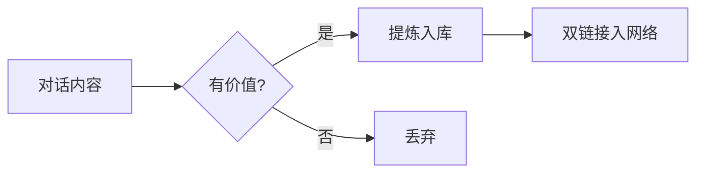
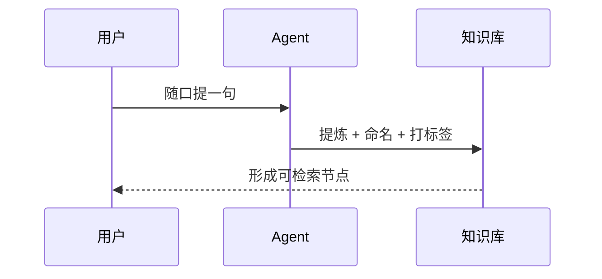

# Obsidian 语法速查

> [!tip] 态度
> 别只会写普通 md。能用图就别用大段文字，能链就别复制粘贴。
> 下方语法 Obsidian 与 Quartz 均支持。

## 速查表

| 能力 | 写法 | 用来干嘛 |
|---|---|---|
| 双链 | `[[笔记名]]` / `[[笔记名\|显示文字]]` | 织网，发布后变站内链接 |
| 嵌入 | `![[笔记名]]` / `![[图片.png]]` | 复用内容块 |
| 块引用 | `[[笔记名#标题]]` / `^blockid` | 精确到段落 |
| Callout | `> [!note] 标题` | 提示框，见下方类型 |
| 标签 | frontmatter `tags:` 或正文 `#标签` | 跨文件夹聚合 |
| 高亮 | `==重点==` | 强调 |
| 评论 | `%%不渲染%%` | 写作备注 |
| 任务 | `- [ ]` / `- [x]` | 待办 |
| 表格 | 标准 md | 对比 |
| Mermaid | ` ```mermaid ` | 流程图/时序/甘特 |
| HTML | 直接写标签 | 折叠、排版、徽章 |
| SVG | 直接内联 | 自定义图形 |
| 图片 | `![[xx.png]]` 或 `` | 附件 |
| 数学 | `$E=mc^2$` | 公式 |

## Callout 类型

| 类型 | 用途 |
|---|---|
| `note` | 常规说明 |
| `tip` | 建议 / 技巧 |
| `warning` | 注意 / 风险 |
| `failure` | 反例，别这么做 |
| `abstract` | 摘要 / 一句话总结 |
| `question` | 待确认 |
| `example` | 示例 |
| `quote` | 引用 |

> [!example] 写法
> `> [!tip] 标题` 换行后接正文。

## Mermaid 示例

流程图：



时序图：



## HTML 示例

<details>
<summary>折叠块：点开看</summary>

用来放长内容、命令输出、备份信息。

```bash
explorer.exe shell:RecycleBinFolder
```

</details>

<div align="center">

**居中排版** · <span style="color:#4b6cb7">彩色文字</span>

</div>

## SVG 示例

<svg viewBox="0 0 300 60" width="300" xmlns="http://www.w3.org/2000/svg">
  <rect x="0" y="0" width="300" height="60" fill="#1e2229" rx="8"/>
  <circle cx="30" cy="30" r="14" fill="#4b6cb7"/>
  <text x="58" y="36" fill="#e6e6e6" font-size="15" font-family="sans-serif">节点 ← 双链 → 节点</text>
</svg>

## 相关

- [[知识库手册]] — 结构与命名
- [[协作规则]] — 操作边界
