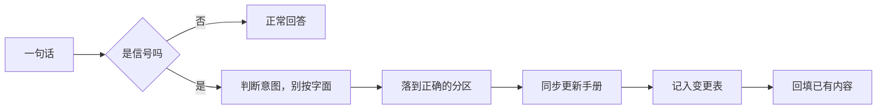

# 对话信号

> [!abstract] 方法
> 结构不该预先设计，应该从对话里长出来。
> 每次对话结束，agent 回头扫一遍：**哪些话其实是规则、哪些是纠正、哪些暴露了结构问题**，捞出来入库。

## 怎么判断一句话是不是信号

| 特征 | 例子 | 归类 |
|---|---|---|
| 带"不要""别""不许" | 「没有明确指示不要直接操作」 | 硬规则 |
| 带"不喜欢""太""有点" | 「这个命名我就不是很喜欢」 | 偏好，要立刻改 + 回填 |
| 反问 / 质疑 | 「删了不也相当于是一种调整吗」 | 我之前说死了，要修正 |
| 补充遗漏 | 「shell:AppsFolder 是不是漏了」 | 内容缺口 |
| 授权扩大 | 「日常也交给你调控」 | 角色升级 |
| 推翻既有做法 | 「不需要 private」 | 撤销上一次决策 |
| 用词含糊 | 「我说规矩，实际可能是提示词」 | 要求 agent 判断，别字面执行 |

## 信号 → 动作

> [!warning] 最容易漏的一步
> **回填**。改了命名规范，就要把旧文件一起改，不然新旧打架。
> 今天改命名时只改了新文件，旧文档里还留着反例，后来才发现。

## 2026-10-10 建库首日捕获的清单

| # | 原话（大意） | 判断后落到哪 |
|---|---|---|
| 1 | 只能提意见，没明确指示不要直接操作 | `[[协作规则]]` 操作边界 |
| 2 | 我说「写」指的是 wiki | `[[协作规则]]` 写入目标 |
| 3 | 别只写普通 md，mermaid/HTML/SVG/双链都用上 | `[[Obsidian 语法速查]]` |
| 4 | 命名我不喜欢（分类-标题那种） | `[[知识库手册]]` 命名规范 |
| 5 | 不要一成不变，别的 agent 别当固定规范 | `[[知识库手册]]` 给接手者的话 |
| 6 | 这里不只放知识点，日记单词资料都放 | 分区设计 |
| 7 | agent 是管理者，要打造知识网络 | `[[Agent 角色]]` |
| 8 | shell:AppsFolder 漏了 | `[[shell 命令速查]]` |
| 9 | 日常也交给你，放心大胆记录，像贴身秘书 | `[[Agent 角色]]` 权限三级 |
| 10 | 你要会自动升级，根据我的行为调控布局 | `[[系统演进]]` |
| 11 | 旧库的东西吸收进来，但不必照搬规范 | `[[旧库遗产]]` |
| 12 | 去网上找找经验看怎么安排 | `[[布局方案]]` |
| 13 | 收件箱不加 | 否决该提案 |
| 14 | 其他你随便改，我不管 | 授权 v2 重构 |
| 15 | 删了不也是一种调整吗 | 修正为删除三档 |
| 16 | 不需要 private，没什么隐私 | 撤销 `private/` |
| 17 | 给 draft 打勾就行 | 发布开关唯一化 |
| 18 | 我说的词可能不准，你要判断 | `[[协作规则]]` 用词判断 |

## 节奏

- **每次对话结束**：扫一遍，有信号就入库
- **攒够 5 条同类信号**：升级成硬规则，写进 `[[协作规则]]`
- **每周**：回头看变更表，确认没有新旧打架

## 相关

- [[系统演进]] · [[协作规则]] · [[Agent 角色]]
