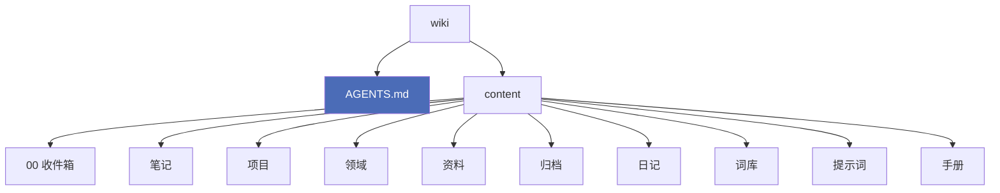

# 布局方案（v2 提案）

> [!abstract] 一句话
> 外部经验的共识是**混合制**，不是二选一：顶层按行动性分（PARA），内容层用双链织网（Zettelkasten），索引（MOC）等笔记够多了再建。

## 外部经验要点

### 1. 主流做法：PARA 骨架 + Zettelkasten 角 + MOC

| 方法 | 组织依据 | 适合 | 风险 |
|---|---|---|---|
| PARA | 行动性（项目/领域/资源/归档） | 有交付、有deadline的事 | 纯想法探索时显得僵硬 |
| Zettelkasten | 原子笔记 + 双链 | 长期思考、写作 | 起步慢，每篇成本高 |
| MOC | 人工策展的索引页 | 超过 200 篇后导航 | 需要维护，会过期 |
| Johnny Decimal | 数字编号 | 文件系统、重参考 | 与"链接优先"相冲 |

**共识结论**：
- 顶层用 PARA 给每篇笔记一个"家"
- 内容层用原子笔记 + 双链产生连接
- **笔记少于 200 篇时不需要 MOC**，一个首页入口就够

### 2. 一定要有收件箱（Inbox）

所有资料一致强调：**先捕获，后分类**。
新建内容一律先落 `00 收件箱/`，周期性清空归位。
理由：捕获时纠结放哪，是第二大脑死在第二天的主要原因。

### 3. 公开发布的私密隔离（很重要）

Quartz 提供三种过滤：

| 过滤器 | 行为 | 安全性 |
|---|---|---|
| 不过滤 | 全部发布 | ❌ |
| `RemoveDrafts`（默认） | 排除 `draft: true` | 黑名单，靠记得标 |
| `ExplicitPublish` | **只发布 `publish: true` 的** | ✅ 白名单，默认不发布 |

经验者的做法：**白名单 + 目录隔离双保险**。
另外，非 Markdown 文件（图片、PDF、音频）**不受过滤器影响，会被全部发布**。

### 4. 给 agent 的入口文件：AGENTS.md

2026 年的开放标准（Linux Foundation 托管，6 万+ 仓库在用）。

- Claude Code、Codex、Cursor、Copilot 等都能读
- 放仓库根目录，agent 启动时自动加载
- **建议保持 60–100 行以内**，用标题、列表、表格，不要长段落
- 只写可操作规则；不要写欢迎语、口号、泛泛原则
- 单一事实源：需要 CLAUDE.md 就 symlink 过去，不要维护两份

### 5. 其他高频建议

- **先写一星期再定结构** —— 结构应从真实内容里长出来，不是从模板抄
- 目录名带序号前缀（`00 Inbox`、`01 Projects`）方便排序
- 插件克制，5 个精选好过 30 个半生不熟
- 每周清一次收件箱，15 分钟

## 现状 vs 提案

| 现在 | 提案 | 理由 |
|---|---|---|
| 无收件箱 | 加 `00 收件箱/` | 先捕获后分类 |
| `日记/` | 保留 | 时间轴，与收件箱互补 |
| `笔记/` | 保留，作为 evergreen 区 | 对应 Zettelkasten 角 |
| `项目/` | 保留 | PARA: Projects |
| `日常/` | 改为 `领域/` | PARA: Areas，覆盖更广（健康、学业、站点运维） |
| `资料/` | 保留 | PARA: Resources |
| 无归档 | 加 `归档/` | PARA: Archive，替代删除 |
| `手册/`（在 content 内，会发布） | **移出公开区** | 含个人信息与内部规则 |
| 无 agent 入口 | 仓库根加 `AGENTS.md` | 跨工具标准，接手即读 |
| `词库/ 提示词/` | 保留 | 用户明确需要 |

## 提案结构

> [!note] 私密隔离：所有者否决
> 外部经验建议做白名单隔离（`ExplicitPublish` + 私密目录）。
> 但所有者明确说**不需要隐私**，只按文件类型过滤即可。
> 于是取消 `private/`，元文档回到 `手册/`。

## 待决策

- [ ] 是否采用 `00 收件箱/` 工作流
- [ ] `日常/` 是否改名为 `领域/`
- [x] ~~元文档是否移入 `private/`~~ → **否决**，不做隐私隔离
- [ ] 是否启用 `ExplicitPublish` 白名单（需改 `quartz.config.yaml`，属高风险改动）
- [ ] 顶层目录是否加序号前缀（`00` `01`…）
- [ ] 旧库 79 文件按什么节奏迁入

## 相关

- [[系统演进]] · [[知识库手册]] · [[旧库遗产]] · [[协作规则]]
