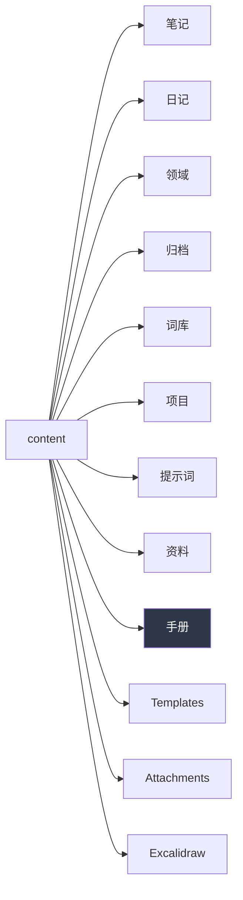

# 知识库手册

> [!abstract] 一句话
> 这个库由 AI agent 协助管理，目标是长成一张**知识网络**，而不是一堆孤立文档。

## 0. 给接手的 agent（最重要）

如果你是被派来接手这个库的 agent，请注意三件事：

1. **先读四个文件**：本手册、[[协作规则]]、[[Agent 角色]]、[[Obsidian 语法速查]]（都从 [[首页]] 出发）。
2. **这里没有固定套路**。你看到的目录、命名、分类，都是**当前版本**，不是标准答案。用户会边用边调。
3. **不要把你看到的结构当成"必须遵守的规范"然后批量套用到新内容上**。有更好的组织方式就提出来，或直接改并说明原因。

> [!failure] 常见错误
> 把 `笔记/` 下某个文件的命名方式当成模板，机械地复制出 `项目-xxx`、`资料-yyy`。
> 我们已经踩过一次：早期用过 `分类-标题` 前缀式命名（如 `约定-写入规则.md`），已被废弃。

## 1. 定位

这不是单一用途的笔记夹。可容纳：

| 类型 | 举例 | 落位 |
|---|---|---|
| 知识 / 技巧 | Windows 回收站原理 | `笔记/` |
| 日记 | 今天做了什么、想法（时间轴） | `日记/` |
| 日常 | 待办、日程、清单、习惯 | `日常/` |
| 英语单词 | 生词、例句 | `词库/` |
| 提示词 | 复用 prompt | `提示词/` |
| 项目 | 进行中的事、进度 | `项目/` |
| 个人资料 | 账号、证件、偏好、地址 | `资料/` |
| 元信息 | 规则、语法备忘 | `手册/` |

边界不清时**先放进去再挪**，比纠结半天不写强。

## 2. 命名方式（当前版本）

**废弃**：~~`分类-标题.md`~~、~~`XXX技巧-YYY的ZZZ.md`~~ 这类前缀拼接。
**采用**：自然语言短标题，分类交给「文件夹 + tags + 双链」。

| 反例 | 正例 |
|---|---|
| `约定-写入规则.md` | `协作规则.md` |
| `Windows技巧-回收站的打开方式.md` | `Windows 回收站.md` |
| `项目-第二大脑建库.md` | `第二大脑建库.md` |

细则：
- 中文为主，能用一句话说清就行
- 不加日期前缀（日期日记除外，用 `YYYY-MM-DD.md`）
- 同名冲突靠文件夹区分，不靠前缀
- 空格可用，中划线尽量少用

## 3. Frontmatter 约定

```yaml
---
title: 显示标题
aliases: [别名1, 别名2]
tags: [标签]
description: 一句话摘要
created: 2026-10-10
draft: false
---
```

- `description` **必填**，列表页用它做摘要
- `draft` **必填**，这是发布开关
- `title` 目前是填的（与旧库"留空"的做法不同），因为已填的太多，统一填比统一空省事

> [!important] 发布开关只有一个：draft
> | 值 | 结果 |
> |---|---|
> | `draft: false` | 发布到站点 |
> | `draft: true` | 不发布，但文件还在 |
>
> 不想公开哪篇，就把它改成 `true`。**不要删文件**——删了就没了，改标记随时能回来。
> 文件类型层面的过滤（pdf / mp4 / docx 之类）由 `quartz.config.yaml` 的 `ignorePatterns` 管，跟 draft 是两回事。

## 4. 目录（当前版本 v2，2026-10-10 已重构）



| 目录 | 放什么 |
|---|---|
| `笔记/` | 知识笔记（Markdown / HTML / 51单片机 / Windows 子目录） |
| `手册/` | 元文档：规则、角色、演进、结构（也公开） |
| `词库/` | 英语单词、缩写 |
| `提示词/` | 提示词库 |
| `日记/` | 每日记录 `YYYY-MM-DD.md` |
| `项目/` | 有目标有期限的事 |
| `领域/` | 长期在管的事（学业、站点、健康） |
| `资料/` | 参考资料与个人信息 |
| `归档/` | 完成或休眠的 |

> [!note] 不做隐私隔离（所有者决定）
> 2026-10-10 所有者明确：**不需要 private 分区**。
> 只按文件类型过滤，见 `quartz.config.yaml` 的 `ignorePatterns`。
> 单篇不想发布就标 `draft: true`。

- **没有收件箱**——所有者明确说不加，新内容直接放到该去的地方
- `Attachments/` `Excalidraw/` 由插件自动使用，不要手动塞东西

## 5. 网络的维护方式

知识网络靠三样东西长出来，不是靠文件夹：

1. **双链** `[[笔记名]]`——写新内容时主动链回已有内容
2. **标签** `tags`——跨文件夹聚合
3. **MOC / 索引**——每个区域攒够 5 篇以上，就该有个索引页

> [!tip] agent 的职责
> 不只是"往里写"。还包括：发现重复内容、把孤立笔记连进网络、定期整理 `index.md` 的入口表、提醒结构该升级了。

## 6. 变更记录

| 日期 | 变更 |
|---|---|
| 2026-10-10 | 建库；废弃 `分类-标题` 命名；确立手册/笔记/日记等分区；加入 Quartz 发布链路说明 |
| 2026-10-10 | agent 角色升级为**贴身秘书**（知识网络 + 日常调控），新增 `日常/` 分区与 [[Agent 角色]] |
| 2026-10-10 | **v2 重构**：`日常/`→`领域/`；新增 `归档/`；旧库 61 篇迁入（笔记 41 / 提示词 9 / 词库 2 / 资料 2）；全库补齐 `draft` 与 `description`；`index.md` 改为面向陌生人的公开首页 |
| 2026-10-10 | **取消 `private/`**，元文档回到 `手册/`、个人信息回到 `资料/`。改为只按文件类型过滤（pdf/mp4/mp3/docx/xlsx/zip） |
