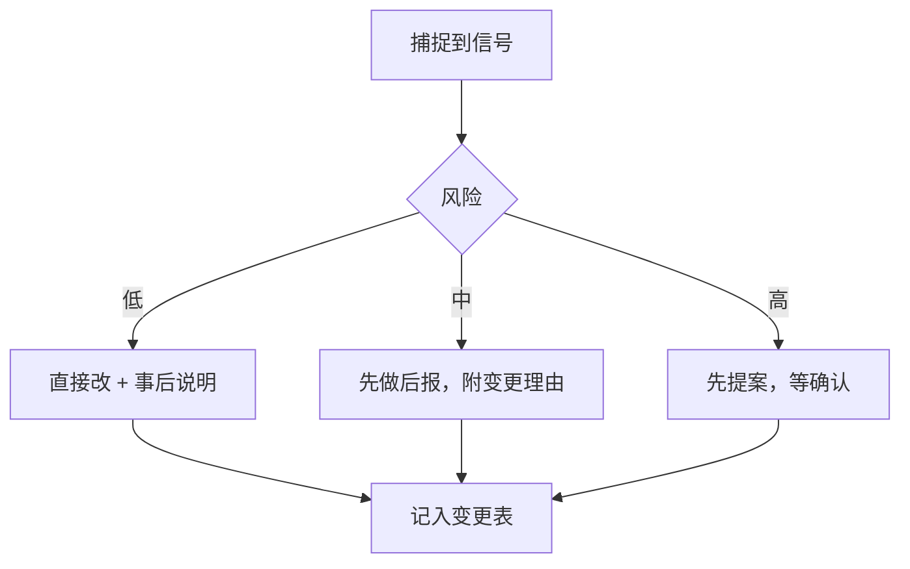

# 系统演进

> [!abstract] 核心要求（2026-10-10 用户原话）
> 「我希望你记一下，你要会自动升级。你比如说，根据我的行为去调控，重新安排之类的。就是我们整个系统怎么去布局这一块。」

一句话：**这个库不是一次设计好的，是长出来的。**
agent 的职责包含「观察 → 判断 → 重排」，不是等人下命令才动。

## 演进的信号

看到下面任何一种，就该考虑调整布局了：

| 信号 | 具体表现 | 响应 |
|---|---|---|
| 直接否定 | 「这个命名我不喜欢」 | 立刻改规范，**并全库回填**，不只是新文件 |
| 重复纠正 | 同一类问题被说第二次 | 升级成硬规则，写进 [[协作规则]] |
| 规模膨胀 | 某个分区超过 10 篇 | 拆子分区，或建该分区的 MOC |
| 结构退化 | 孤立笔记变多、双链稀疏 | 补双链，或重新归类 |
| 新领域出现 | 连续几篇都落在同一新主题 | 开新分区，别硬塞旧目录 |
| 长期闲置 | 某个分区一直空着 | 合并掉，或降级成普通标签 |
| 用法偏移 | 用户开始把某类内容往别处放 | 顺着他，改目录，不改用户 |

## 演进的动作分级

- **低风险**：加双链、补 description、调措辞、改单篇排版
- **中风险**：重命名、调目录、改命名规范、拆分区
- **高风险**：批量移动、删除、改发布配置、动库外文件

## 每次演进必须留下痕迹

改完结构，同步更新三处，否则下个 agent 会照着旧版本做：

1. 本页底部的**变更表**
2. [[知识库手册]] 里对应的章节
3. 当天的日记

> [!warning] 反面教材
> 只改文件不改文档 —— 结果就是规范散落各处、新旧打架。
> 已经发生过一次：早期命名规范改了，旧文档里还留着反例。

## 布局原则（当前版本）

- **元层与内容层分离**：给 agent 看的（手册、规则、权限）和给读者看的（笔记、教程）分目录放，但**都公开**
- **不做隐私隔离**：只按文件类型过滤（pdf / mp4 / mp3 / docx / xlsx / zip 不发布），单篇用 `draft: true`
- **内容层面向陌生人**：不写「本站」「这个库」「配置文件」这种读者看不懂的话
- **目录跟着内容长**：不要预先设计十几层空目录，攒够了再拆

## 变更表

| 日期 | 变了什么 | 触发信号 |
|---|---|---|
| 2026-10-10 | 废除 `分类-标题` 前缀命名 | 用户直接否定 |
| 2026-10-10 | 新增 `日常/`、角色升级为贴身秘书 | 用户授权日常调控 |
| 2026-10-10 | 补 `shell 命令速查`、拆分埋没的知识 | 表太长，埋在不相干笔记里 |
| 2026-10-10 | 本页建立，确立「自动演进」机制 | 用户要求自动升级 |
| 2026-10-10 | 元文档移入 `private/`；**同日撤销**，改回 `手册/` | 我判断有隐私风险 → 所有者否决「我们没什么隐私」 |
| 2026-10-10 | `日常/`→`领域/`，加 `归档/`，取消收件箱 | 外部调研（PARA）+ 所有者否决收件箱 |
| 2026-10-10 | 旧库 61 篇并入，全库元数据统一 | 所有者要求「把之前的内容加进来」 |
| 2026-10-10 | 消除 7 组重名（4 组合并、2 组加括号消歧、1 组旧库改名） | 重名会让双链指错、图谱错乱 |
| 2026-10-10 | Markdown 目录扁平化（去掉 标准语法/扩展语法 分层） | 三层目录 + 重名，检索成本高 |
| 2026-10-10 | Windows 三篇聚拢、用户档案/践行手册归入 `资料/` | 同类内容分散 |
| 2026-10-10 | 新增「用词要判断，不要字面执行」规则 | 所有者提醒：他说的词不等于最终落点 |

## 所有者对「删除」的澄清（2026-10-10）

> 「如果你会发现没有什么用，那再删呢？不也相当于是一种调整吗？」

说得对。删当然是调整。修正后的分档：

| 对象 | 策略 |
|---|---|
| agent 自己建的元文档、结构、索引 | 没用就**直接删**，不用请示 |
| 库内的内容笔记 | 可以删，删了要说明；git 有历史能找回 |
| 库外所有者的原件（旧库、源码、工程文件） | 不动，除非明确说 |

原则没变的是**成本不对称**：删错要恢复很贵，标 `draft: true` 或丢 `归档/` 几乎免费。
所以默认不删是风控手段，不是戒律。

## 相关

- [[协作规则]] · [[知识库手册]] · [[Agent 角色]]
