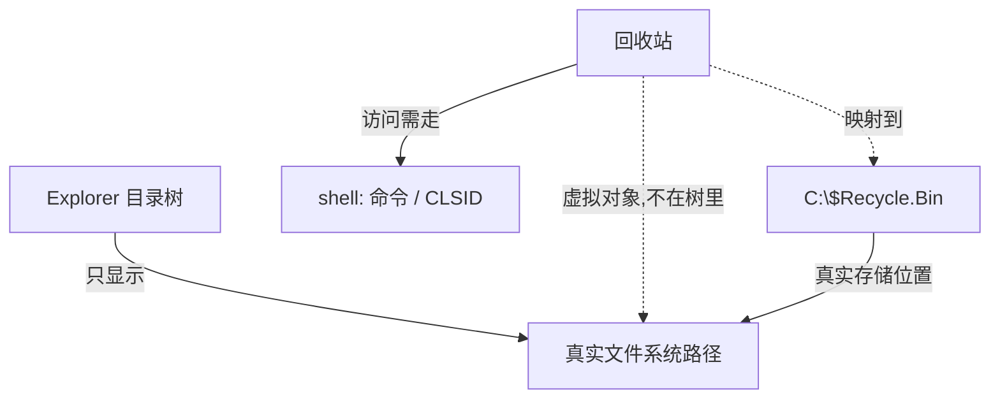

# Windows 回收站

## 为什么找不到它

> [!abstract] 结论
> 回收站**不是真实文件夹**，而是 Windows 的**虚拟 shell 命名空间对象**。
> 它没有可导航的普通路径 —— 这就是"桌面有图标，却怎么也找不到它在哪"的原因。



## 打开方式

| 方法 | 操作 |
|---|---|
| 运行命令 | `Win + R` → `shell:RecycleBinFolder` → 回车 |
| 地址栏 | 任意资源管理器 → 点地址栏 → 粘贴 `shell:RecycleBinFolder` → 回车 |
| CLSID | 地址栏输入 `::{645FF040-5081-101B-9F08-00AA002F954E}` |
| 命令行 | `explorer.exe shell:RecycleBinFolder` |
| 真实位置 | `C:\$Recycle.Bin`（系统隐藏目录，每个盘符各一个） |

## 找回桌面图标

> [!tip] 一条命令搞定
> `Win + R` → `rundll32.exe shell32.dll,Control_RunDLL desk.cpl,,0` → 勾选「回收站」→ 确定

图形路径：设置 → 个性化 → 主题 → 底部「桌面图标设置」。

## 自建快捷方式

桌面右键 → 新建 → 快捷方式 → 位置填：

```text
explorer.exe shell:RecycleBinFolder
```

命名「回收站」，可放任意位置、固定到任务栏。

## 注意

- `C:\$Recycle.Bin` 下按用户 SID 分文件夹，**不要手动改**；清空走回收站界面
- FAT32 分区上的对应目录是 `RECYCLER`
- 打开后可右键任务栏资源管理器图标 → 固定到快速访问

## 延伸：shell: 命令

同属虚拟命名空间对象的还有：此电脑、控制面板、网络、库、全部应用列表。
全部走 `shell:` 或 CLSID，完整清单见 → [[shell 命令速查]]

常用几条：

| 命令 | 打开 |
|---|---|
| `shell:AppsFolder` | 全部应用列表（可拖出 UWP 快捷方式） |
| `shell:MyComputerFolder` | 此电脑 |
| `shell:ControlPanelFolder` | 控制面板 |
| `shell:Startup` | 启动项 |
| `shell:NetworkPlacesFolder` | 网络 |

## 相关

- [[shell 命令速查]] — 完整命令表
- [[Obsidian 语法速查]] — 本页用的 mermaid / callout 写法
- [[2026-10-10]] — 这条笔记的来源
