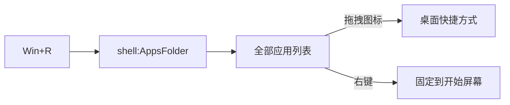

# shell 命令速查

> [!abstract] 用法
> `Win + R` 或资源管理器地址栏输入 `shell:xxx` 回车。
> 用于打开**没有普通路径的虚拟文件夹**，或**一步跳到深层目录**。

## 常用

| 命令 | 打开 |
|---|---|
| `shell:AppsFolder` | 全部应用列表（含 UWP / 商店应用） |
| `shell:RecycleBinFolder` | 回收站 |
| `shell:Desktop` | 桌面 |
| `shell:Downloads` | 下载 |
| `shell:Documents` / `shell:Personal` | 文档 |
| `shell:MyComputerFolder` | 此电脑 |
| `shell:ControlPanelFolder` | 控制面板 |
| `shell:Startup` | 当前用户启动项 |
| `shell:Common Startup` | 所有用户启动项 |
| `shell:AppData` | `AppData\Roaming` |
| `shell:LocalAppData` | `AppData\Local` |
| `shell:Profile` | 用户主目录 `C:\Users\xxx` |
| `shell:ProgramFiles` | `C:\Program Files` |
| `shell:System` | `System32` |
| `shell:Windows` | Windows 安装目录 |
| `shell:SendTo` | 「发送到」菜单目录 |
| `shell:Recent` | 最近使用的文件 |
| `shell:Start Menu` | 开始菜单目录 |
| `shell:Fonts` | 字体 |
| `shell:PrintersFolder` | 打印机 |
| `shell:NetworkPlacesFolder` | 网络 |
| `shell:Libraries` | 库 |
| `shell:Searches` | 保存的搜索 |

## 媒体与库

| 命令 | 打开 |
|---|---|
| `shell:Pictures` / `shell:My Pictures` | 图片 |
| `shell:MusicLibrary` | 音乐库 |
| `shell:VideosLibrary` | 视频库 |
| `shell:PhotoAlbums` | 图片专辑 |
| `shell:SavedGames` | 保存的游戏 |
| `shell:Playlists` | 播放列表 |
| `shell:Ringtones` | 铃声 |

## 系统深处

| 命令 | 打开 |
|---|---|
| `shell:Common Documents` | 公用文档 |
| `shell:Public` | `C:\Users\Public` |
| `shell:UserProfiles` | 所有用户配置目录 |
| `shell:UsersLibrariesFolder` | 用户库根目录 |
| `shell:Administrative Tools` | 管理工具 |
| `shell:Favorites` | 收藏夹 |
| `shell:Links` | 收藏夹-链接 |
| `shell:History` | 浏览器历史 |
| `shell:Cookies` | Cookies |
| `shell:Cache` | 缓存 |
| `shell:ConnectionsFolder` | 网络连接 |
| `shell:SyncCenterFolder` | 同步中心 |
| `shell:OneDrive` | OneDrive |
| `shell:AccountPictures` | 账户头像 |

## AppsFolder 特别用法

> [!tip] 把 UWP / 商店应用拖到桌面
> `Win + R` → `shell:AppsFolder` → 打开的是**所有已安装应用**的虚拟列表。
> 直接把图标**拖到桌面或文件夹**即可生成快捷方式 —— 商店应用平时右键是给不了「创建快捷方式」的，这招能绕过去。

## 注意

- 大小写不敏感；部分命令含空格（`shell:Start Menu`），原样输入即可
- 失效命令通常是系统版本差异（如 HomeGroup 已移除）
- 等价于 CLSID 写法：`::{CLSID}`，例如回收站 `::{645FF040-5081-101B-9F08-00AA002F954E}`

## 相关

- [[Windows 回收站]] — 这张表的来由
